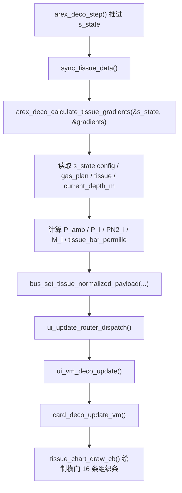

# 16 组织仓归一化视图计算说明

本文说明当前 PC 模拟器里 DECO 卡片 16 组织仓归一化视图的实际计算和调用链。本文面向算法工程师，用于确认当前临时实现是否与算法侧期望一致。

## 当前结论

当前 UI 主图已经使用归一化条长：

- 横轴范围固定为 `0..1000`。
- `400` 表示当前环境压力 `P_amb`。
- `900` 表示当前深度下的 M 值线。
- `tissue_bar_permille[16]` 是 16 个组织仓条长。
- `tissue_pi_permille` 是吸入氮气分压 `P_I` 的虚线位置。

当前算法库没有直接返回 `P_amb`、`P_I`、`PN2_i`、`M_i` 的专用接口。PC 适配层现在临时从 `ArexDecoDiveState` 和 `arex_deco_calculate_tissue_gradients()` 反推出 UI 需要的字段。

## 源码位置

主要代码：

- 算法状态结构：`src/algo_core/include/arex_deco/types.h`
- 算法公开接口：`src/algo_core/include/arex_deco/api.h`
- PC 算法适配层：`src/algo_sim/deco_core.cpp`
- UI data bus：`src/ui/core/data.h`、`src/ui/core/data.c`
- DECO VM：`src/ui/core/vm/ui_vm_dashboard.c`
- DECO 主图绘制：`src/ui/cards/card_deco.c`

## 当前调用链



## 使用到的算法侧数据

### 1. `ArexDecoDiveState`

当前 PC 适配层持有全局状态：

```c
static ArexDecoDiveState s_state;
```

本计算使用其中这些字段：

```c
s_state.config.surface_pressure_bar
s_state.config.water_vapor_pressure_bar
s_state.config.water_meters_per_bar
s_state.current_depth_m
s_state.gas_plan.active_gas_index
s_state.gas_plan.gases[active_idx].nitrogen_fraction
s_state.tissue.nitrogen_bar[i]
s_state.tissue.helium_bar[i]
```

### 2. `arex_deco_calculate_tissue_gradients()`

当前调用：

```c
ArexDecoTissueGradientMetrics gradients;
arex_deco_calculate_tissue_gradients(&s_state, &gradients);
```

使用其中：

```c
gradients.absolute_gf_percent[i]
gradients.relative_gf_percent[i]
gradients.current_target_gf
```

注意：`absolute_gf_percent[i]` 已经是百分比数值，例如 `70.0f` 表示 70%，不是 `0.70f`。

## 物理量计算

### 1. 当前环境压力 `P_amb`

当前实现：

```c
P_amb = surface_pressure_bar + current_depth_m / water_meters_per_bar
```

对应代码：

```c
float ambient_pressure_bar = pressure_bar_at_depth(&s_state.config, s_state.current_depth_m);
```

其中：

```c
pressure_bar_at_depth(config, depth_m)
    = config->surface_pressure_bar + depth_m / config->water_meters_per_bar
```

单位：`bar`。

### 2. 吸入氮气分压 `P_I`

当前实现：

```c
P_I = max(P_amb - water_vapor_pressure_bar, 0) * nitrogen_fraction
```

对应代码：

```c
float dry_pressure_bar = ambient_pressure_bar - s_state.config.water_vapor_pressure_bar;
if (!isfinite(dry_pressure_bar) || dry_pressure_bar < 0.0f) dry_pressure_bar = 0.0f;
float inspired_n2_bar = dry_pressure_bar * n2_fraction;
```

单位：`bar`。

### 3. 16 个组织仓氮气负荷 `PN2_i`

当前直接读取算法状态：

```c
PN2_i = s_state.tissue.nitrogen_bar[i]
```

对应 data bus 字段：

```c
tissue_n2_bar[16]
```

注意：这个字段只表示氮气分压。当前 UI 条长并不是只按 `PN2_i` 算，而是按总惰性气体压力算。

### 4. 16 个组织仓总惰性气体压力 `P_tissue_i`

当前 UI 条长使用：

```c
P_tissue_i = PN2_i + PHe_i
```

对应代码：

```c
float tissue_total_inert_bar = s_state.tissue.nitrogen_bar[i] + s_state.tissue.helium_bar[i];
```

原因：算法支持 Trimix。若 UI 只用 `PN2_i` 计算条长，含氦气体下会漏掉组织氦负荷。

### 5. 16 个组织仓 M 值 `M_i`

当前算法库没有直接返回 `M_i`。PC 适配层临时用 `absolute_gf_percent[i]` 反推。

算法文档给出的关系是：

```text
absolute_gf_percent[i] = ((P_tissue_i - P_amb) / (M_i - P_amb)) * 100
```

因此当前反推：

```text
M_i = P_amb + ((P_tissue_i - P_amb) * 100 / absolute_gf_percent[i])
```

对应代码：

```c
float absolute_gf = gradients.absolute_gf_percent[i];
tissue_m_value_bar[i] = ambient_pressure_bar;
if (isfinite(absolute_gf) && fabsf(absolute_gf) > TISSUE_UI_RECON_EPS)
{
    tissue_m_value_bar[i] = ambient_pressure_bar + ((tissue_total_inert_bar - ambient_pressure_bar) * 100.0f / absolute_gf);
}
if (!isfinite(tissue_m_value_bar[i]) || tissue_m_value_bar[i] < ambient_pressure_bar)
{
    tissue_m_value_bar[i] = ambient_pressure_bar;
}
```

限制：

- 当 `absolute_gf_percent[i]` 接近 0 时，无法稳定反推 `M_i`，当前用 `P_amb` 兜底。
- 这个 `M_i` 是为了 UI 验证临时反推出来的值，不是算法正式 API 输出。
- 后续建议算法侧直接返回 `M_i` 或直接返回归一化 UI payload。

## 归一化映射公式

UI 横轴固定使用：

```c
ANCHOR_PAMB = 400
ANCHOR_MVAL = 900
MAX_VALUE = 1000
```

### 1. PI 虚线位置

当前实现：

```text
PI_permille = (P_I / P_amb) * 400
```

对应代码：

```c
uint16_t pi_permille = (ambient_pressure_bar > TISSUE_UI_RECON_EPS)
    ? round_u16_permille((inspired_n2_bar / ambient_pressure_bar) * TISSUE_UI_PAMB_ANCHOR_PERMILLE)
    : 0U;
```

### 2. 组织条长度

如果组织总惰性气体压力不超过环境压力：

```text
bar_i = (P_tissue_i / P_amb) * 400
```

对应代码：

```c
if (tissue_total_inert_bar <= ambient_pressure_bar)
{
    tissue_bar_permille[i] = round_u16_permille((tissue_total_inert_bar / ambient_pressure_bar) * TISSUE_UI_PAMB_ANCHOR_PERMILLE);
}
```

如果组织总惰性气体压力超过环境压力：

```text
over_ratio_i = (P_tissue_i - P_amb) / (M_i - P_amb)
bar_i = 400 + over_ratio_i * (900 - 400)
```

当前代码没有再次使用反推的 `M_i` 计算 `over_ratio_i`，而是直接使用等价的：

```text
over_ratio_i = absolute_gf_percent[i] / 100
```

对应代码：

```c
float over_limit_ratio = isfinite(absolute_gf) ? (absolute_gf / 100.0f) : 0.0f;
tissue_bar_permille[i] = round_u16_permille(TISSUE_UI_PAMB_ANCHOR_PERMILLE + over_limit_ratio * (TISSUE_UI_MVALUE_ANCHOR_PERMILLE - TISSUE_UI_PAMB_ANCHOR_PERMILLE));
```

### 3. 截断规则

当前 `round_u16_permille()` 负责截断：

```c
if (!isfinite(value) || value <= 0.0f) return 0U;
if (value >= 1000.0f) return 1000U;
return (uint16_t)(value + 0.5f);
```

因此所有传给 UI 的条长都是 `0..1000` 的整数。

## 写入 data bus 的字段

当前写入接口：

```c
bus_set_tissue_normalized_payload(
    tissue_bar_permille,
    pi_permille,
    ambient_pressure_bar,
    inspired_n2_bar,
    tissue_n2_bar,
    tissue_m_value_bar);
```

接口定义：

```c
void bus_set_tissue_normalized_payload(
    const uint16_t tissue_bar_permille[16],
    uint16_t pi_permille,
    float ambient_pressure_bar,
    float inspired_n2_bar,
    const float tissue_n2_bar[16],
    const float tissue_m_value_bar[16]);
```

对应 getter：

```c
bool bus_get_tissue_normalized_valid(void);
uint16_t bus_get_tissue_bar_permille(uint8_t index);
uint16_t bus_get_tissue_pi_permille(void);
float bus_get_tissue_ambient_pressure_bar(void);
float bus_get_tissue_inspired_n2_bar(void);
float bus_get_tissue_n2_bar(uint8_t index);
float bus_get_tissue_m_value_bar(uint8_t index);
```

## UI 绘制规则

DECO 主图在 `card_deco.c` 中固定使用：

```c
#define TISSUE_UI_PAMB_PERMILLE   400
#define TISSUE_UI_MVALUE_PERMILLE 900
#define TISSUE_UI_MAX_PERMILLE    1000
```

绘制行为：

- 背景固定分三段：`0..400`、`400..900`、`900..1000`。
- 每个组织仓一条横向条，条长读取 `tissue_bar_permille[i]`。
- 400 位置画环境压力线 `PAMB`。
- 900 位置画 M 值线 `M`。
- `tissue_pi_permille` 位置画 PI 虚线。
- 条长超过 900 时，900 之后的部分进入红色闪烁。

## 当前实现的临时性

这版实现是为了快速验证 UI 表达，算法侧后续最好提供正式接口。建议二选一：

### 方案 A：算法直接返回物理量

```c
typedef struct {
    float ambient_pressure_bar;
    float inspired_n2_bar;
    float tissue_n2_bar[16];
    float tissue_he_bar[16];
    float tissue_total_inert_bar[16];
    float m_value_bar[16];
} ArexDecoTissuePressureMetrics;
```

优点：UI/适配层可以继续负责 0..1000 映射。

### 方案 B：算法直接返回 UI payload

```c
typedef struct {
    uint16_t tissue_bar_permille[16];
    uint16_t pi_permille;
    float ambient_pressure_bar;
    float inspired_n2_bar;
    uint8_t deco_violation;
} ArexDecoTissueUiPayload;
```

优点：MCU UI 线程不需要浮点映射，最不容易出现两边公式不一致。

## 需要算法工程师确认的问题

1. 当前 `P_amb = surface_pressure_bar + depth_m / water_meters_per_bar` 是否就是算法内部当前使用的环境压力口径？
2. 当前 `P_I = (P_amb - water_vapor_pressure_bar) * nitrogen_fraction` 是否和组织推进时的吸入氮气分压完全一致？
3. 归一化条长是否应使用 `PN2 + PHe`，而不是只使用 `PN2`？当前实现按 `PN2 + PHe`。
4. 当前用 `absolute_gf_percent` 反推 `M_i` 的方式，在 `absolute_gf_percent` 接近 0 或负值时是否可以接受？如果不可接受，需要算法直接返回 `M_i`。
5. UI 固定 400 为环境压力线、900 为 M 值线是否符合算法侧对风险区间的解释？

## 当前验证点

- `bus_get_tissue_normalized_valid()` 为 true 后，DECO 主图应显示横向 16 条组织条。
- `bus_get_tissue_bar_permille(i)` 必须在 `0..1000`。
- 当 `P_tissue_i == P_amb` 时，`tissue_bar_permille[i]` 应接近 400。
- 当 `P_tissue_i == M_i` 时，`tissue_bar_permille[i]` 应接近 900。
- 当 `P_tissue_i > M_i` 时，条长超过 900，UI 应显示红色闪烁段。
