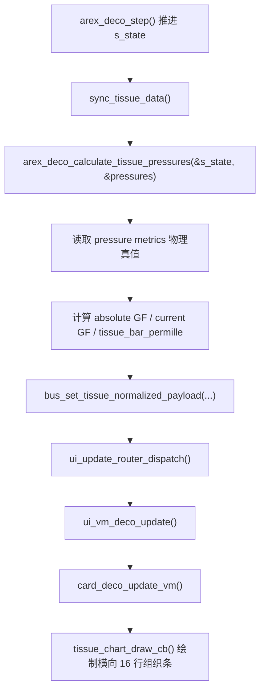

# 16 组织仓归一化视图计算说明

本文说明当前 PC 模拟器里 DECO 卡片 16 组织仓归一化视图的实际计算和调用链。本文面向算法工程师，用于确认 UI 映射是否与算法侧 pressure metrics 口径一致。

## 当前结论

当前 UI 主图已经使用归一化条长：

- X 轴/横向范围固定为 `0..1000`。
- `400` 表示当前环境压力 `P_amb`。
- `900` 表示当前深度下的 M 值线。
- `tissue_bar_permille[16]` 是 16 个组织仓条长。
- `tissue_pi_permille` 是吸入总惰性气体分压 `P_I(N2+He)` 的虚线位置。

AREX Deco Core `0.0.23` 已提供正式 pressure metrics 接口。PC 适配层现在调用 `arex_deco_calculate_tissue_pressures()`，直接读取 `P_amb`、`P_I(N2/He)`、`PN2_i`、`PHe_i`、`M_i` 和 `M_GF_i`，不再从 absolute GF 反推 M 值。

## 源码位置

主要代码：

- 算法状态结构：`src/algo_core/include/arex_deco/types.h`
- 算法公开接口：`src/algo_core/include/arex_deco/api.h`
- PC 算法适配层：`src/algo_sim/deco_core.cpp`
- UI data bus：`src/ui/core/data.h`、`src/ui/core/data.c`
- DECO VM：`src/ui/core/vm/ui_vm_dashboard.c`
- DECO 主图绘制：`src/ui/cards/card_deco.c`

## 当前调用链



## 使用到的算法侧数据

### 1. `ArexDecoDiveState`

当前 PC 适配层持有全局状态：

```c
static ArexDecoDiveState s_state;
```

本计算使用其中这些字段：

```c
s_state
```

`s_state` 不再被 UI 适配层拆开重算组织压力；它只作为 `arex_deco_calculate_tissue_pressures()` 的输入。

### 2. `arex_deco_calculate_tissue_pressures()`

```c
ArexDecoTissuePressureMetrics pressures;
arex_deco_calculate_tissue_pressures(&s_state, &pressures);
```

使用其中：

```c
pressures.ambient_pressure_bar
pressures.inspired_n2_bar
pressures.inspired_he_bar
pressures.tissue_n2_bar[i]
pressures.tissue_he_bar[i]
pressures.tissue_m_value_bar[i]
pressures.tissue_m_gf_bar[i]
pressures.current_gf_target
```

`current_gf_target` 是 `0.0..1.0` 小数形式；UI 需要显示百分比时再乘以 100。

## 物理量计算

### 1. 当前环境压力 `P_amb`

当前实现直接读取算法输出：

```c
P_amb = pressures.ambient_pressure_bar
```

对应代码：

```c
float ambient_pressure_bar = pressures.ambient_pressure_bar;
```

其中：

```c
pressure_bar_at_depth(config, depth_m)
    = config->surface_pressure_bar + depth_m / config->water_meters_per_bar
```

单位：`bar`。

### 2. 吸入总惰性气体分压 `P_I`

当前实现直接读取算法输出：

```c
P_I = pressures.inspired_n2_bar + pressures.inspired_he_bar
```

对应代码：

```c
float inspired_inert_bar = pressures.inspired_n2_bar + pressures.inspired_he_bar;
```

单位：`bar`。

### 3. 16 个组织仓氮气负荷 `PN2_i`

当前直接读取算法状态：

```c
PN2_i = pressures.tissue_n2_bar[i]
```

对应 data bus 字段：

```c
tissue_n2_bar[16]
```

注意：这个字段只表示氮气分压。当前 UI 条长并不是只按 `PN2_i` 算，而是按总惰性气体压力算。

### 4. 16 个组织仓总惰性气体压力 `P_tissue_i`

当前 UI 条长使用：

```c
P_tissue_i = PN2_i + PHe_i
```

对应代码：

```c
float tissue_total_inert_bar = pressures.tissue_n2_bar[i] + pressures.tissue_he_bar[i];
```

原因：算法支持 Trimix。若 UI 只用 `PN2_i` 计算条长，含氦气体下会漏掉组织氦负荷。

### 5. 16 个组织仓 M 值 `M_i`

当前实现直接读取算法输出：

```text
M_i = pressures.tissue_m_value_bar[i]
M_GF_i = pressures.tissue_m_gf_bar[i]
```

对应代码：

```c
tissue_m_value_bar[i] = pressures.tissue_m_value_bar[i];
tissue_m_gf_bar[i] = pressures.tissue_m_gf_bar[i];
```

`tissue_m_value_bar[i]` 是当前组织 N2/He 分压加权得到的 combined a/b M 值；`tissue_m_gf_bar[i] = P_amb + (M_i - P_amb) * current_gf_target`。

## 归一化映射公式

UI 横向坐标固定使用：

```c
ANCHOR_PAMB = 400
ANCHOR_MVAL = 900
MAX_VALUE = 1000
```

### 1. PI 虚线位置

当前实现：

```text
PI_permille = ((PInspiredN2 + PInspiredHe) / P_amb) * 400
```

对应代码：

```c
uint16_t pi_permille = (ambient_pressure_bar > TISSUE_UI_PRESSURE_EPS)
    ? round_u16_permille((inspired_inert_bar / ambient_pressure_bar) * TISSUE_UI_PAMB_ANCHOR_PERMILLE)
    : 0U;
```

### 2. 组织条长度

如果组织总惰性气体压力不超过环境压力：

```text
bar_i = (P_tissue_i / P_amb) * 400
```

对应代码：

```c
if (tissue_total_inert_bar <= ambient_pressure_bar)
{
    tissue_bar_permille[i] = round_u16_permille((tissue_total_inert_bar / ambient_pressure_bar) * TISSUE_UI_PAMB_ANCHOR_PERMILLE);
}
```

如果组织总惰性气体压力超过环境压力：

```text
over_ratio_i = (P_tissue_i - P_amb) / (M_i - P_amb)
bar_i = 400 + over_ratio_i * (900 - 400)
```

当前代码按算法返回的 `M_i` 重新计算绝对 GF：

```text
absolute_gf_i = (P_tissue_i - P_amb) / (M_i - P_amb) * 100
over_ratio_i = absolute_gf_i / 100
```

对应代码：

```c
float raw_denom = pressures.tissue_m_value_bar[i] - ambient_pressure_bar;
float absolute_gf = (isfinite(raw_denom) && fabsf(raw_denom) > TISSUE_UI_PRESSURE_EPS) ? ((tissue_total_inert_bar - ambient_pressure_bar) * 100.0f / raw_denom) : 0.0f;
float over_limit_ratio = isfinite(absolute_gf) ? (absolute_gf / 100.0f) : 0.0f;
tissue_bar_permille[i] = round_u16_permille(TISSUE_UI_PAMB_ANCHOR_PERMILLE + over_limit_ratio * (TISSUE_UI_MVALUE_ANCHOR_PERMILLE - TISSUE_UI_PAMB_ANCHOR_PERMILLE));
```

### 3. 截断规则

当前 `round_u16_permille()` 负责截断：

```c
if (!isfinite(value) || value <= 0.0f) return 0U;
if (value >= 1000.0f) return 1000U;
return (uint16_t)(value + 0.5f);
```

因此所有传给 UI 的条长都是 `0..1000` 的整数。

## 写入 data bus 的字段

当前写入接口：

```c
bus_set_tissue_normalized_payload(
    tissue_bar_permille,
    pi_permille,
    ambient_pressure_bar,
    inspired_n2_bar,
    inspired_he_bar,
    tissue_n2_bar,
    tissue_he_bar,
    tissue_m_value_bar,
    tissue_m_gf_bar);
```

接口定义：

```c
void bus_set_tissue_normalized_payload(
    const uint16_t tissue_bar_permille[16],
    uint16_t pi_permille,
    float ambient_pressure_bar,
    float inspired_n2_bar,
    float inspired_he_bar,
    const float tissue_n2_bar[16],
    const float tissue_he_bar[16],
    const float tissue_m_value_bar[16],
    const float tissue_m_gf_bar[16]);
```

对应 getter：

```c
bool bus_get_tissue_normalized_valid(void);
uint16_t bus_get_tissue_bar_permille(uint8_t index);
uint16_t bus_get_tissue_pi_permille(void);
float bus_get_tissue_ambient_pressure_bar(void);
float bus_get_tissue_inspired_n2_bar(void);
float bus_get_tissue_inspired_he_bar(void);
float bus_get_tissue_n2_bar(uint8_t index);
float bus_get_tissue_he_bar(uint8_t index);
float bus_get_tissue_m_value_bar(uint8_t index);
float bus_get_tissue_m_gf_bar(uint8_t index);
```

## UI 绘制规则

DECO 主图在 `card_deco.c` 中固定使用：

```c
#define TISSUE_UI_PAMB_PERMILLE   400
#define TISSUE_UI_MVALUE_PERMILLE 900
#define TISSUE_UI_MAX_PERMILLE    1000
#define TISSUE_SHOW_PI_LABEL      0
#define TISSUE_SHOW_AMB_LABEL     0
#define TISSUE_SHOW_M_LABEL       0
#define TISSUE_COLOR_BG          lv_color_make(0x00, 0x00, 0x00)
#define TISSUE_COLOR_PI          lv_color_make(0x00, 0x33, 0x00)
#define TISSUE_COLOR_SAFE        lv_color_make(0x00, 0x4C, 0x00)
#define TISSUE_COLOR_AMB         lv_color_make(0x00, 0x7F, 0x00)
#define TISSUE_COLOR_DECO        lv_color_make(0x00, 0xCC, 0x00)
#define TISSUE_COLOR_DANGER      lv_color_make(0x00, 0xFF, 0x00)
```

绘制行为：

- 组织条不再使用绿色、黄色、红色三段色相区分；当前横向版本使用纯黑背景下的绿色 G 通道亮度阶梯表达状态。
- 每个组织仓一条横向组织条，长度读取 `tissue_bar_permille[i]`。
- 400 位置画环境压力竖线，使用 `#007F00`，底部显示 `PAMB`。
- 900 位置画 M 值线，使用 `#00FF00`，底部显示 `M`。
- `tissue_pi_permille` 位置画 PI 竖向虚线，使用 `#003300`，底部显示 `PI`。
- `TISSUE_SHOW_PI_LABEL`、`TISSUE_SHOW_AMB_LABEL`、`TISSUE_SHOW_M_LABEL` 只控制文字标签是否显示，不改变参考线位置和条长计算。
- 组织条低于 400 的安全段使用 `#004C00`；400~900 的排氮段使用 `#00CC00`；超过 900 的部分使用 `#00FF00` 满亮闪烁。

自定义 Tissue 小组件：

- `COMP_TISSUE_RAW_4012` 复用上述横向 16 行组织仓，条长读取 `tissue_bar_permille[i]`；参考线仍画 400、900 和 PI，但不画底部字母。
- `COMP_TISSUE_GF_4012` 同样显示横向 16 行组织仓；400 以下沿用 RAW 的环境压力以下映射，超过 400 后使用 `tissue_gf_pct[i]` 映射到 400~900，900 表示当前 target GF 红线。
- GF 小组件条长公式：`bar_permille = 400 + tissue_gf_pct[i] / 100 * (900 - 400)`。`tissue_gf_pct[i] == 100` 时刚好触碰 900 线，超过 900 的部分闪烁。

## 当前实现的边界

0.0.23 已采纳“算法输出物理量，UI 负责映射”的方案。当前边界如下：

- 算法负责输出物理真值：`P_amb`、吸入 N2/He、组织 N2/He、M 值、GF M 值和当前 target GF。
- UI/适配层负责把物理真值映射为 `0..1000` 图形坐标，并负责纯显示层截断。
- RAW/GF 自定义小组件只复用现有 VM 字段做显示映射，不再在 UI 层提取 Leading Tissue。

## 需要算法工程师确认的问题

1. UI 固定 400 为环境压力线、900 为 M 值线是否符合算法侧对风险区间的解释？
2. GF 模式主图是否应切换使用 `tissue_m_gf_bar[i]` 作为 900 红线，还是继续 RAW 模式使用 `tissue_m_value_bar[i]`？
3. 如果后续再次需要 Leading Tissue summary，字段建议为 `leading_compartment`、`leading_gf_percent`、`leading_tissue_inert_bar`、`leading_m_value_bar` 和 `leading_m_gf_bar`。

## 当前验证点

- `bus_get_tissue_normalized_valid()` 为 true 后，DECO 主图应显示横向 16 行组织条。
- `bus_get_tissue_bar_permille(i)` 必须在 `0..1000`。
- 当 `P_tissue_i == P_amb` 时，`tissue_bar_permille[i]` 应接近 400。
- 当 `P_tissue_i == M_i` 时，`tissue_bar_permille[i]` 应接近 900。
- 当 `P_tissue_i > M_i` 时，条长超过 900，UI 应显示纯绿满亮闪烁段。
