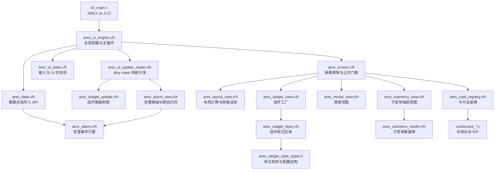
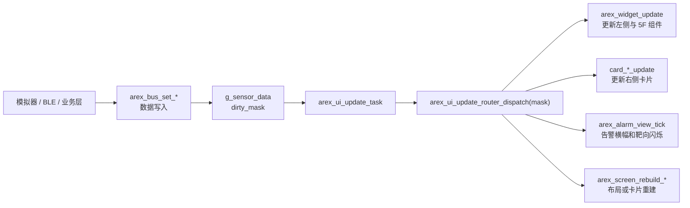
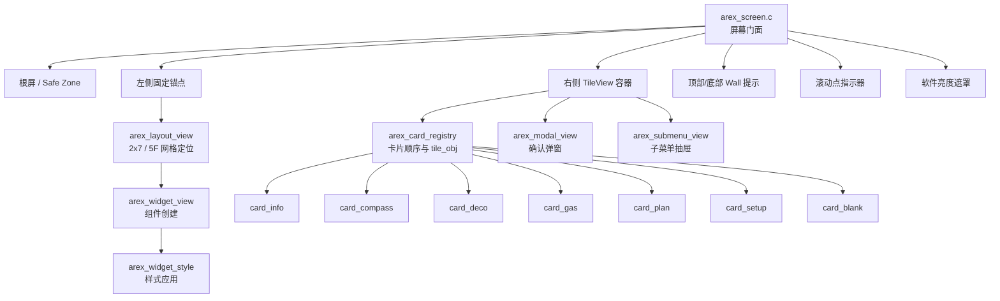
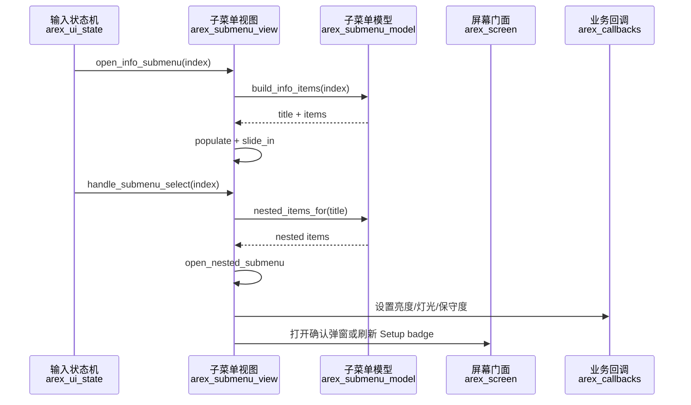
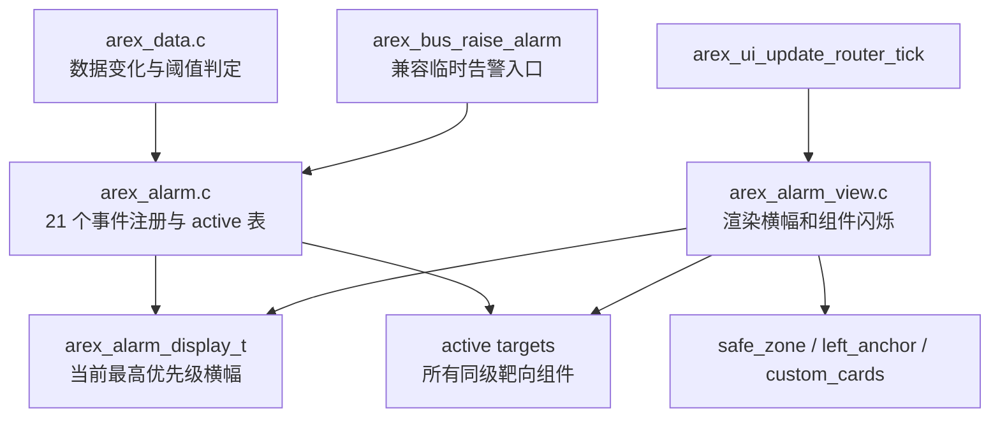
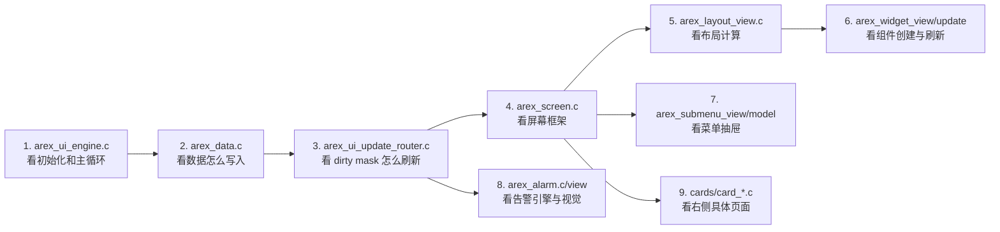

# AREX UI 模块地图

本文档说明 `src/arex_ui/` 当前拆分后的文件职责、调用边界和主要数据流。更完整的历史架构说明仍以 `UI_html_DOC/AREX_ARCH.md` 为准；本文偏向“现在看代码时应该先看哪里”。

## 目录分层

```text
src/arex_ui/
├─ core/      数据总线、全局状态、UI 状态机、刷新路由、业务回调
├─ screen/    屏幕门面、布局计算、卡片注册表
├─ widgets/   可复用组件工厂、组件刷新、组件样式
├─ views/     弹窗与子菜单抽屉/模型
├─ alarm/     告警事件引擎与告警视图
├─ cards/     右侧业务卡片
├─ fonts/     字体资源
└─ picture/   图标资源
```

## 总览



## 启动与刷新链路



## 屏幕拆分

`arex_screen.c` 现在更像一个“屏幕门面”：保留根屏、safe zone、左右区域、wall、dots、亮度遮罩、公共刷新入口。具体 UI 子系统尽量拆到独立模块。



## 子菜单系统

`submenu` 是右侧菜单的二级/三级抽屉。用户在 `INFO` 或 `SETUP` 页面确认一个条目后，子菜单从右侧滑入，显示更细的详情或设置项。



## 告警系统



## 文件职责

### 核心与数据

| 文件 | 作用 |
|---|---|
| `core/arex_ui_engine.h` | 全局类型、配置结构、传感器结构、dirty mask、公开 UI 总线 API 声明。 |
| `core/arex_ui_engine.c` | UI 初始化、默认配置、主刷新任务入口、全局 `g_sys_config` / `g_sensor_data` 持有者。 |
| `core/arex_data.h` | 数据同步帧、数据写入 API、告警判定入口声明。 |
| `core/arex_data.c` | `arex_bus_set_*()` 数据写入实现，维护 dirty mask，并触发可判定告警条件。 |
| `core/arex_ui_update_router.h` | UI 刷新路由模块公开入口。 |
| `core/arex_ui_update_router.c` | 消费 dirty mask，分发到 widget、card、alarm、layout rebuild 等刷新路径。 |
| `core/arex_ui_state.h` | UI 状态机枚举、输入上下文、编辑上下文、子菜单历史结构。 |
| `core/arex_ui_state.c` | 键盘/旋钮输入路由，控制 DASH、INFO、SETUP、SUB_MENU、MODAL、EDIT 等状态切换。 |
| `core/arex_callbacks.h` | UI 调业务层的回调声明，例如灯光、亮度、保守度。 |
| `core/arex_callbacks.c` | PC 模拟器默认回调实现，真实业务层可替换或对接强实现。 |

### 屏幕、布局与组件

| 文件 | 作用 |
|---|---|
| `screen/arex_screen.h` | 屏幕层公开门面，供状态机、卡片、告警、组件刷新调用。 |
| `screen/arex_screen.c` | 根屏、safe zone、左右容器、tileview、wall、dots、亮度遮罩、公共刷新入口。 |
| `screen/arex_layout_view.h` | 布局计算与网格渲染函数声明。 |
| `screen/arex_layout_view.c` | safe zone 计算、左右布局计算、2x7 固定区、5F 自定义网格定位与渲染调度。 |
| `widgets/arex_widget_view.h` | 组件工厂与组件运行态句柄声明。 |
| `widgets/arex_widget_view.c` | `render_widget_by_id()`，创建 DEPTH、NDL、POD、SYS、GAS 等可复用 widget。 |
| `widgets/arex_widget_update.h` | widget 数据刷新 API 声明。 |
| `widgets/arex_widget_update.c` | 根据 widget id 同步 `g_sensor_data` 到屏幕组件，处理文本/数值更新。 |
| `widgets/arex_widget_style_types.h` | widget 样式枚举、布局元数据、样式配置结构。 |
| `widgets/arex_widget_style.h` | widget 样式应用 API 声明。 |
| `widgets/arex_widget_style.c` | 应用边框、字体、颜色、背景等组件样式。 |

### 子菜单与弹窗

| 文件 | 作用 |
|---|---|
| `views/arex_submenu_view.h` | 子菜单抽屉创建、重置、列表句柄获取 API。 |
| `views/arex_submenu_view.c` | 子菜单滑入/滑出、列表渲染、选中态刷新、选择动作处理。 |
| `views/arex_submenu_model.h` | 子菜单数据模型 API，向 view 提供标题和条目。 |
| `views/arex_submenu_model.c` | INFO、SETUP、NESTED 菜单数据表和动态文案构建。 |
| `views/arex_modal_view.h` | 弹窗创建、显示、隐藏、pulse、上下文恢复 API。 |
| `views/arex_modal_view.c` | GAS / COMPASS / ACT 等确认弹窗的 LVGL 对象管理与动画。 |

### 告警

| 文件 | 作用 |
|---|---|
| `alarm/arex_alarm.h` | 21 个告警事件 ID、active/display API、target 查询接口。 |
| `alarm/arex_alarm.c` | 告警定义表、active 状态表、优先级选择、FIFO 轮播、ACK 与清除规则。 |
| `alarm/arex_alarm_view.h` | 告警视图上下文和 tick 渲染 API。 |
| `alarm/arex_alarm_view.c` | 横幅创建、L1/L2/L3 视觉节拍、组件靶向闪烁和样式恢复。 |

### 卡片系统

| 文件 | 作用 |
|---|---|
| `screen/arex_card_registry.h` | 卡片 ID、卡片结构、注册表 API。 |
| `screen/arex_card_registry.c` | 卡片顺序、卡片查找、tile 对象绑定、动态卡片数量计算。 |
| `cards/card_info.c` | INFO 页面主菜单。 |
| `cards/card_setup.c` | SETUP 页面主菜单和 badge 刷新。 |
| `cards/card_compass.h` | 指南针卡片对外刷新接口。 |
| `cards/card_compass.c` | 指南针页面、航向刷新、校准相关 UI 入口。 |
| `cards/card_deco.c` | 减压/组织/毒性相关页面刷新。 |
| `cards/card_gas.c` | 气体列表、气体状态和气体切换相关显示。 |
| `cards/card_plan.c` | 轨迹/计划/曲线类显示。 |
| `cards/card_blank.c` | 空白卡片占位实现。 |

### 字体与图片资源

| 文件 | 作用 |
|---|---|
| `fonts/arex_fonts.h` | 字体 ID 到 LVGL 字体对象的统一入口。 |
| `fonts/FONT_GUIDE.md` | 字体资源说明。 |
| `fonts/lv_font_consola_*.c` | Consola 字体资源，不写业务逻辑。 |
| `fonts/lv_font_courier_*.c` | Courier 字体资源，部分符号显示使用。 |
| `fonts/lv_font_ordinar_*.c` | Ordinar 字体资源。 |
| `picture/sudo_up_level*.c` | 上升速度图标资源。 |
| `picture/sudo_down_level*.c` | 下降速度图标资源。 |
| `picture/qiping.c` | 气瓶图标资源。 |
| `picture/Shoudiantong.c` | 手电筒图标资源。 |
| `picture/liuzhuandeng.c` | 流转灯图标资源。 |

## 推荐阅读顺序



## 维护边界

| 需求 | 优先修改位置 |
|---|---|
| 新增传感器字段或数据写入 | `core/arex_ui_engine.h`、`core/arex_data.c/h` |
| 新增 dirty 刷新策略 | `core/arex_ui_update_router.c` |
| 新增固定区或 5F 组件 | `widgets/arex_widget_view.c`、`widgets/arex_widget_update.c`、`screen/arex_layout_view.c` |
| 调整组件外观 | `widgets/arex_widget_style.c`、`widgets/arex_widget_style_types.h` |
| 新增右侧页面 | `cards/card_*.c`、`screen/arex_card_registry.c/h` |
| 修改子菜单文案或层级 | `views/arex_submenu_model.c` |
| 修改子菜单动画或选中态 | `views/arex_submenu_view.c` |
| 修改告警规则或事件 | `alarm/arex_alarm.c/h`、`core/arex_data.c` |
| 修改告警视觉 | `alarm/arex_alarm_view.c/h` |
| 修改弹窗显示 | `views/arex_modal_view.c/h` |

例行源码调整不要修改 `LittlevGL.cbp`；只有明确需要同步 CodeBlocks 工程文件时再改。
