# 当前 UI 架构深度讲解

本文档按“代码如何运行起来、数据如何流动、界面如何创建和刷新、菜单和告警如何协作”的顺序解释当前架构。它比 `UI_MODULE_MAP.md` 更偏向完整逻辑和改代码时的思考路径。

## 1. 一句话总览

这是一个基于 LVGL v8.3 的潜水电脑 UI。PC 版通过 Windows GDI 模拟 640x480 屏幕，真实设备侧计划对接 RT-Thread 和硬件/算法后端。

当前核心设计可以概括为：

```text
输入/算法/传感器只写 Data Bus
UI 定时任务消费 dirty mask
Router 把 dirty mask 翻译成 VM
Screen/Layout/Component/Card 把 VM 渲染成 LVGL 对象
Menu/Alarm 通过独立状态机管理交互和提醒
```

这意味着上游业务层不应该直接操作 LVGL 控件，UI 层也不应该直接改传感器全局数据。两边通过 `bus_set_*()`、`bus_get_*()` 和 dirty mask 解耦。

## 2. 目录分层

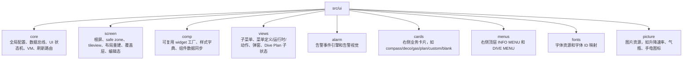

PC 模拟器和算法模拟层在 `src/hal_sim`、`src/algo_sim`。这些模块是 PC 专用能力，共享 UI/core 代码引用它们时必须有 `#ifdef PC_SIMULATOR` 边界。

## 3. 启动流程

入口从 Windows 程序开始：

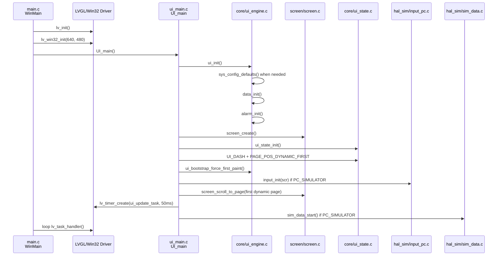

启动时有一个重要细节：`ui_bootstrap_force_first_paint()` 会主动重排一次布局并补一轮数据脏标记。这样 UI 不依赖传感器首帧才显示出来。即使硬件数据还没有到，屏幕对象树、左侧组件和当前页也会先有完整结构。

## 4. 全局数据和配置

当前 UI 有两个关键全局单例：

| 对象 | 定义位置 | 责任 |
|---|---|---|
| `g_sys_config` | `core/ui_engine.c` | 布局、卡片顺序、用户设置、默认气体、亮度、告警阈值等配置 |
| `g_sensor_data` | `core/ui_engine.c` | 深度、NDL、TTS、气体、电量、温度、组织、轨迹等运行时数据，以及 `dirty_mask` |

外部模块不要直接写这两个全局变量。正确入口是：

```text
硬件/算法/模拟器 -> bus_set_*()
UI/组件/VM       -> bus_get_*()
刷新任务          -> bus_take_dirty()
```

原因是 `bus_set_*()` 不只是赋值，它还负责：

| 动作 | 例子 |
|---|---|
| 变化过滤 | `bus_set_depth()` 对显示深度做 0.05m 防抖 |
| 派生统计 | 深度更新时同步最大深度、平均深度 |
| dirty mask | 深度变化打 `DIRTY_DEPTH`，气体变化打 `DIRTY_GAS` |
| 临界区保护 | 组织数组、减压站数组等大块数据写入会关中断保护 |
| 算法同步 | PC 模拟下气体/GF/盐度等会同步给 `buhlmann_debug` |

注意：告警不是 Data Bus 的隐式副作用。`bus_set_*()` 只更新数据和脏标记；告警应由算法、传感器、平台或调试层显式调用 `alarm_set_active()`、`alarm_raise_custom()`、`alarm_clear_custom()` 或 `alarm_clear_all()`。

## 5. 数据刷新主链路

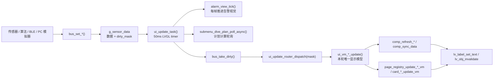

刷新的关键是 dirty mask：

| dirty bit | 典型刷新对象 |
|---|---|
| `DIRTY_DEPTH` | 深度组件、最大/平均深度、DECO 卡、信息子菜单 |
| `DIRTY_NDL` / `DIRTY_NDL_STOP` | NDL/安全停留/减压停留复合组件 |
| `DIRTY_ASCENT` | 升降速率图标和速率文本 |
| `DIRTY_GAS` | 左侧 GAS、GAS 卡片、PPO2/MOD 相关组件、信息子菜单 |
| `DIRTY_TRAJECTORY` | PLAN 卡片轨迹和减压站图 |
| `DIRTY_TISSUES` | 组织柱图和 DECO 卡 |
| `DIRTY_UI_LAYOUT` | 全屏重建：tileview、左侧锚点、右侧卡片、子菜单/弹窗层 |

同一轮 dirty mask 里，一个业务域只生成一次 VM。比如 DECO 域由 router 调一次 `ui_vm_deco_update()`，然后同一个 `deco_vm` 同时交给 `page_registry_update_deco_vm()` 和 `comp_refresh_tissue_widgets()`。无参 `card_*_update()` 是页面注册表、初始化或旧入口的兼容 wrapper，不是 router 已有 VM 时的首选路径。

## 6. VM 层是什么

VM 是 View Model。它把 `g_sensor_data`、`g_sys_config`、`ui_state` 里的原始状态转成“界面刚好需要的结构”。

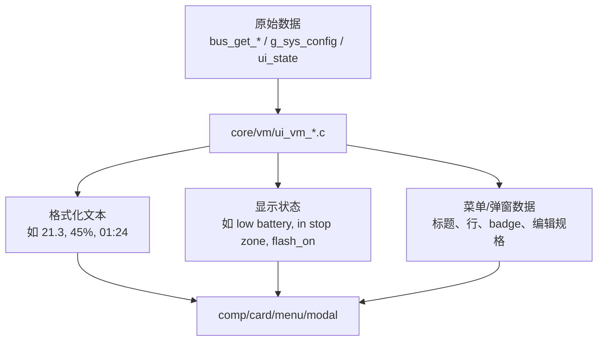

VM 层的好处：

| 没有 VM 时 | 有 VM 后 |
|---|---|
| 每个卡片自己读数据、自己格式化 | 统一格式化，卡片只负责显示 |
| 同一个值在不同地方显示格式可能不一致 | `ui_vm_value_text_update()` 统一文本规则 |
| Router 里塞满字符串拼接和 UI 细节 | Router 只决定刷新谁，VM 决定显示成什么 |
| 菜单、弹窗、组件各自理解业务状态 | 复杂状态先汇总成 VM，再交给视图 |

VM 不应该偷偷补业务默认值。GF 低/高、气体数量、菜单档位等可信内部数据应原样进入 VM；默认值属于初始化、设置表或外部输入解析层。确实为了绘制需要限制范围时，变量名必须说明它是绘制边界，例如 `draw_pct`、`line_pct`、`ui_battery_draw_pct()`。

常见 VM 文件：

| 文件 | 作用 |
|---|---|
| `core/vm/ui_vm_dashboard.*` | 仪表盘组件、罗盘、气体、DECO、SYS、NDL_STOP、升降速率、通用文本 |
| `core/vm/ui_vm_menu.*` | 顶层菜单、气体切换菜单、设置菜单、编辑规格、弹窗数据 |
| `core/vm/ui_vm_plan_chart.*` | PLAN 卡片轨迹和减压站曲线数据 |
| `core/vm/ui_vm_plan_view.*` | Dive Plan 子菜单页面的输入和结果 |
| `core/vm/ui_vm_system_view.*` | 子菜单容器、软件亮度、左侧辅助温度槽 |
| `core/vm/ui_vm_info.*` | 信息页显示模型 |

## 7. 屏幕对象树

当前屏幕不是一堆固定坐标控件，而是一个“安全区 + 左锚点 + 右 tileview + 覆盖层”的对象树。

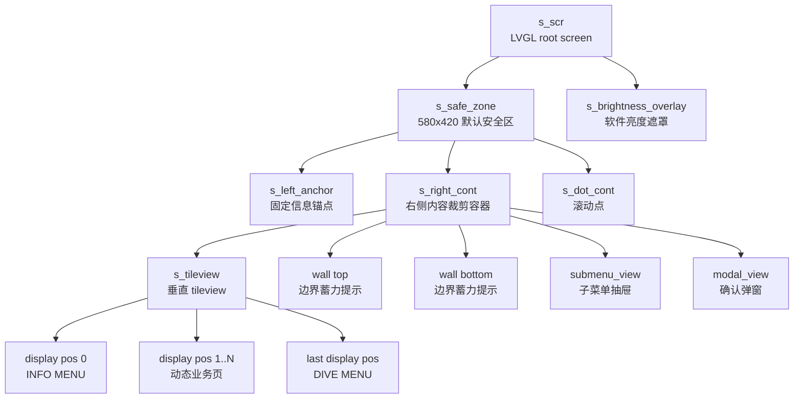

主要文件拆分：

| 文件 | 责任 |
|---|---|
| `screen/screen.c` | 屏幕门面、根对象、样式、导航、wall、菜单选中态、通用刷新入口 |
| `screen/screen_layout.c` | 左锚点、右面板、tileview 创建，布局重建和整页重建 |
| `screen/screen_dots.c` | 滚动点显示与高亮 |
| `screen/screen_edit.c` | 数值编辑态显示、提交、取消 |
| `screen/screen_overlay.c` | 软件亮度遮罩和 safe zone 获取 |
| `screen/layout_view.c` | 几何计算、固定栏实际坐标、自定义卡实际坐标、菜单行渲染辅助 |
| `screen/page_registry.c` | 页面注册表、显示位置和存储位置映射 |

## 8. 页面注册和动态顺序

右侧页面不直接按数组下标硬编码。`g_sys_config.card_order[]` 存“配置槽位”，`page_registry` 把它压缩成 tileview 的“显示位置”。

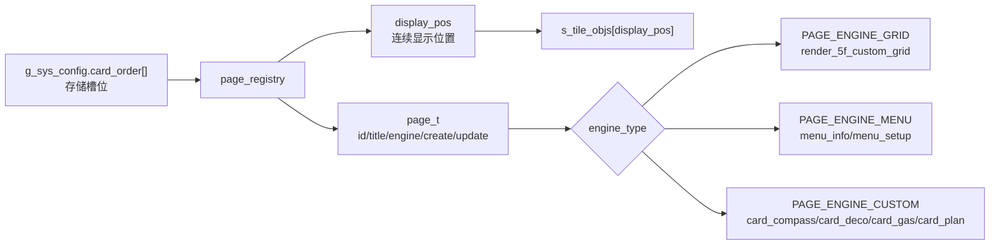

几个重要概念：

| 概念 | 含义 |
|---|---|
| `page_id_t` | 页面身份，如 `PAGE_ID_COMPASS`、`PAGE_ID_PLAN` |
| `storage_pos` | `card_order[]` 中的原始槽位，可能包含 `UNUSED` 或 `BLANK` |
| `display_pos` | tileview 中实际显示的连续序号 |
| `PAGE_POS_INFO` | INFO MENU 固定在首位 |
| `PAGE_POS_SETUP` | DIVE MENU 固定在配置末位，但显示位置会跟随动态页数量变化 |
| `custom_card_slot[]` | 某个 CUSTOM_GRID 槽位映射到哪一张 `custom_cards[]` |

因此，状态机和屏幕层需要查页面时应调用 `page_id_at(display_pos)`，不要直接拿 `display_pos` 当 `card_order[]` 下标。

## 9. 布局系统

当前布局分为 side 与 top/bottom 两类，APP/BLE 发送当前方向下的实际坐标，固件不再转置坐标。

```text
side 布局:
  safe zone 580x420，offset=(0,-10)
  固定栏 2列 x 7行
  自定义卡 5列 x 6行

top/bottom 布局:
  safe zone 560x420，offset=(0,-10)
  固定栏 7列 x 2行
  自定义卡 7列 x 4行

内部 panel_gap 默认 2U=20px，属于 safe zone 内部分区，不计入外边距。
```

固定栏仍使用历史字段 `left_widgets[]` 配置，但 0x02 协议下语义已经是“固定栏实际坐标”：

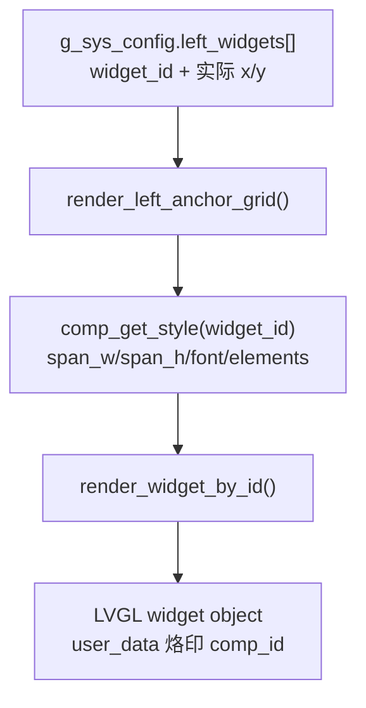

CUSTOM_GRID 使用 `custom_cards[].widgets[]` 配置，side 为 5x6，top/bottom 为 7x4：

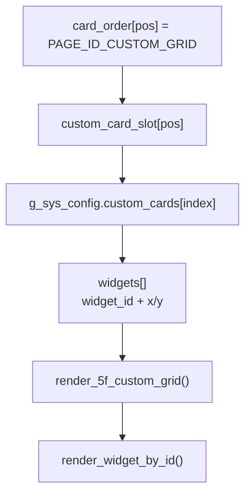

TCP 调试切换 `layout side/top/bottom` 时会先保存当前方向 archive，再恢复目标方向 archive；目标 archive 为空时加载该方向默认布局。这样 top/bottom 不会继续使用 side 的坐标。

布局和刷新是分开的。布局负责“这个 widget 放在哪里、尺寸多大”，刷新负责“这个 widget 显示什么数据”。

## 10. 组件系统

组件系统由三块组成：

| 模块 | 作用 |
|---|---|
| `comp_style.*` | 样式字典：组件 span、字体、标题、单位、元素掩码、特殊布局参数 |
| `comp_view.*` | 组件工厂：按 `comp_id_t` 创建 LVGL 对象并打 `user_data` 烙印 |
| `comp_update.*` | 组件刷新：按 `comp_id_t` 查找对象并写入 VM 格式化后的文本或专用状态 |

核心机制是“烙印”：

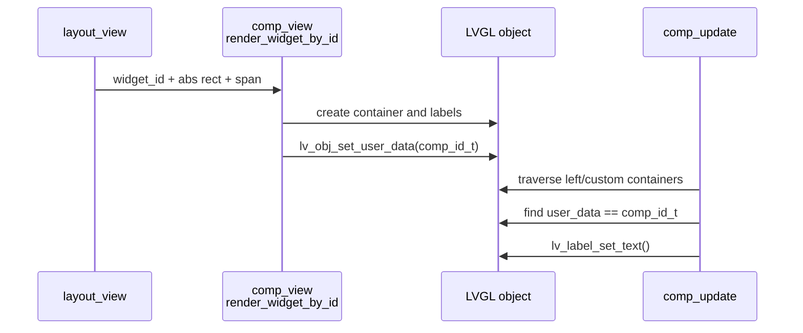

复杂组件有专门路径：

| 组件 | 特殊点 |
|---|---|
| `COMP_DEPTH_1612` | 大深度整数、小数、单位、升降速率图标分开排版 |
| `COMP_NDL_STOP_1606` | 同一个组件在 NDL、安全停留、减压停留三种状态间切换 |
| `COMP_TISSUE_RAW_4012` / `COMP_TISSUE_GF_4012` | 通过 LVGL draw callback 绘制 16 根组织柱 |
| `COMP_POD_0806` | 单模具复用，渲染顺序轮转成 POD1/POD2，并用 1033/2033 tag 区分 |
| `COMP_SYS_1606` | 电量和温度使用静态句柄快速刷新 |

## 11. 输入和 UI 状态机

PC 输入由 `hal_sim/input_pc.c` 转成三类事件：

```text
rotate(+1/-1)
click
back
```

状态机在 `core/ui_state.c`。

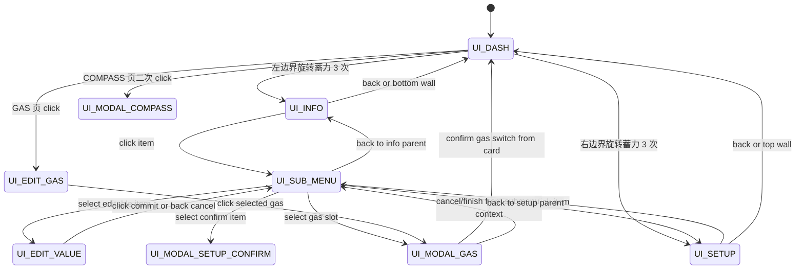

同一个输入在不同状态下含义不同：

| 状态 | rotate | click | back |
|---|---|---|---|
| `UI_DASH` | 翻动态页，边界蓄力进菜单 | 特定卡片动作，如 GAS/COMPASS | 通常无动作 |
| `UI_INFO` | 移动 INFO 菜单光标 | 打开信息子菜单 | 回 DASH |
| `UI_SETUP` | 移动 DIVE MENU 光标 | 打开设置子菜单 | 回 DASH |
| `UI_SUB_MENU` | 移动子菜单光标或 Dive Plan 内部编辑 | 执行 row action | 返回父级 |
| `UI_EDIT_VALUE` | 按 step 改数值 | 提交 | 取消 |
| `UI_MODAL_*` | 通常不动或 pulse | 确认 | 取消/关闭 |

## 12. 菜单系统

菜单分为四层：

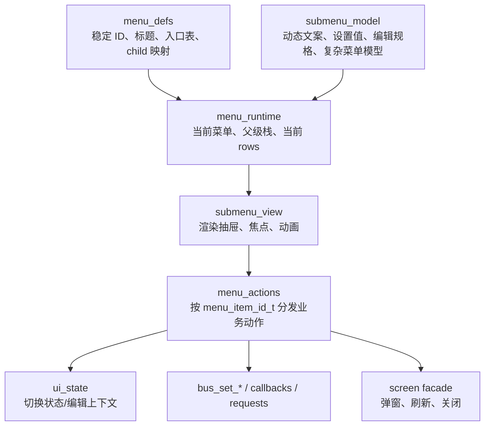

菜单选择路径禁止依赖字符串判断。显示字符串只用于 LVGL label；业务逻辑必须基于：

```text
menu_id_t
menu_item_id_t
menu_row_type_t
submenu_setting_kind_t
```

典型打开流程：

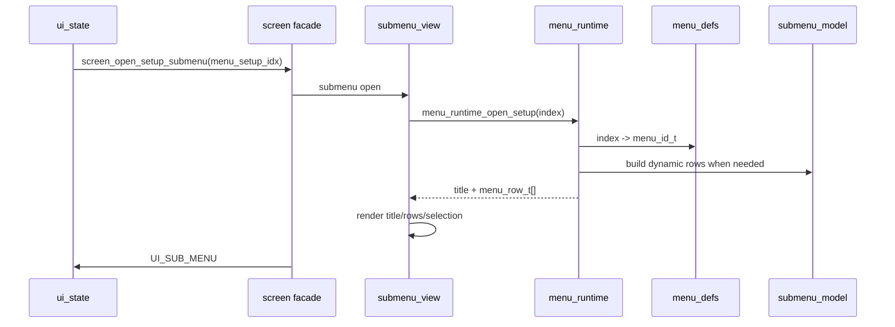

典型选择流程：

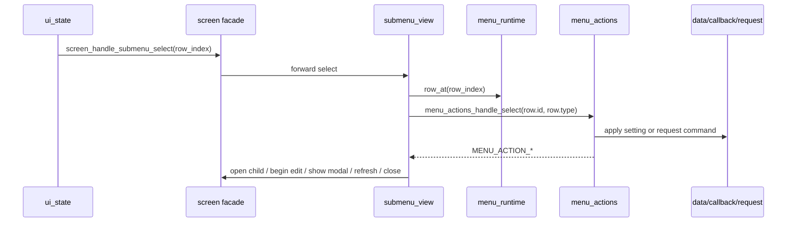

## 13. 告警系统

告警分为引擎和视图：

| 模块 | 责任 |
|---|---|
| `alarm/alarm.c` | 告警定义表、条件 active、横幅/原位确认状态、自动超时、横幅轮播 |
| `alarm/alarm_view.c` | 横幅创建、颜色/动画、目标组件反色闪烁/呼吸/稳定高亮、样式恢复 |

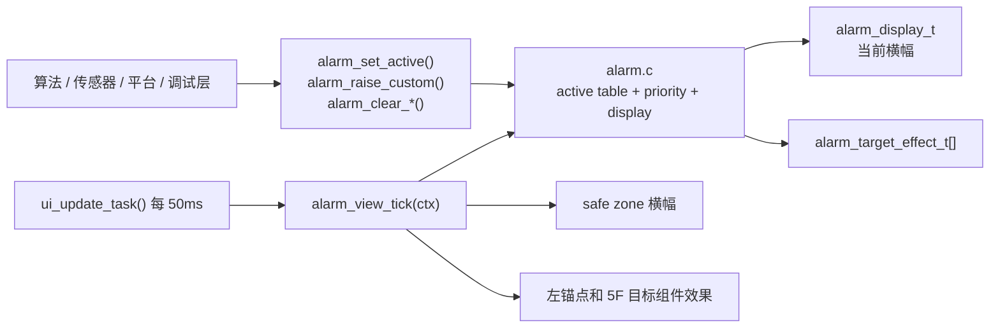

告警等级和策略：

| 等级 | 行为 |
|---|---|
| `ALARM_CRIT` | 横幅反色闪烁，目标模块反色闪烁；`back 2` 后隐藏横幅，目标模块保持稳定异常高亮，直到条件解除 |
| `ALARM_WARN` | 目标模块可见时不弹横幅，只在原位呼吸；目标不可见时弹 WARNING 横幅；`back 2` 后隐藏横幅并取消呼吸，直到条件解除 |
| `ALARM_INFO` | 普通通知静态显示 5s 后自动消失；`INFO_GAS_SWITCH` 是特殊交互提示，必须 `back 2` 确认 |

目标效果依赖组件创建时的 `user_data` 烙印。比如 `ALARM_ID_WARN_NDL_LOW` 的 target 是 `COMP_NDL_STOP_1606`，告警视图会在左侧锚点和当前可见 CUSTOM_GRID 容器中找这个 comp id，然后按等级应用闪烁、呼吸或稳定高亮。

## 14. PC 模拟器边界

PC 专用模块包括：

| 模块 | 作用 |
|---|---|
| `src/hal_sim/input_pc.*` | 键盘/旋钮输入模拟 |
| `src/hal_sim/sim_data.*` | 定时模拟传感器和潜水数据 |
| `src/hal_sim/debug_link_pc.*` | PC 调试链路 |
| `src/algo_sim/buhlmann_debug.*` | PC 侧 Buhlmann 调试算法后端 |

共享 UI/core 代码不能无保护地 include 这些模块。需要 PC 钩子时，应像当前 `ui_main.c` 和 `data.c` 一样：

```c
#ifdef PC_SIMULATOR
#include "hal_sim/input_pc.h"
#endif
```

DIVE PLAN 不是 PC-only。UI 侧应调用中性的 `dive_plan_backend_calculate()` 后端接口；PC 模拟可以由 `buhlmann_debug` 实现，嵌入式构建应替换为真实算法实现。

## 15. 例子 1：深度从算法层刷新到屏幕

假设算法或模拟器得到深度 `21.3m`。

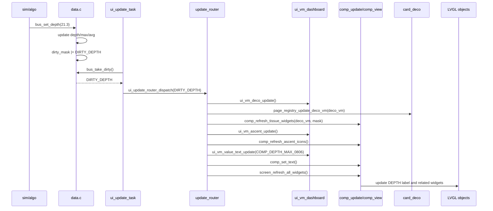

这条链路里没有任何模拟器代码直接碰 LVGL。数据写入和 UI 刷新通过 dirty mask 延迟解耦。

同一个 `deco_vm` 会同时驱动右侧 DECO 卡和 5F/左侧里的组织组件。这样 GF、GF99、SurfGF、CNS、OTU、组织柱不会出现“卡片读了一次 bus，组件又读了一次 bus”的双链路问题。

温度/电量这种简单文本走更短的链路：`DIRTY_TEMP` 或 `DIRTY_BATT` 到 router 后，只调用 `ui_vm_value_text_update()` 组装文本，再由 `comp_set_text()` 或 `comp_refresh_sys()` 更新 label。右下角系统栏的电量百分比会用 `ui_battery_draw_pct()` 限制在 0..100，只影响电池条/百分比绘制，不改变 bus 里的原始电量。

GF 设置变化时，数据入口仍是 `bus_set_gf_setting(low, high)`。router 消费 `DIRTY_GF_SETTING` 后刷新所有相关 widget；DECO 卡显示的 `gf_setting` 由 VM 直接使用 bus 值格式化，不再把 0 偷偷改成 40/85。

## 16. 例子 2：用户在 GAS 卡切换气体

流程不是“点一下立刻改气体”，而是先进入选择态，再二次确认。

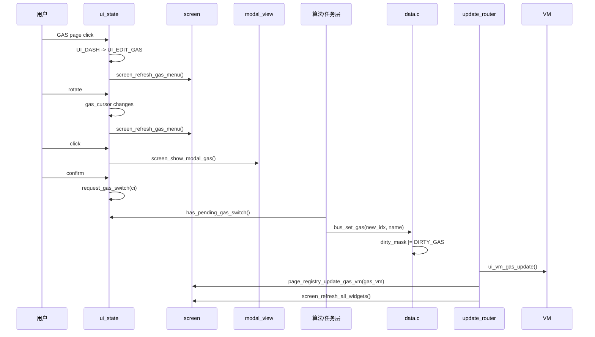

注意：UI 只提交“请求切到哪一路气体”。真正气体状态由算法/任务层执行后再通过 Data Bus 反向更新 UI。

## 17. 例子 3：APP/BLE 下发布局配置

假设 APP 下发新 `card_order[]`、固定栏 widget 或自定义卡 widget 配置。

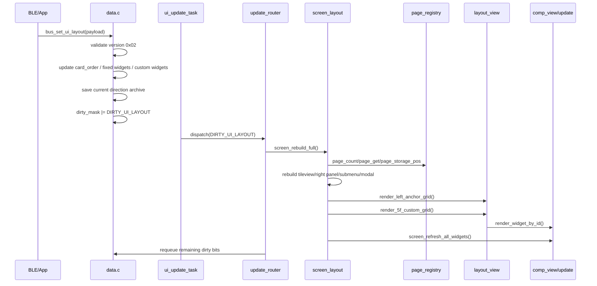

`DIRTY_UI_LAYOUT` 会优先处理，因为布局重建可能销毁旧 LVGL 对象。如果先刷新数据再重建，刷新路径可能访问已经失效的对象。

0x02 坐标例子：

```text
上固定栏第 2 列第 1 行：APP 直接发 x=2,y=1。
上下自定义卡第 6 列第 3 行：APP 直接发 c=6,r=3。
TCP 从 side 切到 top：恢复 top archive，不使用 side 坐标。
```

## 18. 例子 4：修改一个简单设置项

以亮度菜单为例，用户在 DIVE MENU 中进入 `BRIGHTNESS`，选择 `HIGH`。

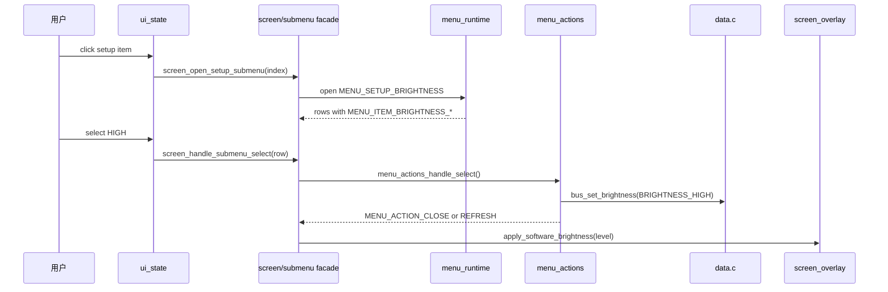

业务分发依据 `MENU_ITEM_BRIGHTNESS_HIGH`，不是 `"HIGH"` 这个显示字符串。

## 19. 例子 5：告警触发和确认

假设算法判断 PPO2 超限：

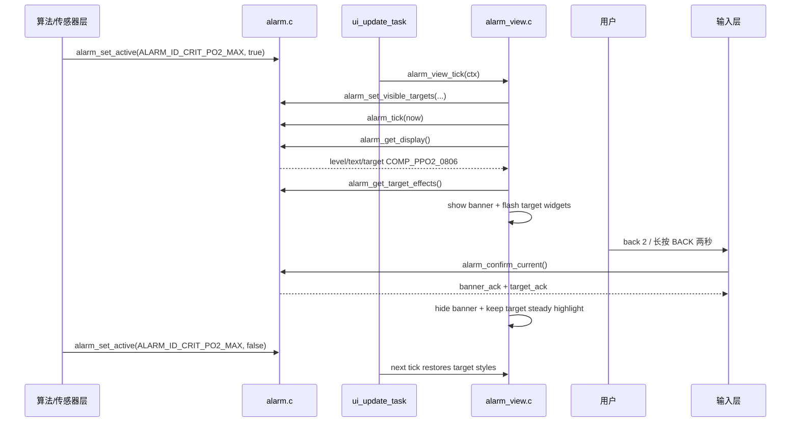

确认只影响视觉提示，不代表条件解除。普通 ENTER/BACK 不确认告警；PC 调试链路的 `back 2` 和真机长按 BACK 两秒应统一调用 `alarm_confirm_current()`。`INFO_GAS_SWITCH` 在该函数内读取推荐气体并提交 `request_gas_switch()`。

## 20. 改代码时的定位方法

| 目标 | 优先看哪里 |
|---|---|
| 程序怎么启动 | `main.c` -> `src/ui_main.c` -> `core/ui_engine.c` |
| 某个传感器值怎么显示 | `data.c bus_set_*` -> `update_router.c` -> `core/vm/*` -> `comp_update.c` |
| 固定栏怎么改 | `sys_config_defaults()` 的 `left_widgets[]`、`layout_view.c`、`comp_style.c` |
| 右侧新增卡片 | `cards/card_*.c`、`page_registry.c/h`、必要时 `ui_vm_*` |
| 调整页面顺序 | `g_sys_config.card_order[]` 和 `page_registry` 的 display/storage 映射 |
| 新增通用 widget | `comp_style_types.h`、`comp_style.c`、`comp_view.c`、`comp_update.c`、VM 文本 |
| 修改顶层 INFO/DIVE MENU | `menus/menu_info.c`、`menus/menu_setup.c` |
| 修改子菜单结构 | `views/menu_defs.c`、`views/menu_runtime.c` |
| 修改子菜单动作 | `views/menu_actions.c`、`views/submenu_model.c` |
| 修改数值编辑 | `screen/screen_edit.c`、`submenu_model.c`、`ui_vm_menu.c` |
| 修改告警事件 | `alarm/alarm.c/h` |
| 修改告警视觉 | `alarm/alarm_view.c/h` |
| 修改 PC 输入/模拟数据 | `src/hal_sim`，共享代码引用时加 `#ifdef PC_SIMULATOR` |

## 21. 两条最重要的维护边界

第一，数据边界：

```text
外部输入 -> bus_set_* -> dirty mask -> ui_update_task -> router -> VM -> view
```

不要让传感器、算法或 PC 模拟器直接操作 LVGL 对象。

第二，菜单边界：

```text
menu_id_t / menu_item_id_t / row type -> action
display string -> label only
```

不要用菜单标题或行文本做业务分发。文案以后可能改，ID 才是稳定协议。
