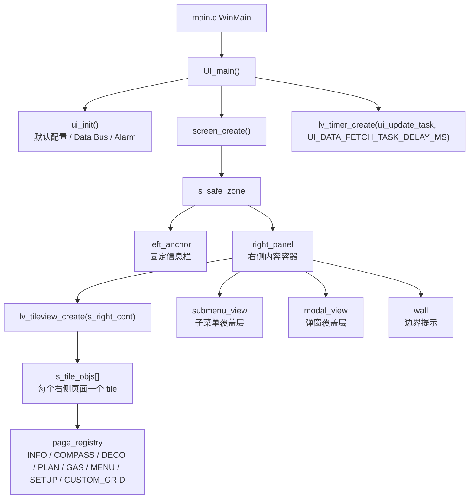
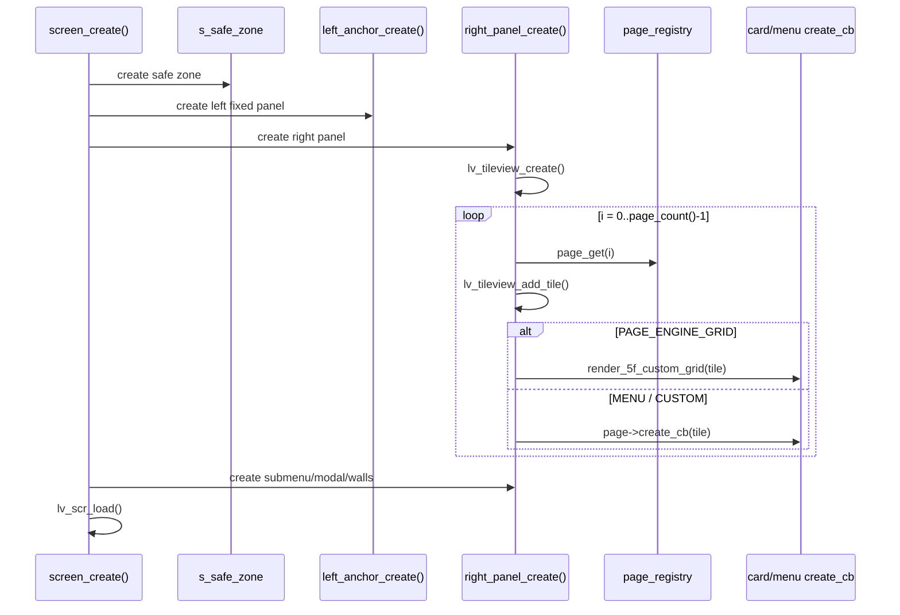
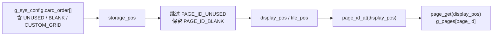
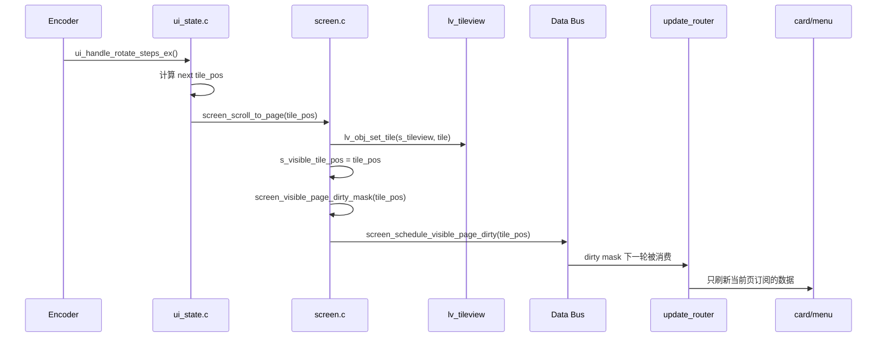
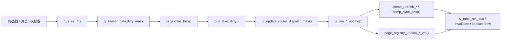

# LVGL 卡片切换与运行时刷新说明

本文说明当前 UI 在 LVGL 里的真实运行方式，重点回答两个问题：

- 右侧卡片切换是不是用 LVGL `tabview`？
- 切卡时到底是重绘、重建，还是像页面栈一样切换？

结论先说：当前右侧卡片使用的是 **LVGL `tileview`**，不是 `tabview`。卡片不是每次切换才创建，也不是典型“push/pop 页面栈”。系统在 `right_panel_create()` 阶段把右侧可见页对应的 tile 一次性创建出来，切换时调用 `lv_obj_set_tile()` 改变当前 tile；切到目标页后，再按该页订阅的 dirty mask 补一轮数据刷新。

## 总体结构



核心对象：

| 对象/模块 | 作用 |
|---|---|
| `s_right_cont` | 右侧内容总容器，承载 tileview、submenu、modal、wall。 |
| `s_tileview` | LVGL `tileview`，右侧卡片滑动容器。 |
| `s_tile_objs[]` | 每个 display page 对应的 tile 对象缓存。 |
| `page_registry.c` | 页面注册表，负责 display position -> page id -> create/update callback。 |
| `g_sys_config.card_order[]` | APP/配置下发的右侧动态卡片顺序。 |
| `ui_state.c` | 输入状态机，把旋钮/点击翻译成翻页、菜单移动、编辑等语义。 |
| `update_router.c` | dirty mask 消费者，决定本轮刷新哪些 VM、组件和卡片。 |

## 不是 TabView

当前代码没有用 `lv_tabview_create()` 或 LVGL tabview 控件来管理右侧卡片。右侧页创建代码在 `src/ui/screen/screen_layout.c`：

```c
s_tileview = lv_tileview_create(s_right_cont);
...
lv_obj_t *tile = lv_tileview_add_tile(s_tileview, 0, i, LV_DIR_TOP | LV_DIR_BOTTOM);
```

切页代码在 `src/ui/screen/screen.c`：

```c
lv_obj_set_tile(s_tileview, tile, TILE_ANIM_ENABLED ? LV_ANIM_ON : LV_ANIM_OFF);
```

所以它更像一个纵向 tile 列表：每张卡片是 tileview 里的一个 tile，旋钮切换时把 tileview 移到目标 tile。

## 也不是页面栈

它不是典型的页面栈：

- 没有每次进入页面时 `create`，退出时 `delete`。
- 没有 `push page` / `pop page` 的堆栈模型。
- 大多数右侧 tile 在 `right_panel_create()` 时已经创建。
- 切页时优先复用已经存在的 tile 和里面的 LVGL 对象。

真正会大量销毁/重建的是 `screen_rebuild_tileview()`，它会删除整个 `s_right_cont`，再重建 tileview、submenu、modal、wall。这是重操作，只用于页面顺序、页面数量、页面类型变化等结构级变化。

## 页面创建流程

`screen_create()` 负责整屏对象树初始化：



页面来源在 `src/ui/screen/page_registry.c`。注册表里每个页面有：

- `id`
- `title`
- `engine_type`
- `tile_obj`
- `create_cb`
- `update_cb`
- `update_vm_cb`

例如：

| Page ID | engine | 创建方式 |
|---|---|---|
| `PAGE_ID_INFO` | `PAGE_ENGINE_MENU` | `menu_info_create(tile)` |
| `PAGE_ID_COMPASS` | `PAGE_ENGINE_CUSTOM` | `card_compass_create(tile)` |
| `PAGE_ID_DECO` | `PAGE_ENGINE_CUSTOM` | `card_deco_create(tile)` |
| `PAGE_ID_PLAN` | `PAGE_ENGINE_CUSTOM` | `card_plan_create(tile)` |
| `PAGE_ID_GAS` | `PAGE_ENGINE_CUSTOM` | `card_gas_create(tile)` |
| `PAGE_ID_CUSTOM_GRID` | `PAGE_ENGINE_GRID` | `render_5f_custom_grid(tile, ...)` |
| `PAGE_ID_MENU` | `PAGE_ENGINE_CUSTOM` | `menu_entry_create(tile)` |
| `PAGE_ID_SETUP` | `PAGE_ENGINE_MENU` | `menu_setup_create(tile)` |

## 页面顺序：storage_pos 和 display_pos

右侧页面有两个位置概念，不能混用：

| 名称 | 含义 |
|---|---|
| `storage_pos` | `g_sys_config.card_order[]` 里的原始槽位。 |
| `display_pos` / `tile_pos` | tileview 当前真正显示出来的连续页序号。 |

原因是 `PAGE_ID_UNUSED` 会被跳过，不占显示页；`PAGE_ID_BLANK` 是有效空白卡，会占一个 tile。`page_registry.c` 负责把两者映射起来：



`page_count()` 返回当前 tileview 要创建的总页数：

- `INFO`
- 动态卡片区
- 合成的 `MENU` 入口页
- 真正的 `DIVE MENU` / `SETUP` 页

## 切卡流程

DASH 状态下旋钮会触发 `ui_handle_rotate_steps_ex()`。它计算下一页，然后调用 `ui_schedule_dash_page()`。普通情况下最终会走到：

```c
screen_scroll_to_page(tile_pos);
```

核心切页流程：



关键点：

- `lv_obj_set_tile()` 负责视觉切换。
- `screen_scroll_to_page()` 会记录 `s_visible_tile_pos`。
- 切到页面后不会默认刷新所有页面，只会给当前页补对应 dirty。
- 如果目标页是 `PAGE_ID_MENU`，会立即 `menu_entry_update()`。
- 如果目标页是 `PAGE_ID_COMPASS`，会立即 `card_compass_refresh_heading(true)`，避免罗盘页刚进入时航向滞后。

## 快速旋转优化

为了减轻芯片压力，DASH 快速旋转启用了合并窗口：

| 配置 | 作用 |
|---|---|
| `UI_DASH_ROTATE_COALESCE_ENABLED` | 开启 DASH 旋转合并。 |
| `UI_DASH_ROTATE_COALESCE_WINDOW_MS` | 合并窗口时间。 |
| `UI_DASH_ROTATE_DELAYED_DISPLAY_ENABLED` | 快速多步旋转时先做轻量预览。 |
| `UI_DASH_ROTATE_DEFER_MIN_STEPS` | 达到多少步开始延后完整提交。 |

快速旋转中的中间页走：

```c
screen_scroll_to_page_preview(tile_pos);
```

它只做：

- `lv_obj_set_tile()`
- 更新 dots
- 记录 `s_preview_tile_pos`

它不做：

- 不更新 `s_visible_tile_pos`
- 不补 dirty
- 不刷新当前页 VM
- 不触发卡片数据更新

等旋钮停顿后，`ui_state_poll_deferred_navigation()` 会触发最终落页：

```c
screen_scroll_to_page(tile_pos);
```

这时才补当前页 dirty。这个设计的目的就是避免旋钮快速经过多个重页面时，把 DECO/PLAN/LOGBOOK/组件刷新都塞进 LVGL handler。

## Dirty 刷新链路

数据更新不是直接操作 LVGL 对象。上游只通过 `bus_set_*()` 写数据并打 dirty bit。



`update_router.c` 会先计算当前可见上下文：

- 当前可见 tile：`screen_visible_tile_pos_get()`
- 当前 page id：`page_id_at(tile_pos)`
- 当前可见左侧组件
- 当前可见 5F 自定义卡组件

然后通过订阅裁剪 dirty：

```c
mask &= ui_router_subscription_mask(&visible_ctx);
```

这意味着不可见页通常不会被刷新。比如：

| 当前可见页 | 额外订阅 dirty |
|---|---|
| `PAGE_ID_COMPASS` | `DIRTY_COMPASS` |
| `PAGE_ID_DECO` | `DIRTY_DIVE_PROFILE / DIRTY_DECO_STATUS / DIRTY_TISSUE_TOX / DIRTY_DIVE_CONFIG` |
| `PAGE_ID_GAS` | `DIRTY_GAS_SUPPLY` |
| `PAGE_ID_PLAN` | `DIRTY_PLAN` |
| `PAGE_ID_CUSTOM_GRID` | 当前自定义卡里可见组件对应 dirty |
| `PAGE_ID_INFO / PAGE_ID_SETUP` | `DIRTY_INFO_REFRESH_MASK` |
| `PAGE_ID_MENU` | 不额外补 `DIRTY_INFO_REFRESH_MASK`，只做轻量入口页更新 |

## 切页时不是整页重绘

普通切页不是“把所有卡片重绘一遍”。实际过程更克制：

1. `lv_obj_set_tile()` 切到目标 tile。
2. 如果该 tile 的 layout generation 过期，只对该 tile `lv_obj_update_layout(tile)`。
3. 调 `screen_visible_page_dirty_mask(tile_pos)` 得到目标页需要的数据域。
4. `screen_schedule_visible_page_dirty(tile_pos)` 把这些 dirty 重新排队。
5. 下一轮 router 只刷新当前页订阅内容。

所以普通切页成本主要来自：

- LVGL tileview 切换/动画
- 目标页首帧补数据
- 目标页内部对象的 invalidate 和 draw callback

不是每次切页都销毁对象树。

## 什么时候会真正重建对象树

### `screen_rebuild_layout()`

轻一些。只重建空间关系和组件挂载，不重建右侧页面集合。

适用场景：

- safe zone 变化
- 左右/上下布局变化
- 左侧固定栏 widget 变化
- 5F 自定义网格位置变化

它会：

- 标记 layout generation
- 清组件句柄数组
- clean/rebuild 左侧 anchor
- rebuild 5F grid
- 全量同步左侧组件
- 只给当前可见页补 dirty

### `screen_rebuild_tileview()`

重很多。会删除并重建整个右侧容器。

适用场景：

- 页面顺序变化
- 页面数量变化
- 页面类型变化
- card_order 结构级变化

它会：

- 清空 `s_tile_objs`
- 清空 `page->tile_obj`
- `lv_obj_del(s_right_cont)`
- 让 `s_tileview = NULL`
- 重建 `right_panel_create()`
- 重建 wall/submenu/modal
- 尝试恢复用户之前所在页面和菜单上下文

这是芯片上最容易造成压力的路径之一。

## 为什么芯片上压力会大

虽然切页本身用了 tileview 复用对象，但当前系统仍可能在这些地方产生压力：

1. **启动和 tileview 重建会创建大量对象**  
   `right_panel_create()` 会按 `page_count()` 创建所有 tile，并调用各页 `create_cb()`。如果页面多、5F 自定义组件多，对象数会很快上去。

2. **右侧页面虽然离屏不刷新，但对象仍存在**  
   tileview 内所有 tile 对象常驻。好处是切换快；代价是内存和 LVGL 对象树更大。

3. **重页面的 draw callback 成本高**  
   PLAN 轨迹、DECO 组织图、罗盘卷尺/指针、组织柱等都可能触发绘制。当前已有签名缓存和可见性裁剪，但芯片上仍比 PC 模拟器敏感。

4. **`lv_obj_clean()` / `lv_obj_del()` 成本高**  
   子菜单、Logbook、tileview 重建时会删除或重建对象树。这类操作在 PC 上看不明显，在芯片上可能造成明显卡顿。

5. **动画会增加 handler 压力**  
   `TILE_ANIM_ENABLED` 为开时，tileview 切换会走 LVGL 动画。动画期间如果同时有大面积 invalidate，帧时间会上升。

6. **dirty 频率和 UI handler 同时竞争**  
   高频传感器/模拟数据、告警闪烁、旋钮输入、tile 动画如果集中到同一时间窗口，会形成峰值。

## 当前已经做过的减压设计

| 机制 | 目的 |
|---|---|
| `screen_scroll_to_page_preview()` | 快速旋转中间页只做视觉预览，不补 dirty。 |
| `ui_state_dash_navigation_pending()` | DASH 合并窗口内推迟普通业务 dirty。 |
| `ui_router_subscription_mask()` | 只刷新当前可见页和当前可见组件订阅的 dirty。 |
| `screen_visible_page_dirty_mask()` | 切入目标页时只补目标页需要的数据域。 |
| `screen_obj_refresh_visible()` | 组件动画/刷新前确认对象属于当前可见 tile 或左侧固定栏。 |
| `s_tile_layout_generation[]` | layout generation 没变时不重复更新同页 layout。 |
| `s_tile_dirty_generation[]` | 同页重复跳转时不重复补 dirty。 |
| PLAN/DECO/TISSUE render signature | 图形像素没变化时避免重复 invalidate。 |

## 如果继续优化，可以优先看这些方向

1. **减少 tileview 常驻页面对象数**  
   当前是预创建所有 tile。可以考虑只常驻当前页、上一页、下一页，远端页延迟创建或释放。但这会增加页面生命周期复杂度。

2. **关闭或缩短 tile 动画**  
   如果芯片上动画期间明显掉帧，先检查 `TILE_ANIM_ENABLED`。关动画能快速验证瓶颈是不是动画 + 重绘叠加。

3. **把重页面拆成静态层 + 动态层**  
   PLAN/DECO/COMPASS 可把背景刻度、边框、标题等静态内容和动态曲线/指针分开，动态时只 invalidate 小区域。

4. **减少 `lv_obj_clean()` 的使用频率**  
   菜单和 Logbook 可以更多复用 row 对象，只更新 label 文本和 hidden 状态。

5. **为芯片建对象数/绘制耗时统计**  
   PC 上“流畅”不代表芯片上 `lv_task_handler()` 峰值低。建议统计每轮 handler 时间、对象数量、draw callback 耗时和 dirty mask。

6. **检查屏幕驱动 flush 面积**  
   即使 LVGL 对象刷新少，如果底层 flush 总是大面积刷屏，芯片压力仍会很大。

## 一句话模型

当前 UI 是：

```text
Data Bus dirty 驱动刷新
+ 右侧 LVGL tileview 预创建页面
+ 旋钮用 lv_obj_set_tile 切换可见 tile
+ update_router 只刷新当前可见页/组件
+ 结构变化时才删除并重建整个右侧 tileview
```

它不是 tabview，也不是传统页面栈。它的核心优势是切页复用对象、状态稳定；核心成本是 tile 对象常驻、结构级重建很重、复杂页面 draw callback 在芯片上容易形成峰值。
