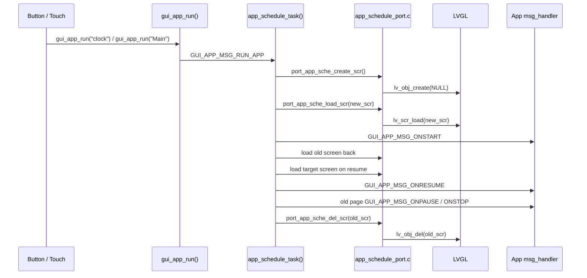
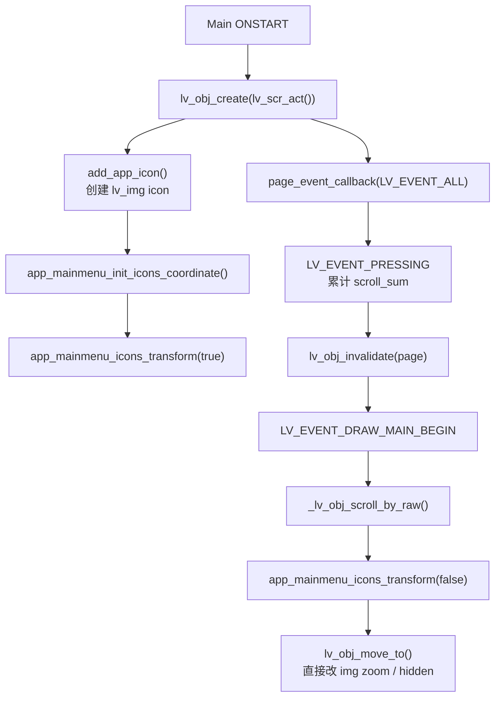
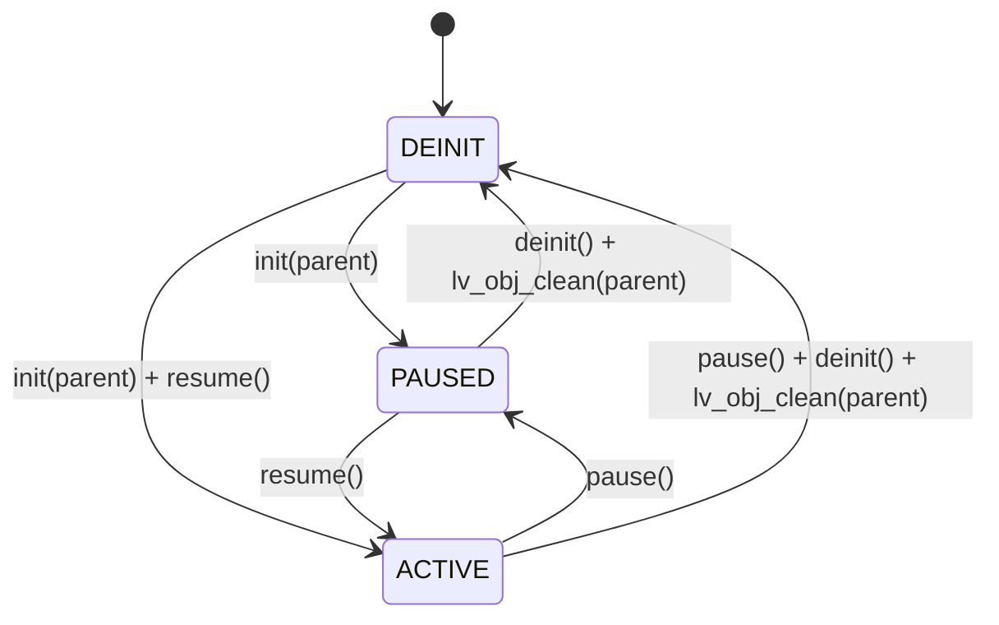
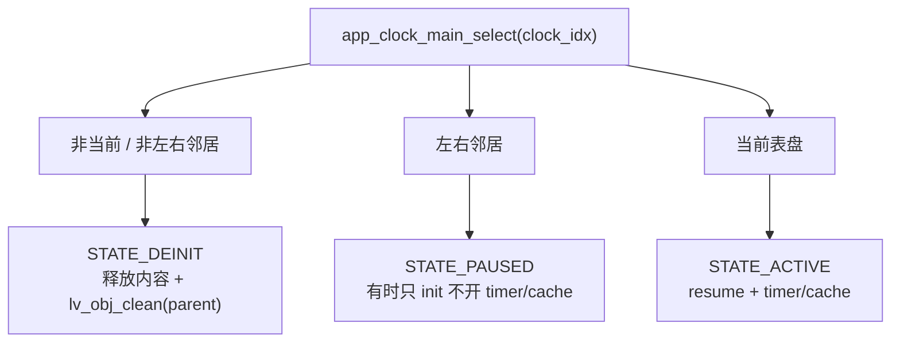
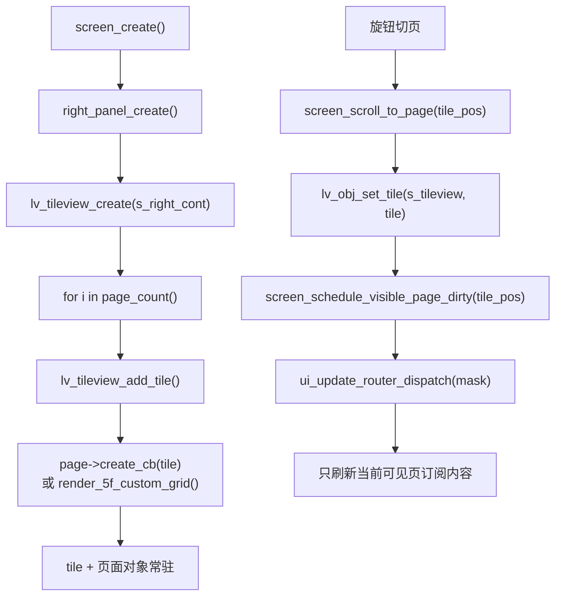
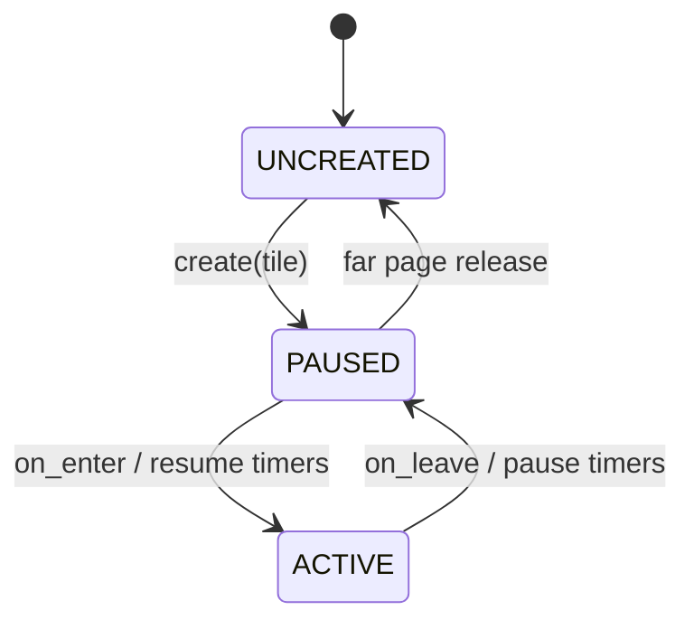

# SF32 官方 Watch 例程与当前潜水电脑 UI 的 LVGL 对比

本文只对比官方 watch 例程里的 LVGL UI 组织方式，不讨论潜水算法、传感器、业务协议。

官方例程路径：

```text
E:\JBD013_lvgl_spi_V0.5\SF32_JBD013_LVGL_2\SF32_JBD013_LVGL\SF32_SDK_Test\example\multimedia\lvgl\watch
```

当前项目路径：

```text
E:\UI\lv_port_win_codeblocks-release-v8.3_hasGroup
```

## 先给结论

官方 watch 例程并不是因为“LVGL 本身随便写都很快”才流畅。它的关键是：

- 用 `gui_app_fwk` 把每个 app 拆成独立 screen 生命周期。
- app 切换时通过 `lv_scr_load()` 加载目标 screen，并配合 `ONSTART / ONRESUME / ONPAUSE / ONSTOP` 做资源开关。
- 表盘内部虽然也用了 `lv_tileview`，但 tile 里真正重的表盘内容会按当前页、邻近页做 `ACTIVE / PAUSED / DEINIT` 管理。
- 动画和旋转图片会把图片复制到 SRAM/PSRAM cache，离开页面时释放。
- 页面暂停时删除 `lv_timer`，不让不可见页面继续刷新。
- SDK 工程配置启用了图形加速、EZIP 图片、图片 cache、行缓冲等硬件相关能力。

我们当前 UI 的右侧卡片也是 `lv_tileview`，不是 `tabview`。但我们更偏“一个大 screen + 右侧 tile 全量预创建 + dirty 裁剪刷新”。这个结构切页稳定，业务状态简单；代价是右侧对象树常驻、重页面 draw callback 常驻在对象树里，结构级重建和复杂图形首帧容易形成芯片峰值。

## 官方 Watch 总体流程

官方入口在：

- `src/gui_apps/watch_demo.c`
- `src/gui_apps/main/app_mainmenu.c`
- `src/gui_apps/clock/app_clock_main.c`
- `src/gui_apps/clock/app_clock_simple.c`
- `src/gui_apps/clock/app_clock_dial.c`
- `src/gui_apps/clock/app_clock_rotate_bg.c`
- `src/gui_apps/mem/app_mem.c`

核心启动链路：

```mermaid
flowchart TD
    WatchThread["app_watch_entry()"] --> LVInit["littlevgl2rtt_init(LCD_DEVICE_NAME)"]
    LVInit --> DataPool["lv_ex_data_pool_init()"]
    DataPool --> Resource["resource_init()"]
    Resource --> FreeType["lv_freetype_open_font(true)"]
    FreeType --> AppFwk["gui_app_init()"]
    AppFwk --> RunMain["gui_app_run(\"Main\")"]
    RunMain --> MainMenu["Main app ONSTART<br/>app_mainmenu_ui_init()"]
    WatchThread --> Loop["while(1): lv_timer_handler()"]
    Loop --> Sleep["rt_thread_mdelay(ms)"]
```

它不是固定死循环硬刷，而是每轮调用 `lv_timer_handler()` 后按 LVGL 返回的下一次到期时间 `ms` 休眠。省电模式下还会 `lv_timer_enable(false)` 暂停 LVGL timer。

## 官方 App 切换方式

官方 watch 的 app 切换不是 `tabview`，也不是直接把所有 app 都放进同一个 permanent 容器。它依赖 `gui_app_fwk`：



也就是说，官方的一级 app 页面是 screen 级生命周期。每个 app 在 `ONSTART` 里创建自己的 UI，在 `ONPAUSE` 停掉活动，在 `ONSTOP` 后 screen 会被删除。

这点和我们差异很大：我们当前是 `screen_create()` 后长期运行一个 LVGL screen，右侧卡片在同一个 screen 的 `s_tileview` 下切换。

## 官方主菜单

官方蜂窝主菜单在 `app_mainmenu.c`，核心不是 tileview/tabview，而是一个可滚动 `lv_obj` 加很多 `lv_img` icon：



它为了顺滑做了几个比较激进的点：

| 点 | 官方做法 | 含义 |
|---|---|---|
| 滚动 | 按输入累计 `scroll_sum`，在 draw begin 阶段一次处理 | 输入事件不立刻重排全部 icon，合到绘制阶段 |
| icon 变换 | 自己算蜂窝坐标、半径、缩放 | 避免复杂 layout 系统介入 |
| 属性设置 | 直接改 `lv_img_t->zoom`、`obj->flags`，再 `lv_obj_move_to()` | 少走一部分通用 API 成本，偏性能写法 |
| 可见裁剪 | 超出区域的 icon 直接 hidden 或半径为 0 | 不让离屏 icon 参与绘制 |
| 点击进 app | `gui_app_run(cmd)` | 交给 app framework 切 screen |

这类写法不是普通应用层 LVGL 风格，而是明显针对芯片性能调过。

## 官方表盘 Tileview

官方表盘 app 在 `app_clock_main.c`。它内部用了 `lv_tileview` 横向切换不同表盘：

```c
tileview = lv_tileview_create(lv_scr_act());
page = lv_tileview_add_tile(tileview, i, 0, LV_DIR_HOR);
lv_obj_set_tile_id(tileview, last_active_clock_bak, 0, false);
```

但是它的 tileview 和我们当前右侧卡片有一个关键区别：官方只先创建 tile 容器，把每个表盘的 `parent` 指向对应 tile；真正重的表盘内容由状态机决定什么时候 `init / pause / resume / deinit`。



切到某个表盘时，`app_clock_main_select(clock_idx)` 做三件事：



所以官方表盘不是“所有表盘都常驻刷新”。它更像：

- tile 容器常驻；
- 当前表盘 active；
- 邻近表盘可预热；
- 远端表盘 deinit；
- 离开表盘 app 时全部 deinit。

## 官方动态图像与 Timer 管理

官方表盘里，重资源基本都跟页面状态绑定。

以 `app_clock_simple.c` 和 `app_clock_dial.c` 为例：

| 生命周期 | 动作 |
|---|---|
| `init(parent)` | 创建背景和指针 `lv_img` 对象。 |
| `resume()` | 把旋转指针图片复制到 `ROTATE_MEM`，创建 `lv_timer_create(..., 30, ...)`。 |
| `pause()` | `lv_timer_del()`，释放指针图片 cache，把图片 src 恢复到 flash 资源。 |
| `deinit()` | 释放上下文结构，父 tile 由 manager `lv_obj_clean(parent)` 清空。 |

`app_clock_rotate_bg.c` 也类似：进入 active 才 cache 背景图，pause 时释放 cache，并把角度和 zoom 复位。

这和我们当前卡片的区别非常实际：我们虽然做了 dirty 裁剪，但很多页面对象和 draw callback 仍长期存在；官方更倾向于让非当前重页面直接失活或清空。

## 官方资源配置

官方 watch 的 `project/proj.conf` 里有这些和流畅度直接相关的配置：

| 配置 | 作用 |
|---|---|
| `CONFIG_DRV_EPIC_NEW_API=y` | 启用芯片图形加速相关路径。 |
| `CONFIG_LV_INDEV_DEF_READ_PERIOD=16` | 输入读取周期偏高频，触摸手感更细。 |
| `CONFIG_LV_IMG_CACHE_DEF_SIZE=16` | LVGL 图片 cache。 |
| `CONFIG_LV_USE_EZIP=y` | 使用 EZIP 图片资源。 |
| `CONFIG_LV_FB_TWO_NOT_SCREEN_SIZE=y` | 双 framebuffer，但不是整屏大小。 |
| `CONFIG_LV_FB_LINE_NUM=50` | framebuffer 行数，偏向分块刷新。 |
| `CONFIG_ROTATE_MEM_IN_SRAM=y` | 旋转图像缓存优先放 SRAM。 |
| `CONFIG_IMAGE_CACHE_IN_PSRAM_SIZE=1100000` | 给图片/动画 cache 留 PSRAM。 |
| `CONFIG_IMAGE_CACHE_IN_SRAM_SIZE=50000` | 给热点图片 cache 留 SRAM。 |

这说明官方例程的“苹果手表效果”不是单纯 LVGL widget 写法，而是 LVGL + 资源格式 + cache + framebuffer + GPU/EPIC 的组合。

## 我们当前 UI 的做法

我们当前右侧卡片逻辑在：

- `src/ui/screen/screen_layout.c`
- `src/ui/screen/screen.c`
- `src/ui/screen/page_registry.c`
- `src/ui/core/ui_state.c`
- `src/ui/core/update_router.c`
- `src/ui/core/ui_engine.c`

当前结构：



已经有的优化：

| 机制 | 作用 |
|---|---|
| `TILE_ANIM_ENABLED 0` | 默认关闭 tileview 动画。 |
| `APP_UI_UPDATE_TIMER_DELAY_MS 100U` | UI dirty 消费 timer 周期 100ms。 |
| `screen_scroll_to_page_preview()` | 快速旋转中间页只预览，不补 dirty。 |
| `UI_DASH_ROTATE_COALESCE_WINDOW_MS 80U` | DASH 旋钮合并窗口。 |
| `ui_router_subscription_mask()` | 只刷新当前可见页/组件订阅 dirty。 |
| `screen_visible_page_dirty_mask()` | 切入页面时只补该页面需要的数据域。 |
| PLAN/DECO/TISSUE render signature | 图形内容没变时避免重复 invalidate。 |

这些方向是对的，但它和官方最大的差别仍在对象生命周期。

## 关键差异表

| 维度 | 官方 watch | 当前潜水电脑 UI |
|---|---|---|
| 一级页面模型 | `gui_app_fwk` 管理多个 LVGL screen。 | 一个主 screen 长期运行。 |
| app 切换 | `gui_app_run()` -> scheduler -> `lv_scr_load()`。 | UI state 切换，主要在同一对象树内变化。 |
| 卡片/表盘切换 | 表盘内部用 `lv_tileview`。 | 右侧卡片用 `lv_tileview`。 |
| tile 内容创建 | tile 容器先创建，重内容按 active/pause/deinit 管。 | `right_panel_create()` 基本一次创建所有右侧页内容。 |
| 不可见页面 | 非当前/非邻近表盘可 `deinit + lv_obj_clean()`。 | 不可见页通常不刷新，但对象仍常驻。 |
| timer 生命周期 | 页面 `resume` 创建 timer，`pause` 删除 timer。 | 全局 dirty timer 常驻；个别卡片内部 timer 需各自控制。 |
| 重图片 | active 时复制到 SRAM/PSRAM cache，pause 释放。 | 主要是 LVGL 对象/绘制；当前项目图片 cache 策略不是右侧卡片生命周期核心。 |
| 动画 | app framework 可用转场 buffer/snapshot 类策略。 | tileview 切换默认无动画；复杂页首帧补刷仍可能重。 |
| 主菜单性能 | 手写蜂窝 transform，draw begin 合并滚动。 | 菜单/组件更通用，存在 rebuild/clean 路径。 |
| 硬件配置 | 明确启用 EPIC/EZIP/image cache/line framebuffer。 | PC simulator 配置与实际芯片配置需要另行对齐。 |

## 为什么我们会觉得压力大

从这次对比看，原因更可能不是“我们用了 tileview，所以卡”。官方表盘也用了 `lv_tileview`。

真正差异在这里：

1. **我们把更多复杂页面内容常驻在一个大对象树里**  
   官方表盘 tile 常驻，但远端表盘内容会 deinit。我们右侧 DECO、PLAN、GAS、MENU、SETUP、CUSTOM 等页面在 tileview 创建时基本都建好。

2. **我们对不可见页主要是不刷新，不是释放**  
   dirty 裁剪能降低持续刷新成本，但不能降低对象树遍历、内存占用、首次切入补刷、layout/invalidate 峰值。

3. **我们的重页面是实时绘制型**  
   PLAN trace、DECO profile、tissue、compass 等更像动态仪表图。官方 watch 很多效果是图片旋转/缩放，配合 cache 和硬件路径更容易跑满。

4. **官方重资源严格绑定 active 状态**  
   timer、旋转 cache、动态图像资源在 `pause()` 里释放。我们如果有内部 timer 或动画，必须逐页检查是否在不可见时还工作。

5. **官方转场可能不是 live object tree 全量动**  
   app framework 有专门 transition animation buffer。我们当前 tileview 切换虽然默认无动画，但如果页面首帧补刷很重，还是会在切页时集中爆发。

6. **官方工程配置已经按芯片路径配置过**  
   EPIC、EZIP、image cache、line framebuffer 这些都很关键。PC 上模拟流畅不能说明实际 flush、cache、图片解码路径也合理。

## 可以借鉴的优化方向

### 1. 给右侧重卡片加生命周期

可以保留现在的 `page_registry`，但给重页面加状态：



优先对象：

- `PAGE_ID_PLAN`
- `PAGE_ID_DECO`
- `PAGE_ID_COMPASS`
- `PAGE_ID_CUSTOM_GRID` 中包含重组件的情况
- Logbook / submenu 详情页

不要一上来全量改。可以先让 `PLAN` 和 `DECO` 做“当前页 active，离开页 pause，远端页 deinit”，验证芯片峰值。

### 2. 学官方的 current + neighbor 策略

官方表盘的策略很适合我们右侧卡片：

| 距当前页距离 | 建议状态 |
|---|---|
| 当前页 | `ACTIVE`，允许 timer、动画、首帧补刷。 |
| 上一页/下一页 | `PAUSED`，可保留基础对象，停 timer，不做动态图。 |
| 更远页 | `DEINIT` 或只保留空 tile。 |

这样能保持旋钮切换手感，又不会让所有重页面长期压在对象树上。

### 3. 把 PLAN/DECO 拆静态层和动态层

官方大量使用图片资源和 cache。我们可以把重图形拆成：

- 静态背景：刻度、网格、标题、边框，尽量缓存成 canvas 或图片。
- 动态层：曲线、当前点、stop label、组织柱等，只 invalidate 小区域。

尤其 `DIVE PLAN TRACK`、`DECO` 和 tissue 类页面，收益会比继续微调 label 更新大。

### 4. 逐页审计 timer

官方页面 `pause()` 会 `lv_timer_del()`。我们也应该确保：

- 离开 compass 页后罗盘动画 timer 不继续跑。
- 离开 tissue/deco 后 blink/flash timer 不继续 invalidate。
- modal/logbook 的延迟加载 timer 在关闭时取消。
- 快速旋转预览期间不触发重页面业务刷新。

### 5. 避免潜水中触发 `screen_rebuild_tileview()`

官方 app 切 screen 是明确生命周期操作；我们 `screen_rebuild_tileview()` 是右侧对象树重建，芯片上很可能是峰值。建议把 card_order、页面类型变化这类结构级操作尽量限制在 setup 或非潜水状态。

### 6. 对齐芯片 LVGL 配置

需要确认嵌入式工程有没有类似官方这些配置：

- 图形加速路径是否启用。
- 图片/字体 cache 是否足够。
- framebuffer 是整屏、双缓冲、还是行缓冲。
- flush 面积是否真的按 LVGL invalid area 刷，而不是每帧全屏刷。
- LVGL color depth、字体渲染、图片格式是否和官方推荐一致。

## 推荐的下一步验证

最值得做的不是立刻大改架构，而是先量化：

| 指标 | 怎么看 |
|---|---|
| `lv_timer_handler()` 单轮耗时 | 找出切页、告警、菜单、PLAN/DECO 首帧的峰值。 |
| 每轮 dirty mask | 确认快速旋转期间有没有业务 dirty 穿透。 |
| flush 面积 | 看驱动是不是大面积刷屏。 |
| LVGL 对象数 | 比较初始、切到 PLAN、切到 DECO、打开 submenu/logbook。 |
| draw callback 耗时 | 重点看 PLAN、DECO、compass、tissue。 |
| timer 数量 | 切页前后看隐藏页 timer 是否还在跑。 |

## 一句话判断

官方 watch 不是靠 `tabview` 流畅，也不是靠“所有页面常驻”。它是：

```text
app framework 管 screen 生命周期
+ tileview 只做局部表盘切换
+ 重内容 current/neighbor 生命周期管理
+ timer/cache 跟 active 状态绑定
+ 图片资源和芯片图形路径强配合
```

我们当前是：

```text
单 screen 常驻
+ 右侧 tileview 预创建所有卡片
+ 切页 lv_obj_set_tile
+ dirty router 裁剪刷新
+ 结构变化时整体重建右侧 tileview
```

所以现在最有价值的优化方向，是把 `PLAN / DECO / COMPASS` 这类重页面从“常驻但不刷新”推进到“按当前页生命周期启停/释放”，同时补上芯片侧 `lv_timer_handler`、flush 面积和 draw callback 耗时统计。
