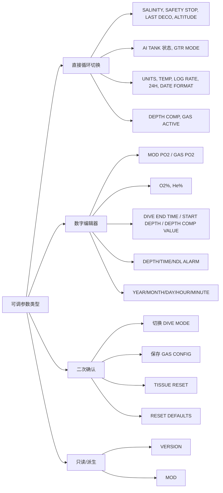

# SYSTEM SETUP 菜单结构

本文档按当前源码整理 `DIVE MENU -> SYSTEM SETUP` 的完整菜单框架、子菜单层级和可调参数。

来源文件：

- `src/ui/views/menu_defs.c`
- `src/ui/views/menu_runtime.c`
- `src/ui/views/submenu_model.c`
- `src/ui/core/vm/ui_vm_menu.c`
- `src/ui/core/ui_settings.h`

说明：

- 顶层入口显示为 `SYSTEM SETUP`。
- 进入子菜单后的标题是 `SYSTEMS SETUP`。
- `DEPTH COMP` 打开后，`COMP VALUE` 才会动态出现。
- `VERSION` 和 `MOD` 是只读/派生项。

```mermaid
flowchart TD
    Root["DIVE MENU / SETUP Root"] --> GasSwitch["GAS SWITCH"]
    Root --> Conservatism["CONSERVATISM"]
    Root --> SystemSetup["SYSTEM SETUP<br/>子菜单标题: SYSTEMS SETUP"]

    SystemSetup --> Version["VERSION: SYSTEM_VERSION<br/>只读"]
    SystemSetup --> ModeSetup["MODE SETUP<br/>当前潜水模式: AIR / NITROX / 3 GAS / OC Tech"]
    SystemSetup --> DiveSetup["DIVE SETUP"]
    SystemSetup --> AiSetup["AI SETUP"]
    SystemSetup --> AlertsSetup["ALERTS SETUP"]
    SystemSetup --> Display["DISPLAY"]

    ModeSetup --> ModeAir["AIR"]
    ModeSetup --> ModeNitrox["NITROX"]
    ModeSetup --> Mode3Gas["3 GAS"]
    ModeSetup --> ModeOcTech["OC Tech"]

    ModeAir --> AirGas["AIR GAS CONFIG"]
    AirGas --> AirPpo2["PO2<br/>1.0-1.6, step 0.1"]
    AirGas --> AirMod["MOD<br/>只读, 由气体/PO2计算"]
    AirGas --> AirSave["SAVE<br/>确认保存"]

    ModeNitrox --> NitroxMenu["NITROX"]
    NitroxMenu --> NitroxGas["NITROX GAS CONFIG"]
    NitroxMenu --> NitroxConfirm["CONFIRM<br/>确认切换 NITROX"]
    NitroxGas --> NitroxO2["O2<br/>21%-40%, step 1"]
    NitroxGas --> NitroxPpo2["PO2<br/>1.0-1.6, step 0.1"]
    NitroxGas --> NitroxMod["MOD<br/>只读, 由气体/PO2计算"]
    NitroxGas --> NitroxSave["SAVE<br/>确认保存"]

    Mode3Gas --> ThreeGasMenu["3 GAS"]
    ThreeGasMenu --> G1["G1 3 GAS CONFIG"]
    ThreeGasMenu --> G2["G2 3 GAS CONFIG"]
    ThreeGasMenu --> G3["G3 3 GAS CONFIG"]
    ThreeGasMenu --> ThreeGasConfirm["CONFIRM<br/>确认切换 3 GAS"]
    G1 --> ThreeGasFields["每个气体槽:<br/>O2 21%-100%, step 1<br/>PO2 1.0-1.6, step 0.1<br/>ACTIVE ON/OFF<br/>MOD 只读<br/>SAVE"]
    G2 --> ThreeGasFields
    G3 --> ThreeGasFields

    ModeOcTech --> OcTechMenu["OC Tech"]
    OcTechMenu --> Tx1["G1 TX CONFIG"]
    OcTechMenu --> Tx2["G2 TX CONFIG"]
    OcTechMenu --> Tx3["G3 TX CONFIG"]
    OcTechMenu --> Tx4["G4 TX CONFIG"]
    OcTechMenu --> Tx5["G5 TX CONFIG"]
    OcTechMenu --> OcTechConfirm["CONFIRM & ACTIVATE<br/>确认切换 OC Tech"]
    Tx1 --> TxFields["每个 TX 槽:<br/>O2 8%-(100%-He), step 1<br/>He 0%-(100%-O2), step 1<br/>PO2 1.0-1.6, step 0.1<br/>ACTIVE ON/OFF<br/>MOD 只读<br/>SAVE"]
    Tx2 --> TxFields
    Tx3 --> TxFields
    Tx4 --> TxFields
    Tx5 --> TxFields

    DiveSetup --> Salinity["SALINITY<br/>FRESH / SALT / EN13319<br/>直接循环切换"]
    DiveSetup --> ModPpo2["MOD PO2<br/>1.0-1.6, step 0.1"]
    DiveSetup --> SafetyStop["SAFETY STOP<br/>OFF / 3MIN / 4MIN / 5MIN / ADAPT / CNTUP"]
    DiveSetup --> LastDeco["LAST DECO<br/>3m / 6m"]
    DiveSetup --> EndTime["DIVE END TIME<br/>1-10 min, step 1"]
    DiveSetup --> StartDepth["DIVE START DEPTH<br/>0.3-2.0m, step 0.1"]
    DiveSetup --> DepthComp["DEPTH COMP<br/>ON / OFF"]
    DepthComp --> CompValue["COMP VALUE<br/>仅 DEPTH COMP=ON 时显示<br/>0.1-0.5m, step 0.1"]
    DiveSetup --> TissueReset["TISSUE RESET<br/>二次确认<br/>水下不可用"]
    DiveSetup --> Altitude["ALTITUDE<br/>Metric: 0-300m (default) / 300-1500m / 1500-3000m<br/>Imperial: 0-980ft (default) / 980-4900ft / 4900-9800ft"]

    AiSetup --> Tank1["T1 MAIN<br/>UNPAIRED / PAIRING / PAIRED"]
    AiSetup --> Tank2["T2 BUDDY<br/>UNPAIRED / PAIRING / PAIRED"]
    AiSetup --> GtrMode["GTR MODE<br/>ON / OFF"]

    AlertsSetup --> DepthAlarm["DEPTH ALARM<br/>10-150m, step 10"]
    AlertsSetup --> TimeAlarm["TIME ALARM<br/>10-300min, step 10"]
    AlertsSetup --> NdlAlarm["LOW NDL ALARM<br/>0-80min, step 1"]

    Display --> Units["UNITS<br/>METRIC / IMPERIAL"]
    Display --> Temp["TEMP<br/>C / F"]
    Display --> DateClock["Time/date"]
    Display --> LogRate["LOG RATE<br/>2s / 5s / 10s / 30s"]
    Display --> ResetDefaults["RESET DEFAULTS<br/>二次确认"]

    DateClock --> TimeMenu["TIME"]
    TimeMenu --> Hour["HOUR<br/>0-23, step 1"]
    TimeMenu --> Minute["MINUTE<br/>0-59, step 1"]

    DateClock --> DateMenu["DATE"]
    DateMenu --> Year["YEAR<br/>2000-2099, step 1"]
    DateMenu --> Month["MONTH<br/>1-12, step 1"]
    DateMenu --> Day["DAY<br/>1-31, step 1"]

    DateClock --> Time24h["24H<br/>ON / OFF"]
    DateClock --> DateFormat["DATE FORMAT"]
    DateFormat --> Format1["mm/dd/yyyy"]
    DateFormat --> Format2["dd.mm.yyyy"]
```

## 可调参数类型

## 参数清单

| 路径 | 参数/条目 | 类型 | 可选值或范围 |
|---|---|---|---|
| SYSTEMS SETUP | VERSION | 只读 | `SYSTEM_VERSION` |
| MODE SETUP | AIR / NITROX / 3 GAS / OC Tech | 二次确认 | 切换潜水模式 |
| AIR GAS CONFIG | PO2 | 数字编辑 | 1.0-1.6, step 0.1 |
| NITROX GAS CONFIG | O2 | 数字编辑 | 21%-40%, step 1 |
| NITROX GAS CONFIG | PO2 | 数字编辑 | 1.0-1.6, step 0.1 |
| 3 GAS CONFIG | O2 | 数字编辑 | 21%-100%, step 1 |
| 3 GAS CONFIG | PO2 | 数字编辑 | 1.0-1.6, step 0.1 |
| 3 GAS CONFIG | ACTIVE | 直接切换 | ON / OFF |
| OC Tech TX CONFIG | O2 | 数字编辑 | 8%-(100%-He), step 1 |
| OC Tech TX CONFIG | He | 数字编辑 | 0%-(100%-O2), step 1 |
| OC Tech TX CONFIG | PO2 | 数字编辑 | 1.0-1.6, step 0.1 |
| OC Tech TX CONFIG | ACTIVE | 直接切换 | ON / OFF |
| DIVE SETUP | SALINITY | 直接切换 | FRESH / SALT / EN13319 |
| DIVE SETUP | MOD PO2 | 数字编辑 | 1.0-1.6, step 0.1 |
| DIVE SETUP | SAFETY STOP | 直接切换 | OFF / 3MIN / 4MIN / 5MIN / ADAPT / CNTUP |
| DIVE SETUP | LAST DECO | 直接切换 | 3m / 6m |
| DIVE SETUP | DIVE END TIME | 数字编辑 | 1-10 min, step 1 |
| DIVE SETUP | DIVE START DEPTH | 数字编辑 | 0.3-2.0m, step 0.1 |
| DIVE SETUP | DEPTH COMP | 直接切换 | ON / OFF |
| DIVE SETUP | COMP VALUE | 数字编辑 | 0.1-0.5m, step 0.1，仅 DEPTH COMP=ON 时显示 |
| DIVE SETUP | TISSUE RESET | 二次确认 | 水下不可用 |
| DIVE SETUP | ALTITUDE | 直接切换 | 按 UNITS 显示：0-300m / 300-1500m / 1500-3000m，或 0-980ft / 980-4900ft / 4900-9800ft；默认第一档 |
| AI SETUP | T1 MAIN | 直接切换 | UNPAIRED / PAIRING / PAIRED |
| AI SETUP | T2 BUDDY | 直接切换 | UNPAIRED / PAIRING / PAIRED |
| AI SETUP | GTR MODE | 直接切换 | ON / OFF |
| ALERTS SETUP | DEPTH ALARM | 数字编辑 | 10-150m, step 10 |
| ALERTS SETUP | TIME ALARM | 数字编辑 | 10-300min, step 10 |
| ALERTS SETUP | LOW NDL ALARM | 数字编辑 | 0-80min, step 1 |
| DISPLAY | UNITS | 直接切换 | METRIC / IMPERIAL |
| DISPLAY | TEMP | 直接切换 | C / F |
| DISPLAY | LOG RATE | 直接切换 | 2s / 5s / 10s / 30s |
| DISPLAY | RESET DEFAULTS | 二次确认 | 重置显示/部分系统默认值 |
| DATE & CLOCK -> TIME | HOUR | 数字编辑 | 0-23, step 1 |
| DATE & CLOCK -> TIME | MINUTE | 数字编辑 | 0-59, step 1 |
| DATE & CLOCK -> DATE | YEAR | 数字编辑 | 2000-2099, step 1 |
| DATE & CLOCK -> DATE | MONTH | 数字编辑 | 1-12, step 1 |
| DATE & CLOCK -> DATE | DAY | 数字编辑 | 1-31, step 1 |
| DATE & CLOCK | 24H | 直接切换 | ON / OFF |
| DATE FORMAT | Format | 直接选择 | mm/dd/yyyy / dd.mm.yyyy |

## 当前未显示项

`MENU_ITEM_DISPLAY_BLUETOOTH` 在枚举里存在，但当前 `MENU_DISPLAY` 运行时列表没有加入 Bluetooth 行，因此此文档按当前界面实际菜单结构未列入 Mermaid 主图。
