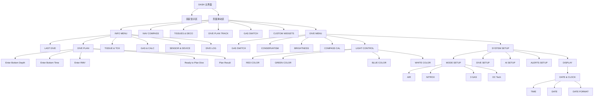

# 潜水电脑 UI 信息架构

## 文档定位

本文面向项目经理，用于整理当前 UI 的包含关系、页面入口、实际显示内容和设备端用户可调参数。

本文按“源码可证明、截图可验证”的原则整理。没有在当前 UI 源码里确认到的字段，不写进本文档。

## 来源说明

| 内容类型 | 核对来源 |
|---|---|
| 页面滑动区页面 | `page_registry_types.h`、`page_registry.c` |
| INFO MENU 和 SETUP MENU 顶层入口 | `menu_defs.c`、`menu_defs.h` |
| INFO 子页实际显示行 | `ui_vm_info.c`、`submenu_model.c` |
| SETUP 子菜单层级 | `menu_runtime.c`、`submenu_model.c` |
| 可编辑参数范围 | `ui_vm_menu.c`、`ui_settings.h` |
| COMPASS / DECO / GAS / PLAN 卡片可见标题与标签 | 对应 `card_*.c` 和 VM 文件 |

说明：本文不展开底层连接方式、工程调试能力或布局工程细节。只读页面如果没有逐项截图确认，只写源码中能确认的标题和可见标签。

## UI 包含关系总览

## DASH 主界面

- 固定显示区
  - NDL / 停留信息
  - 当前深度
  - 潜水时间
  - 当前气体
  - 电池 / 温度等系统信息
- 页面滑动区
  - INFO MENU
  - NAV COMPASS
  - TISSUES & DECO
  - DIVE PLAN TRACK
  - GAS SWITCH
  - CUSTOM WIDGETS
  - DIVE MENU

说明：固定显示区在本文只作为主界面组成描述，不展开工程布局配置。

## INFO MENU

INFO MENU 的顶层入口来自 `menu_defs.c`：

- LAST DIVE
- DIVE PLAN
- TISSUE & TOX
- GAS & CALC
- SENSOR & DEVICE
- DIVE LOG

### LAST DIVE

- 页面类型：只读信息页
- 可调参数：无
- 无上次潜水记录时显示：
  - `NO LAST DIVE`
  - `SURFACE: mm:ss` 或 `SURFACE: hh:mm:ss`
- 有上次潜水记录时显示：
  - `LOG #0000  dd-mm-yyyy`
  - `MAX DEPTH: x.xm`
  - `AVG DEPTH: x.xm`
  - `DIVE TIME: mm:ss` 或 `DIVE TIME: hh:mm:ss`
  - `SURFACE: mm:ss` 或 `SURFACE: hh:mm:ss`

### DIVE PLAN

- 页面类型：一次性计划输入
- 可调参数：计划深度、计划时间、RMV
- 顶部输入摘要：
  - `DEPTH`
  - `TIME`
  - `RMV`
  - 当前气体摘要，例如 `GAS: ...`
- 输入页：
  - `Enter Bottom Depth`
  - `in meters`
  - `MIN: 3`
  - `MAX: 120`
  - `Enter Bottom Time`
  - `in minutes`
  - `MIN: 1`
  - `MAX: 300`
  - `Enter RMV`
  - `in Liters/min`
  - `MIN: 5`
  - `MAX: 50`
- 准备页：
  - `Ready to Plan Dive`
  - `GF: low/high`
  - `Last Stop: xm`
  - `Start CNS: 0%`
  - `GAS: ...`
- 结果列表页：
  - 表头：`Stp`、`Tme`、`Run`、`Gas`、`Qty`
  - 行内容：停留深度、停留时间、运行时间、气体、气量
  - 页码：`Page x/y`
- 结果摘要页：
  - `SUMMARY`
  - `Runtime: xmin`
  - `Total Deco: xmin`
  - `Gas: xL`
  - `CNS: x%`
  - `OTU: x`
- 错误页：
  - `Plan Failed`
  - `Check depth, time, RMV and gas setup`
- 操作：
  - `Exit`
  - `Next`
  - `Plan`
  - `More`
  - `Calculating...`

说明：DIVE PLAN 的输入只用于本次计划计算，不等同于长期系统设置。

### TISSUE & TOX

- 页面类型：只读信息页
- 可调参数：无
- 实际显示行：
  - `GF: low/high`
  - `GF99: x%`
  - `SURF GF: x%`
  - `TISSUE: x%`
  - `CNS: x%`
  - `OTU: x`

### GAS & CALC

- 页面类型：只读信息页
- 可调参数：无
- 实际显示行：
  - `ACTIVE: Gx name`
  - `MIX: O2 x% HE x%`
  - `MOD: xm`
  - `PPO2: x.xx`
  - `DENS: x.xg/L`

### SENSOR & DEVICE

- 页面类型：只读信息页
- 可调参数：无
- 实际显示行：
  - `POD 1: -- BAR` 或 `POD 1: x BAR`
  - `POD 2: -- BAR` 或 `POD 2: x BAR`
  - `BATTERY: x%`
  - `TEMP: x.xC`
  - `BAT/PRJ: x.x/x.xC`

说明：当前页面按源码和截图只确认以上五行。

### DIVE LOG

- 页面类型：日志管理
- 可调参数：日志编号、开始时间、日期、删除日志
- 已确认页面状态：
  - 日志列表
  - 日志摘要
  - 日志详情
  - 日志编辑
- 已确认可见文案：
  - `DIVE#x     dd-Mmm-yyyy`
  - `MAX x.xm`
  - `AVG x.xm`
  - `Mode`
  - `Surface Int`
  - `Surface mbar`
  - `Deco Model`
  - `Start CNS`
  - `End CNS`
  - `Avg SAC D1 x.x`
  - `Back`
  - `More`
  - `Edit`

说明：DIVE LOG 页面较多，后续如果要给外部做最终图稿，建议逐页截图再补齐详情字段。

## 页面滑动区卡片

### NAV COMPASS

- 页面类型：只读信息页
- 可调参数：无
- 已确认可见内容：
  - 页面标题：`NAV COMPASS`
  - 当前航向：`000` 格式数字
  - 未锁定提示：`[ ENTER ] mark heading`
  - 锁定提示：`[ TARGET LOCKED: 000 ]`
  - 底部罗盘卷尺

说明：罗盘校准入口在 `DIVE MENU -> COMPASS CAL`。

### TISSUES & DECO

- 页面类型：只读信息页
- 可调参数：无
- 已确认可见内容：
  - 页面标题：`TISSUES & DECO`
  - `ALGORITHM`
  - `ZHL-16C`
  - `GF LOW / HIGH`
  - `GF99`
  - `SurfGF`
  - `CNS O2`
  - `OTU`
  - `TISSUE SATURATION`
  - 1 到 16 的组织柱状图编号
  - M-value 参考线

### DIVE PLAN TRACK

- 页面类型：只读信息页
- 可调参数：无
- 已确认可见内容：
  - 页面标题：`DIVE PLAN TRACK`
  - 深度轴
  - 时间轴
  - 当前点 / `NOW`
  - 潜水轨迹
  - 减压停留点

### GAS SWITCH

- 页面类型：气体选择页
- 可调参数：当前活动气体
- 已确认可见内容：
  - 页面标题：`GAS SWITCH`
  - 气体名称
  - `MOD xm`
  - `PO2 x.xx` 或 `PO2 -.-`
  - `[ PRESS TO SWITCH GAS ]`

### CUSTOM WIDGETS

- 页面类型：只读信息页
- 可调参数：无
- 已确认页面注册标题：
  - `5F: CUSTOM WIDGETS`

说明：本文不展开该页的组合内容。外部图稿如需展示该页，请以实际截图为准。

## DIVE MENU

DIVE MENU 的顶层入口来自 `menu_defs.c`：

- GAS SWITCH
- CONSERVATISM
- BRIGHTNESS
- COMPASS CAL
- LIGHT CONTROL
- SYSTEM SETUP

### GAS SWITCH

- 页面类型：可配置
- 可调参数：当前活动气体
- 菜单行：
  - 当前可用气体列表；多气体时显示 `GAS x: name`
  - 没有可用气体时显示 `NO ACTIVE GAS`
- 确认弹窗：
  - 标题：`CONFIRM GAS`
  - 目标气体名称
  - `MOD: xm`
  - 正常提示：`[ ENTER CONFIRM ]  [ ESC CANCEL ]`
  - 超过 MOD 提示：`[ FATAL: OVER MOD ]`

### CONSERVATISM

- 页面类型：可配置
- 可调参数：保守度档位
- 菜单行：
  - `LOW (GF 40/95)`
  - `MED (GF 40/85)`
  - `HIGH (GF 30/70)`
  - `CUSTOM (GF 50/70)`

### BRIGHTNESS

- 页面类型：可配置
- 可调参数：屏幕亮度
- 菜单行：
  - `LOW`，亮度值 190
  - `MED`，亮度值 212
  - `HIGH`，亮度值 232
  - `MAX`，亮度值 255

### COMPASS CAL

- 页面类型：维护操作
- 可调参数：无
- 菜单行：
  - `AUTO CAL: ...`
  - `RESET AUTO CAL`

### LIGHT CONTROL

- 页面类型：可配置
- 可调参数：灯光开关、灯光模式、颜色强度
- 菜单行：
  - `LIGHT ON/OFF`
  - `LIGHT MODE`
  - `RED COLOR`
  - `GREEN COLOR`
  - `BLUE COLOR`
  - `WHITE COLOR`
- 颜色强度子菜单：
  - `10%`
  - `30%`
  - `50%`
  - `70%`
  - `100%`

### SYSTEM SETUP

- 页面类型：系统设置入口
- 可调参数：无
- 菜单行：
  - `VERSION: ...`
  - `MODE SETUP: AIR / NITROX / 3 GAS / OC Tech`
  - `DIVE SETUP`
  - `AI SETUP`
  - `ALERTS SETUP`
  - `DISPLAY`

## MODE SETUP

### MODE SETUP 入口

- 菜单行：
  - `AIR`
  - `NITROX`
  - `3 GAS`
  - `OC Tech`

### AIR / NITROX 编辑

- AIR GAS：
  - `MOD PO2`
    - 最小：1.0
    - 最大：1.6
    - 步进：0.1
- NITROX：
  - `G1: AIR` 或 `G1: EANx`
  - `CONFIRM & ACTIVATE`
- NITROX GAS：
  - `O2`
    - 最小：21
    - 最大：40
    - 步进：1
  - `PO2`
    - 最小：1.0
    - 最大：1.6
    - 步进：0.1

### 3 GAS

- 菜单行：
  - `G1: AIR / O2 100% / EANx`
  - `G2: AIR / O2 100% / EANx`
  - `G3: AIR / O2 100% / EANx`
  - `CONFIRM & ACTIVATE`
- 单个气体编辑：
  - `GAS x`
    - 最小：21
    - 最大：100
    - 步进：1
  - `PO2`
    - 最小：1.0
    - 最大：1.6
    - 步进：0.1

### OC Tech

- 菜单行：
  - `G1` 到 `G5`，显示 `OFF`、`AIR`、`O2 100%`、`NX x` 或 `TX x/y`
  - `CONFIRM & ACTIVATE`
- 单个气体编辑：
  - `O2 PERCENT`
    - 最小：8
    - 最大：100 - He
    - 步进：1
  - `HE PERCENT`
    - 最小：0
    - 最大：100 - O2
    - 步进：1
  - `PO2`
    - 最小：1.0
    - 最大：1.6
    - 步进：0.1
  - 保存气体配置

## DIVE SETUP

- 页面类型：可配置
- 菜单行：
  - `SALINITY: FRESH / SALT / EN13319`
  - `MOD PO2: x.x`
  - `SAFETY STOP: OFF / 3MIN / 4MIN / 5MIN / ADAPT / CNTUP`
  - `LAST DECO: 3M / 6M`
  - `ALTITUDE` 按 `UNITS` 显示：公制 `0-300m`（默认）/ `300-1500m` / `1500-3000m`；英制 `0-980ft`（默认）/ `980-4900ft` / `4900-9800ft`
- 可编辑范围：
  - `MOD PO2`
    - 最小：1.0
    - 最大：1.6
    - 步进：0.1

## AI SETUP

- 页面类型：可配置
- 菜单行：
  - `T1 MAIN: UNPAIRED / PAIRING / PAIRED`
  - `T2 BUDDY: UNPAIRED / PAIRING / PAIRED`
  - `GTR MODE: OFF / ON`

## ALERTS SETUP

- 页面类型：可配置
- 菜单行：
  - `DEPTH ALARM: xm`
  - `TIME ALARM: xmin`
  - `LOW NDL ALARM: xmin`
- 可编辑范围：
  - DEPTH
    - 最小：10
    - 最大：150
    - 步进：10
  - TIME
    - 最小：10
    - 最大：300
    - 步进：10
  - NDL
    - 最小：0
    - 最大：80
    - 步进：1

## DISPLAY

- 页面类型：可配置
- 菜单行：
  - `UNITS: METRIC / IMPERIAL`
  - `Time/date`
  - `LOG RATE: 2s / 5s / 10s / 30s`
  - `RESET DEFAULTS`

说明：源码中还有其他内部行，但本文按当前需求不展开。

### DATE & CLOCK

- 菜单行：
  - `TIME: ...`
  - `DATE: ...`
  - `24-hour: ON / OFF`
  - `Date format: ...`

### TIME

- 菜单行：
  - `HOUR: 00`
  - `MINUTE: 00`
- 可编辑范围：
  - HOUR：0 到 23，步进 1
  - MINUTE：0 到 59，步进 1

### DATE

- 菜单行：
  - `YEAR: yyyy`
  - `MONTH: mm`
  - `DAY: dd`
- 可编辑范围：
  - YEAR：2000 到 2099，步进 1
  - MONTH：1 到 12，步进 1
  - DAY：1 到 31，步进 1

### DATE FORMAT

- 菜单行：
  - `MM-DD-YY`
  - `DD-MM-YY`

## 可调参数汇总

- 气体与模式
  - 当前活动气体
  - 潜水模式：AIR、NITROX、3 GAS、OC Tech
  - O2 百分比
  - He 百分比
  - PO2 / MOD PO2
- 潜水参数
  - Conservatism
  - Salinity
  - Safety Stop
  - Last Deco
  - Altitude
- 告警阈值
  - Depth Alarm
  - Time Alarm
  - Low NDL Alarm
- 显示与记录
  - Units
  - Time / Date
  - 24-hour
  - Date format
  - Log Rate
  - Brightness
- 灯光与外设
  - Compass Calibration
  - Light Power
  - Light Mode
  - Light Color Level
  - AI Tank State
  - GTR Mode
- 一次性输入 / 日志管理
  - DIVE PLAN：计划深度、计划时间、RMV
  - DIVE LOG：日志编号、开始时间、日期、删除日志

## 待截图确认项

- DIVE LOG 的所有详情页字段建议用最新 UI 截图逐页核对。
- CUSTOM WIDGETS 页面本文只确认页面存在，不确认内部组合内容。
