# UI 状态逻辑全景

本文档专门说明当前 UI 的“状态、输入、输出响应”完整链路。它和 `UI_MODULE_MAP.md`、`CURRENT_ARCHITECTURE_DEEP_DIVE.md` 的关系是：

- `UI_MODULE_MAP.md`：看模块在哪里。
- `CURRENT_ARCHITECTURE_DEEP_DIVE.md`：看整体架构怎么跑起来。
- 本文档：看 UI 在每一种状态下，输入会被解释成什么，状态如何迁移，屏幕输出如何响应。

本文基于当前源码检查：

| 主题 | 主要文件 |
|---|---|
| 全局 UI 状态机 | `src/ui/core/ui_state.c/h` |
| PC 输入适配 | `src/hal_sim/input_pc.c` |
| 刷新与输出响应 | `src/ui/core/update_router.c`、`src/ui/core/ui_engine.c` |
| 屏幕门面与布局 | `src/ui/screen/screen.c`、`screen_layout.c`、`layout_view.c` |
| 页面注册 | `src/ui/screen/page_registry.c/h` |
| 子菜单 | `src/ui/views/menu_defs.c/h`、`menu_runtime.c/h`、`menu_actions.c/h`、`submenu_view.c/h` |
| 数值编辑 | `src/ui/screen/screen_edit.c/h` |
| 弹窗 | `src/ui/views/modal_view.c/h` |
| DIVE PLAN 内部状态 | `src/ui/views/submenu_dive_plan_state.c/h` |
| 告警状态 | `src/ui/alarm/alarm.c/h`、`alarm_view.c/h` |
| 显示模型 VM | `src/ui/core/vm/ui_vm_*.c/h` |

## 1. 状态系统分层

当前 UI 不只有一个 `ui_state_t`。真实运行时是多层状态叠在一起：

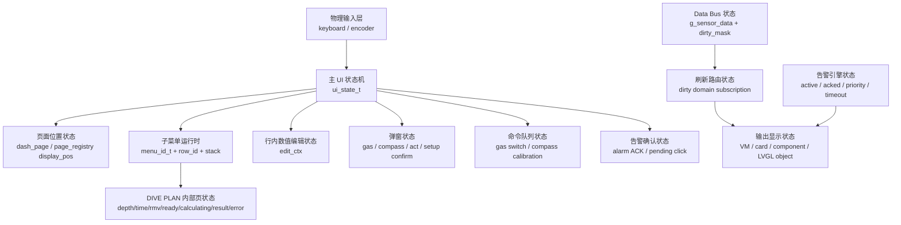

可以把它理解成三条并行主线：

| 主线 | 解释 |
|---|---|
| 输入状态 | 用户旋钮、点击、返回，先进入 `ui_handle_rotate()`、`ui_handle_click()`、`ui_handle_back()`。 |
| 交互状态 | `ui_state_t` 决定当前输入语义；子菜单、弹窗、编辑态、Dive Plan 会继续细分。 |
| 输出状态 | 传感器/算法/设置变化打 dirty bit，`ui_update_task()` 消费后由 router 生成 VM 并刷新 LVGL。 |

## 2. 输入入口

PC 模拟器里，键盘和 encoder 被适配成三个语义事件：

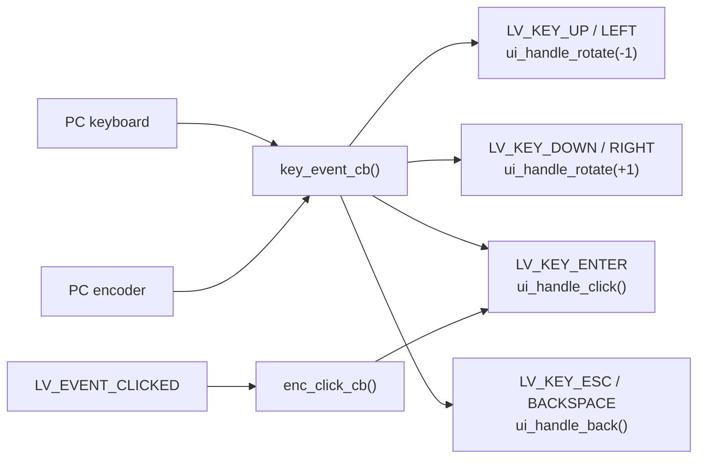

输入层不直接操作页面，也不直接改数据。它只把硬件事件翻译为：

| 输入 API | 语义 |
|---|---|
| `ui_handle_rotate(-1)` | 向上/向左/上一项。 |
| `ui_handle_rotate(+1)` | 向下/向右/下一项。 |
| `ui_handle_click()` | 确认、进入、执行当前焦点动作。 |
| `ui_handle_back()` | 退出当前层级、取消编辑、关闭弹窗。 |

## 3. 主 UI 状态全集

`ui_state_t` 当前共有 10 个状态：

| 状态 | 视觉含义 | rotate | click | back |
|---|---|---|---|---|
| `UI_DASH` | 正常仪表盘动态页。 | 翻页；到边界后 wall-charge 进入菜单。 | 特定卡片动作：GAS 进入选气，COMPASS 锁定/清除目标。 | 回到动态页首页。 |
| `UI_INFO` | INFO MENU 顶层列表。 | 移动 INFO 选中项；底部蓄力回 DASH。 | 打开对应 INFO 子菜单。 | 回 DASH 首页。 |
| `UI_SETUP` | DIVE MENU 顶层列表。 | 移动 SETUP 选中项；顶部蓄力回 DASH 尾页。 | 打开对应 SETUP 子菜单。 | 回 DASH 首页。 |
| `UI_EDIT_GAS` | GAS 卡片选气游标态。 | 移动 gas_cursor。 | 打开 GAS 确认弹窗。 | 取消选气，回 DASH。 |
| `UI_MODAL_GAS` | GAS 切换确认弹窗。 | 当前不处理。 | 深度允许则投递切气命令；否则弹窗 pulse。 | 从卡片来则回 `UI_EDIT_GAS`，从子菜单来则关闭子菜单。 |
| `UI_MODAL_COMPASS` | 清除罗盘航向目标确认弹窗。 | 当前不处理。 | 清除 heading lock，回 DASH。 | 关闭弹窗，回 DASH 或 SUB_MENU。 |
| `UI_SUB_MENU` | 二级/多级子菜单抽屉。 | 普通菜单移动光标；DIVE PLAN 页可能消费旋钮修改输入值。 | 执行当前 row action。 | 返回上级子菜单；无上级则回父顶层菜单。 |
| `UI_MODAL_ACT` | 一次性动作提示弹窗。 | 当前不处理。 | 当前不处理。 | 关闭弹窗，回 SUB_MENU 或 DASH。 |
| `UI_EDIT_VALUE` | 子菜单行内数值编辑。 | 按 step 修改数值。 | 提交并回 SUB_MENU。 | 回滚原值并回 SUB_MENU。 |
| `UI_MODAL_SETUP_CONFIRM` | 设置二次确认弹窗。 | 当前不处理。 | 提交 pending setting。 | 取消 pending setting，回 SUB_MENU。 |

完整主状态图：

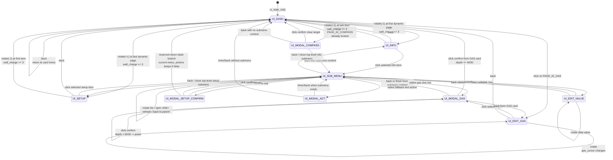

## 4. UI 上下文字段

`ui_ctx_t` 是主状态机的上下文仓库。外部模块通过 getter/setter 读写，不直接碰字段。

| 字段 | 状态含义 |
|---|---|
| `state` | 当前主状态，即上面的 `ui_state_t`。 |
| `dash_page` | 当前 tileview 显示位置，使用 display position，不是 `card_order[]` 原始下标。 |
| `menu_info_idx` | INFO MENU 顶层选中行。 |
| `menu_setup_idx` | DIVE MENU 顶层选中行。 |
| `sub_menu_idx` | 当前子菜单选中行。 |
| `gas_cursor` | GAS 切换候选气体索引。 |
| `gas_modal_from_submenu` | GAS 弹窗来源标记；决定弹窗关闭后回卡片还是回子菜单。 |
| `wall_charge` | 边界蓄力计数，0..3。 |
| `wall_dir` | 预留的墙方向字段，当前主要通过调用 side 区分。 |
| `sub_history[]` | 旧历史结构，当前真实子菜单栈主要在 `menu_runtime` 中维护。 |
| `sub_history_depth` | 同步 `menu_runtime_stack_depth()`，用于布局重建和返回语义判断。 |
| `edit_ctx` | 行内编辑值、范围、step、原始值、设置类型、显示 label。 |
| `sub_title/sub_items/sub_item_count` | 子菜单可见内容数量等状态；当前 row 细节来自 `menu_runtime`。 |
| `sub_parent` | 当前子菜单是从 `UI_INFO` 还是 `UI_SETUP` 打开的。 |
| `alarm_pending_click` | 告警确认相关标记。 |

## 5. DASH 页面状态

`UI_DASH` 并不是单页，它还带一个 `dash_page` 子状态。

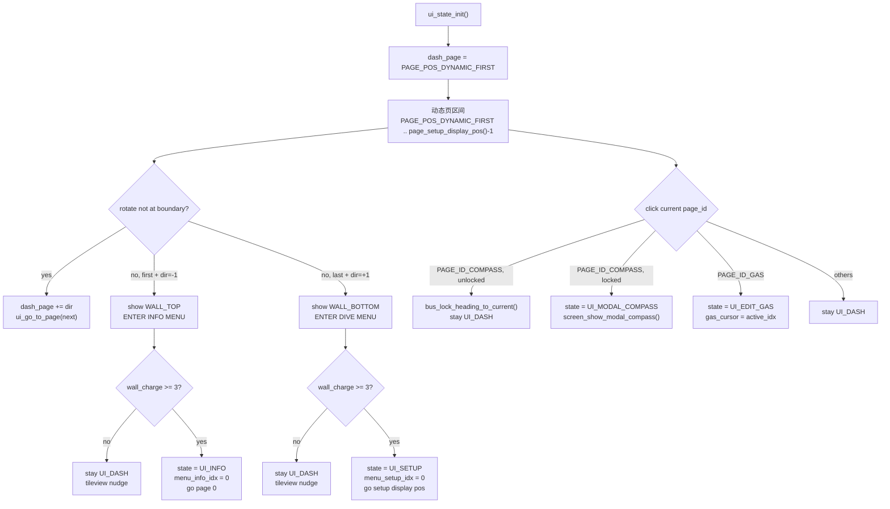

边界蓄力 wall 是一个状态反馈机制：

| 场景 | wall |
|---|---|
| DASH 第一张动态页继续 `rotate(-1)` | 顶部 wall：`>>> ENTER INFO MENU >>>` |
| DASH 最后一张动态页继续 `rotate(+1)` | 底部 wall：`<<< ENTER DIVE MENU <<<` |
| INFO 最后一项继续 `rotate(+1)` | 底部 wall：`<<< RETURN TO DASH <<<` |
| SETUP 第一项继续 `rotate(-1)` | 顶部 wall：`>>> RETURN TO DASH >>>` |

`wall_charge` 达到 3 才真正迁移状态，未达到时只显示提示和轻微挪动 tileview。

## 6. 页面位置状态

页面显示位置由 `page_registry` 管理。这里要区分 `display_pos` 和 `storage_pos`。

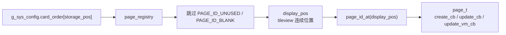

| 概念 | 说明 |
|---|---|
| `PAGE_POS_INFO` | INFO MENU 固定在显示序列最前面。 |
| `PAGE_POS_DYNAMIC_FIRST` | 第一个动态业务页位置。 |
| `PAGE_POS_SETUP` | 配置数组中的 SETUP 固定槽，不等于实际显示位置。 |
| `page_setup_display_pos()` | SETUP 在 tileview 里的实际显示位置，等于 `INFO + 可见动态页数量`。 |
| `page_visible_dash_count()` | 统计动态页中非 `UNUSED`、非 `BLANK` 的可见页面。 |
| `page_storage_pos(display_pos)` | 把 tileview 显示位置反查到 `card_order[]` 原始槽位。 |

当前页面 ID：

| 页面 ID | 页面类型 | 入口文件 |
|---|---|---|
| `PAGE_ID_INFO` | 顶层菜单页 | `menus/menu_info.c` |
| `PAGE_ID_COMPASS` | 自定义业务卡 | `cards/card_compass.c` |
| `PAGE_ID_DECO` | 自定义业务卡 | `cards/card_deco.c` |
| `PAGE_ID_GAS` | 自定义业务卡 | `cards/card_gas.c` |
| `PAGE_ID_PLAN` | 自定义业务卡 | `cards/card_plan.c` |
| `PAGE_ID_CUSTOM_GRID` | 5F 网格页 | `layout_view.c` + `comp_view.c` |
| `PAGE_ID_BLANK` | 空白页 | `cards/card_blank.c` |
| `PAGE_ID_SETUP` | 顶层菜单页 | `menus/menu_setup.c` |

## 7. INFO / SETUP 顶层菜单状态

INFO 和 SETUP 是 tileview 里的两个固定菜单页，但输入状态不同：

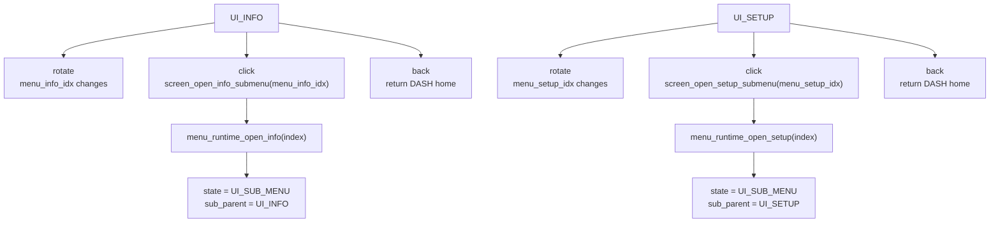

顶层 INFO 入口：

| index | title | child menu |
|---|---|---|
| 0 | `LAST DIVE` | `MENU_INFO_LAST_DIVE` |
| 1 | `DIVE PLAN` | `MENU_INFO_DIVE_PLAN` |
| 2 | `TISSUE & TOX` | `MENU_INFO_TISSUE_TOX` |
| 3 | `GAS & CALC` | `MENU_INFO_GAS_CALC` |
| 4 | `SENSOR & DEVICE` | `MENU_INFO_SENSOR_DEVICE` |

顶层 SETUP 入口：

| index | title | child menu |
|---|---|---|
| 0 | `GAS SWITCH` | `MENU_SETUP_GAS_SWITCH` |
| 1 | `CONSERVATISM` | `MENU_SETUP_CONSERVATISM` |
| 2 | `BRIGHTNESS` | `MENU_SETUP_BRIGHTNESS` |
| 3 | `COMPASS CAL` | `MENU_SETUP_COMPASS_CAL` |
| 4 | `LIGHT CONTROL` | `MENU_SETUP_LIGHT_CONTROL` |
| 5 | `SYSTEM SETUP` | `MENU_SETUP_SYSTEMS` |

## 8. 子菜单运行时状态

子菜单运行时不靠字符串判断业务，而靠稳定 ID：

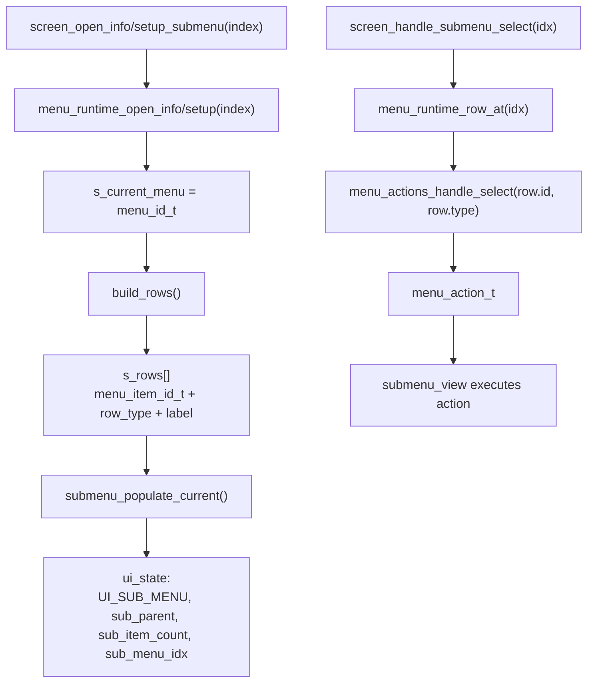

子菜单栈：

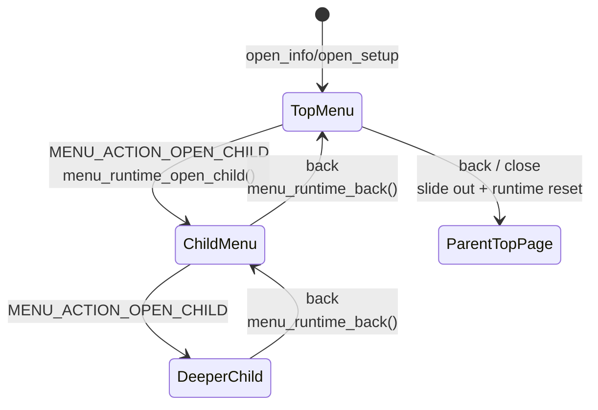

`menu_runtime` 保存：

| 运行时字段 | 含义 |
|---|---|
| `s_current_menu` | 当前打开的 `menu_id_t`。 |
| `s_rows[]` | 当前可渲染行，每行有稳定 `menu_item_id_t`。 |
| `s_row_count` | 当前行数，同步到 `ui_state.sub_item_count`。 |
| `s_stack[]` | 父菜单栈，保存 `menu_id + selected_idx`。 |
| `s_stack_depth` | 当前嵌套深度，同步到 `ui_state.sub_history_depth`。 |
| `s_oc_tech_edit_title` | OC Tech gas slot 编辑页标题缓存。 |

## 9. 子菜单动作优先级

选中一行后，`menu_actions_handle_select()` 按固定优先级分发：

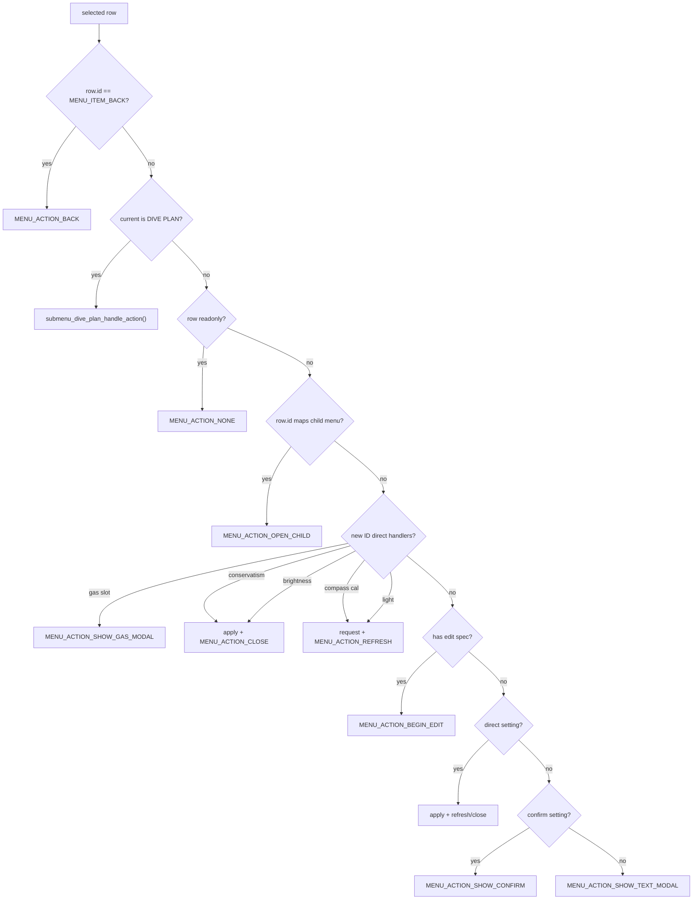

动作返回值由 `submenu_view.c` 执行：

| action type | view 层行为 |
|---|---|
| `MENU_ACTION_BACK` | `screen_close_submenu()`。 |
| `MENU_ACTION_OPEN_CHILD` | `menu_runtime_open_child()`，重绘子菜单，更新 stack depth。 |
| `MENU_ACTION_REFRESH` | 重建当前 rows，保持或修正选中行。 |
| `MENU_ACTION_CLOSE` | 关闭当前子菜单；如果有父菜单则返回父菜单。 |
| `MENU_ACTION_SHOW_CONFIRM` | `screen_show_modal_setup_confirm()`，状态切到 `UI_MODAL_SETUP_CONFIRM`。 |
| `MENU_ACTION_BEGIN_EDIT` | `screen_begin_edit_value()`，状态切到 `UI_EDIT_VALUE`。 |
| `MENU_ACTION_SHOW_GAS_MODAL` | `screen_show_modal_gas()`，状态切到 `UI_MODAL_GAS`。 |
| `MENU_ACTION_SHOW_TEXT_MODAL` | `screen_show_modal_act()`，状态切到 `UI_MODAL_ACT`。 |

## 10. 行内数值编辑状态

行内编辑态由 `UI_EDIT_VALUE + edit_ctx` 表示。

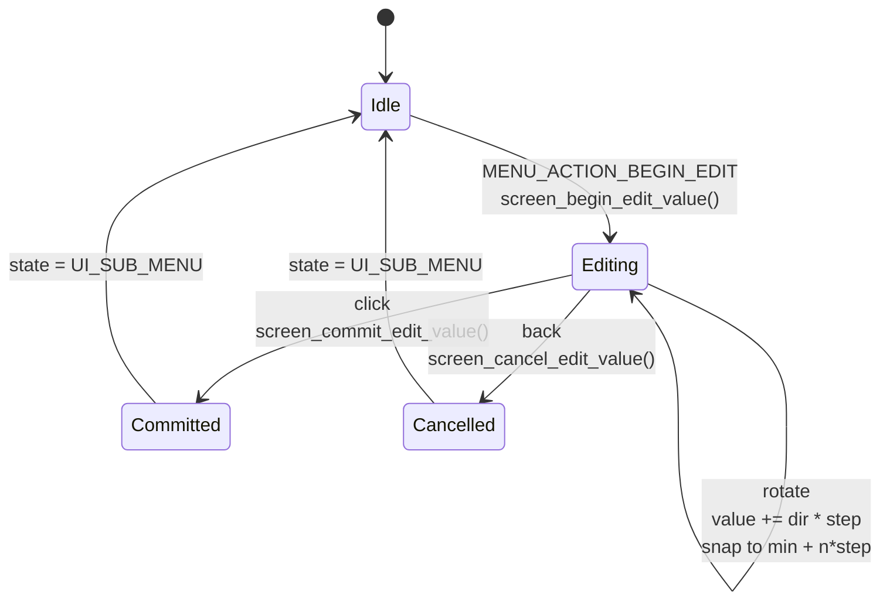

`edit_ctx` 保存：

| 字段 | 含义 |
|---|---|
| `value` | 当前编辑值。 |
| `original` | 进入编辑时的原值，back 时恢复。 |
| `min/max/step` | 旋钮调整边界和步进。 |
| `setting_kind` | 提交后应用到哪类设置。 |
| `setting_arg` | 同类设置的索引或字段。 |
| `decimals` | 显示小数位。 |
| `item_index` | 正在编辑的子菜单行。 |
| `label` | 编辑态左侧显示文本。 |
| `active` | 是否正在编辑。 |

提交路径：

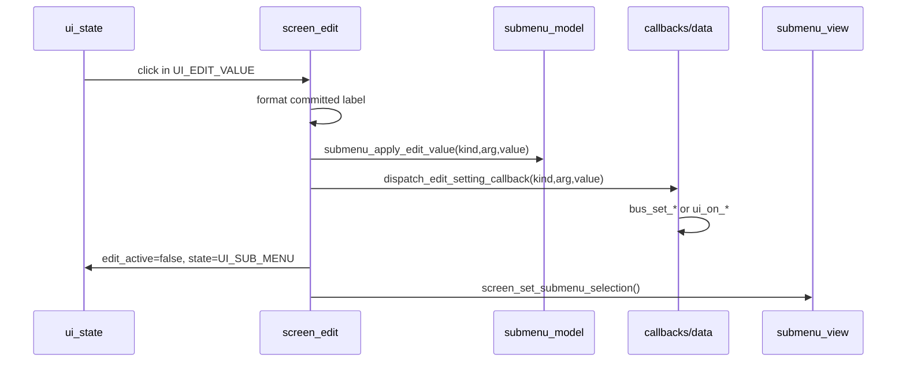

## 11. 弹窗状态

弹窗由 `modal_view.c` 统一创建和复用。主状态机区分四种弹窗语义：

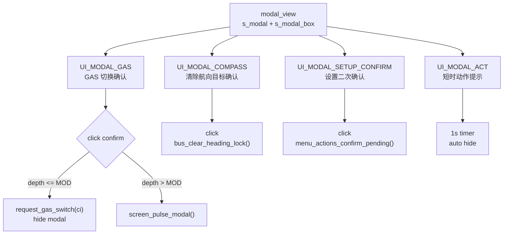

GAS 弹窗有来源上下文：

| 来源 | `gas_modal_from_submenu` | confirm/back 后去向 |
|---|---:|---|
| GAS 卡片 | false | confirm 回 `UI_DASH`；back 回 `UI_EDIT_GAS`。 |
| SETUP/GAS SWITCH 子菜单 | true | confirm/back 都走 `screen_close_submenu()` 回父菜单或顶层。 |

## 12. GAS 切换命令状态

UI 不直接改当前算法气体。它只投递命令。

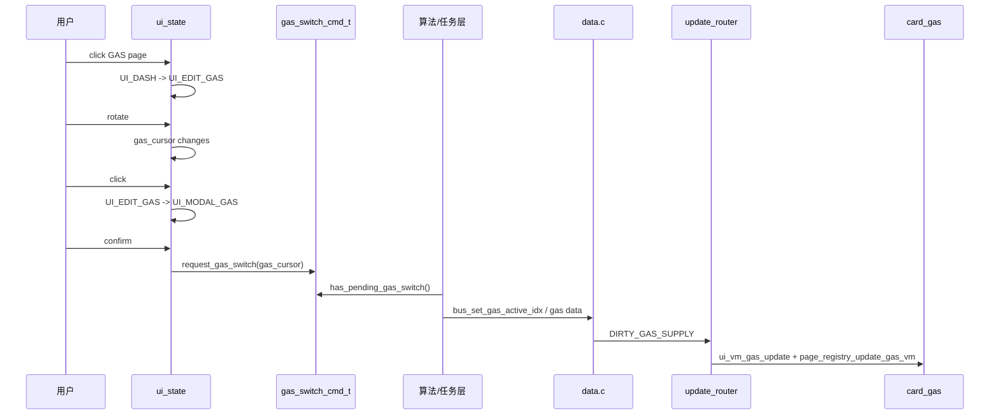

命令队列字段：

| 字段 | 含义 |
|---|---|
| `pending` | 是否有待算法处理的切气请求。 |
| `gas_idx` | 目标气体索引。 |

## 13. 罗盘状态

罗盘有两套状态：

| 状态 | 存储位置 | 含义 |
|---|---|---|
| 航向锁定 | Data Bus：`heading_locked`、`heading_target` | 显示目标游标，点击已锁定罗盘页会进入清除确认。 |
| 校准命令 | `compass_cal_cmd_t` | SETUP/COMPASS CAL 菜单发给底层传感器任务的请求。 |
| 校准 UI 状态 | `compass_cal_ui_state_t` | 菜单 badge/文案展示 `IDLE/RUNNING/READY`。 |

航向锁定：

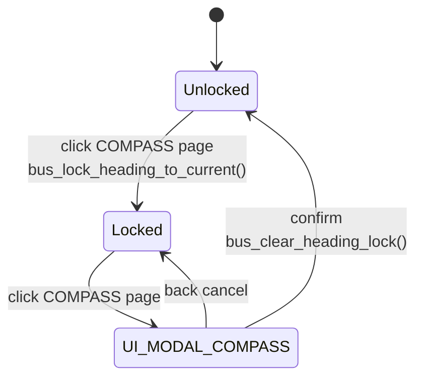

罗盘校准：

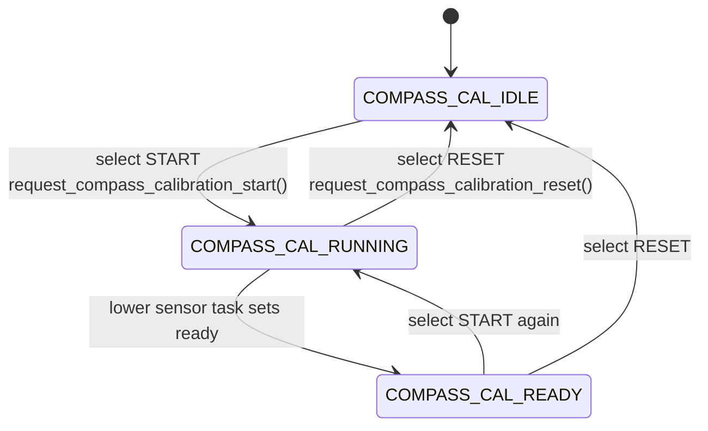

`ui_update_task()` 每帧比较校准 UI 状态，如果变化就 `screen_refresh_setup_menu()`，让顶层 SETUP badge 同步。

## 14. DIVE PLAN 内部状态

DIVE PLAN 是 INFO 菜单里的特殊页。外层仍是 `UI_SUB_MENU`，但内部有自己的 `dive_plan_page_t`。

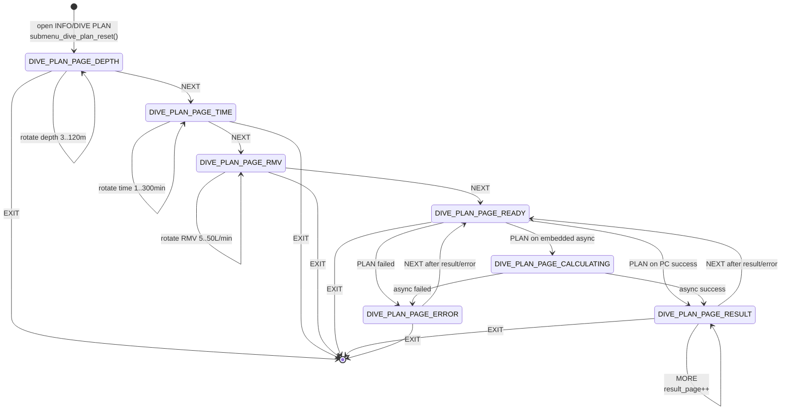

DIVE PLAN 的点击行 ID 会随内部页变化：

| 页状态 | 主要行 ID | 行为 |
|---|---|---|
| `DEPTH` | `MENU_ITEM_DIVE_PLAN_NEXT` | 进入 `TIME`。 |
| `TIME` | `MENU_ITEM_DIVE_PLAN_NEXT` | 进入 `RMV`。 |
| `RMV` | `MENU_ITEM_DIVE_PLAN_NEXT` | 进入 `READY`。 |
| `READY` | `MENU_ITEM_DIVE_PLAN_PLAN` | 开始计算。 |
| `CALCULATING` | 通常不消费 rotate，等待 poll。 | 后台完成后刷新。 |
| `RESULT` | `MENU_ITEM_DIVE_PLAN_MORE` 或 `NEXT` | 翻结果页或回 READY。 |
| `ERROR` | `MENU_ITEM_DIVE_PLAN_NEXT` | 回 READY。 |
| 任意页 | `MENU_ITEM_DIVE_PLAN_EXIT` | 关闭子菜单。 |

输出刷新：

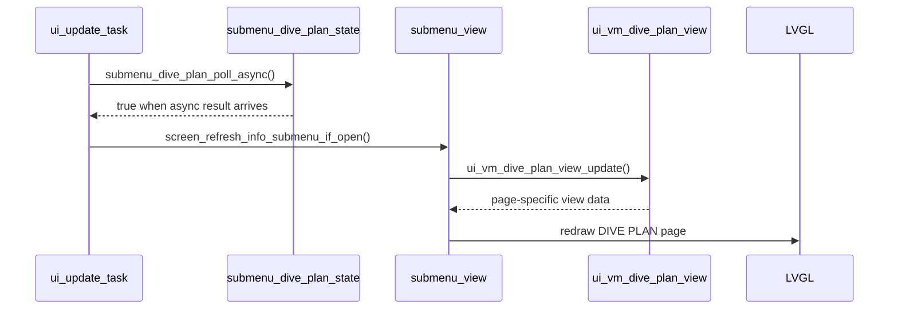

## 15. 告警状态

告警有自己的状态表，不属于 `ui_state_t`。

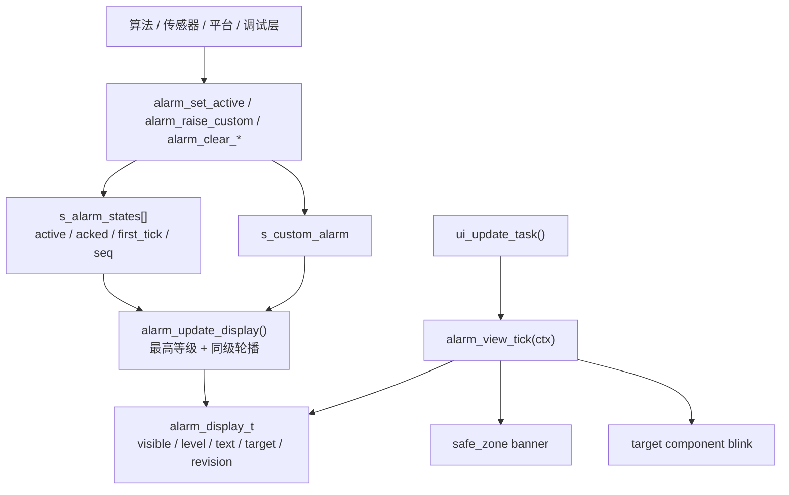

告警等级：

| level | 视觉行为 | ACK 行为 |
|---|---|---|
| `ALARM_CRIT` | banner 强闪烁，目标组件强闪烁。 | 多数 `CONDITION_ONLY`，ACK 不隐藏，必须条件解除。 |
| `ALARM_WARN` | banner 弱闪烁，目标组件弱高亮。 | 多数 `ACK_HIDE`，用户确认后隐藏，条件解除前不重复弹出。 |
| `ALARM_INFO` | banner 进入/退出动画，不做组件闪烁。 | 多数 `AUTO_TIMEOUT`，约 3 秒后自动隐藏。 |

告警确认路径：

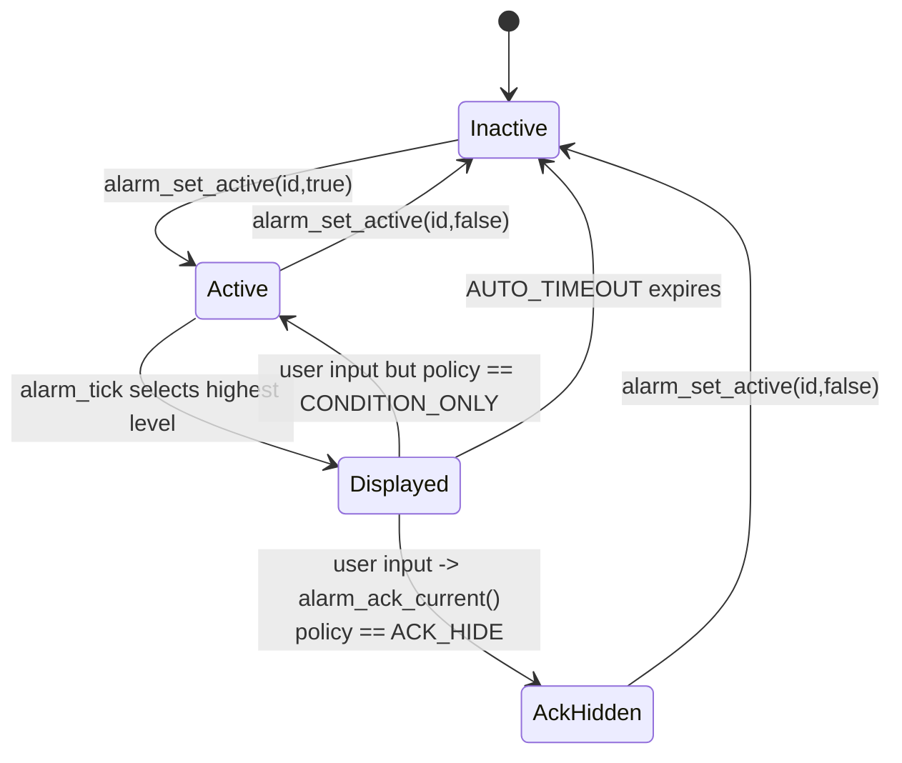

注意：`bus_set_*()` 不触发告警。告警 owner 必须显式调用 alarm API。

## 16. 刷新输出状态

UI 输出不是输入回调里直接刷新，而是 `ui_update_task()` 每 50ms 消费 dirty mask。

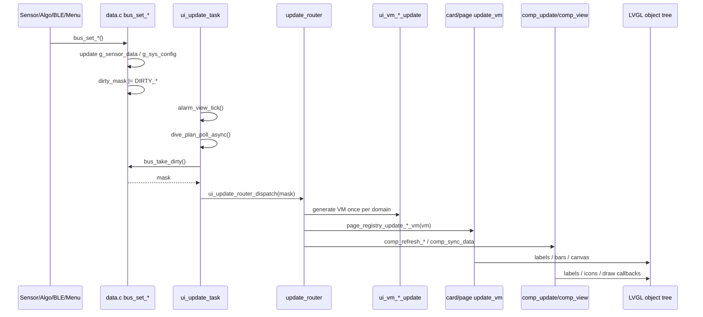

刷新路由先做两件关键事：

1. 如果有 `DIRTY_UI_LAYOUT`，优先全屏重建，关闭 invalidation，重建后把剩余 dirty 重新排队并 return。
2. 对 mask 做订阅过滤：只刷新当前布局和当前状态真正订阅的域。

```mermaid
flowchart TB
    Mask["incoming dirty mask"] --> Layout{"DIRTY_UI_LAYOUT?"}
    Layout -->|"yes"| DisableInv["lv_disp_enable_invalidation(false)"]
    DisableInv --> Rebuild["screen_rebuild_full()"]
    Rebuild --> EnableInv["lv_disp_enable_invalidation(true)"]
    EnableInv --> Requeue["bus_requeue_dirty(mask & ~DIRTY_UI_LAYOUT)"]
    Requeue --> End1["return"]

    Layout -->|"no"| Subscription["mask &= ui_router_subscription_mask()"]
    Subscription --> Empty{"mask == DIRTY_NONE?"}
    Empty -->|"yes"| End2["return"]
    Empty -->|"no"| Dispatch["按 dirty domain 分发"]
```

当前 dirty 域：

| dirty bit | 数据域 | 典型来源 | 输出响应 |
|---|---|---|---|
| `DIRTY_DIVE_PROFILE` | 深度、潜水时间、上升率、NDL 主态等。 | `bus_set_depth()`、`bus_set_dive_time()`、`bus_set_ascent_rate()` | DECO VM、NDL_STOP、ascent icons、深度统计组件、相关 5F/左侧组件。 |
| `DIRTY_DECO_STATUS` | TTS、stop depth/time、ceiling 等减压状态。 | `bus_set_tts()`、`bus_set_stop_*()`、`bus_set_ceiling_m()` | DECO 卡、NDL_STOP、TTS/STOP/CEIL 组件。 |
| `DIRTY_TISSUE_TOX` | tissue raw/GF、GF99、SurfGF、CNS、OTU。 | `bus_set_tissue_loads()`、`bus_set_gf99()`、`bus_set_cns_pct()` | DECO 卡、组织图组件、tox 文本组件。 |
| `DIRTY_GAS_SUPPLY` | active gas、gas slots、PPO2、MOD、density、POD。 | `bus_set_gas_*()`、`bus_set_pod_*()` | GAS 卡、GAS/PPO2/MOD/FIO2/POD 等组件。 |
| `DIRTY_SYSTEM` | 电量、温度、时间、板级温度。 | `bus_set_battery_pct()`、`bus_set_temperature()` | SYS 复合组件、TEMP/BATT/TIME 等组件、左侧辅助温度槽。 |
| `DIRTY_COMPASS` | heading、heading target、lock。 | `bus_set_heading()`、`bus_lock_heading_to_current()` | COMPASS 卡、heading 组件。 |
| `DIRTY_SENSOR` | 传感器预览页数据。 | gyro/accel/mag/tmag/CPU/FPS 等 setter | 传感器 5F 组件。 |
| `DIRTY_PLAN` | 轨迹和计划卡片数据。 | `bus_set_trajectory()` 等 | PLAN 卡。 |
| `DIRTY_DIVE_CONFIG` | GF、保守度、盐度、安全停留等配置。 | 菜单设置或 BLE 配置 | DECO/配置相关组件、INFO 子菜单刷新。 |
| `DIRTY_ALARM` | 告警显示修订。 | `alarm_mark_dirty()` | 告警 view tick 已推进，router 只消费标记。 |
| `DIRTY_UI_LAYOUT` | 布局和页面配置。 | BLE/App 下发、布局设置 | `screen_rebuild_full()`。 |

## 17. Router 订阅过滤

Router 不会盲目刷新所有 dirty。它会根据当前布局和当前状态计算订阅：

```mermaid
flowchart TB
    Subscription["ui_router_subscription_mask()"] --> Base["DIRTY_UI_LAYOUT | DIRTY_ALARM"]
    Subscription --> LayoutSub["ui_router_layout_subscription_mask()"]
    Subscription --> StateSub["ui_router_state_subscription_mask()"]

    LayoutSub --> LeftWidgets["遍历 left_widgets[]<br/>widget -> dirty domain"]
    LayoutSub --> DynamicPages["遍历 card_order dynamic pages"]
    DynamicPages --> Compass["PAGE_ID_COMPASS -> DIRTY_COMPASS"]
    DynamicPages --> Deco["PAGE_ID_DECO -> DIVE_PROFILE / DECO_STATUS / TISSUE_TOX / DIVE_CONFIG"]
    DynamicPages --> Gas["PAGE_ID_GAS -> DIRTY_GAS_SUPPLY"]
    DynamicPages --> Plan["PAGE_ID_PLAN -> DIRTY_PLAN"]
    DynamicPages --> Custom["PAGE_ID_CUSTOM_GRID -> widgets subscription"]

    StateSub --> InfoOpen{"state == UI_INFO<br/>or INFO submenu open?"}
    InfoOpen -->|"yes"| InfoMask["DIRTY_INFO_REFRESH_MASK"]
    InfoOpen -->|"no"| None["DIRTY_NONE"]
```

这个机制的意义：

- 当前布局里没有某类 widget，就不刷新那类 widget。
- 右侧没有某张业务卡，就不调用它的 VM 刷新。
- INFO 子菜单打开时，数据变化会刷新只读信息页；没打开时不额外刷。

## 18. 典型输出 VM 状态

### 18.1 NDL / STOP 复合组件

`COMP_NDL_STOP_1606` 的显示状态来自 `ui_vm_ndl_stop_t`：

```mermaid
stateDiagram-v2
    [*] --> NDL
    NDL --> SAFETY_STOP: stop_type indicates safety stop
    NDL --> DECO_STOP: stop_type indicates deco stop
    SAFETY_STOP --> NDL: stop cleared
    DECO_STOP --> NDL: deco cleared
    SAFETY_STOP --> SAFETY_STOP: in_stop_zone toggles visual emphasis
    DECO_STOP --> DECO_STOP: stop_time_left_s changes
```

关键字段：

| 字段 | 显示含义 |
|---|---|
| `stop_type` | 决定显示 NDL、SAFE STOP 还是 DECO STOP。 |
| `ndl` | 普通 NDL 分钟。 |
| `stop_depth_m` | 停留深度。 |
| `stop_time_left_s` | 停留剩余时间。 |
| `ndl_bar_pct` | NDL 条绘制百分比。 |
| `in_stop_zone` | 是否在停留区域内。 |

### 18.2 GAS 卡片高亮状态

```mermaid
flowchart TB
    State["ui_state"] --> GasVM["ui_vm_gas_update(state, gas_cursor)"]
    Data["bus gas active idx / slots"] --> GasVM
    GasVM --> Selection{"state == UI_EDIT_GAS<br/>or UI_MODAL_GAS?"}
    Selection -->|"yes"| CursorHighlight["highlight gas_cursor"]
    Selection -->|"no"| ActiveHighlight["highlight active_idx"]
    CursorHighlight --> Card["card_gas_update_vm()"]
    ActiveHighlight --> Card
```

GAS 卡的“高亮”不是卡片自己猜，而是 VM 根据主状态决定：

| 主状态 | 高亮对象 |
|---|---|
| `UI_DASH` | 当前 active gas。 |
| `UI_EDIT_GAS` | `gas_cursor`。 |
| `UI_MODAL_GAS` | `gas_cursor`。 |

### 18.3 DECO / TISSUE 输出状态

```mermaid
flowchart TB
    Dirty["DIVE_PROFILE / DECO_STATUS / TISSUE_TOX / DIVE_CONFIG"] --> DecoVM["ui_vm_deco_update()"]
    DecoVM --> DecoCard["page_registry_update_deco_vm()"]
    DecoVM --> TissueWidgets["comp_refresh_tissue_widgets() when DIRTY_TISSUE_TOX"]
    DecoCard --> Fields["GF / GF99 / SurfGF / CNS / OTU"]
    TissueWidgets --> Charts["TISSUE_RAW / TISSUE_GF charts"]
```

重要规则：同一轮 dirty 里 `deco_vm` 只生成一次。卡片和组件消费同一个 VM。

### 18.4 SYS / 温度 / 电量输出状态

系统域不再走历史 `ui_vm_sys_t`。刷新方式是：

```mermaid
flowchart LR
    DirtySystem["DIRTY_SYSTEM"] --> Router["update_router"]
    Router --> TextVM["ui_vm_value_text_update()<br/>BATTERY/TEMP/TIME/MIN/AVG"]
    Router --> SysComp["comp_refresh_sys(mask)<br/>SYS 复合组件"]
    Router --> Aux["refresh_left_aux_slots()<br/>固定栏辅助温度槽"]
```

电量/温度数据来源：

| 组件 | 文本来源 |
|---|---|
| `COMP_BATTERY_0806` | `bus_get_battery_pct()` 格式化为百分比。 |
| `COMP_TEMP_0806` | `bus_get_temperature()` 保留一位小数。 |
| `COMP_BATT_TEMP_0806` | `bus_get_bat_temperature()`。 |
| `COMP_PRJ_TEMP_0806` | `bus_get_prj_temperature()`。 |
| `COMP_SYS_1606` | `comp_refresh_sys()` 分别刷新电量和主温度。 |

## 19. 布局重建状态

布局相关 dirty 是特殊状态，因为它会销毁并重建 LVGL 对象树。

```mermaid
sequenceDiagram
    participant App as BLE/App/Menu
    participant Bus as data.c
    participant Router as update_router
    participant Screen as screen_layout
    participant Submenu as submenu_view
    participant Modal as modal_view
    participant Comp as comp_view/update

    App->>Bus: bus_set_ui_layout / layout setting
    Bus->>Bus: dirty_mask |= DIRTY_UI_LAYOUT
    Router->>Router: detect DIRTY_UI_LAYOUT first
    Router->>Screen: screen_rebuild_full()
    Screen->>Screen: reset_transient_ui_refs()
    Screen->>Submenu: submenu_view_reset()
    Screen->>Modal: modal_view_reset()
    Screen->>Screen: rebuild tileview / right panel / left anchor
    Screen->>Comp: render_widget_by_id()
    Screen->>Comp: screen_refresh_all_widgets()
    Router->>Bus: bus_requeue_dirty(remaining mask)
```

为什么要优先处理布局：

- 旧 LVGL 对象会失效。
- 组件句柄缓存必须清空。
- 子菜单、弹窗、编辑态引用必须重置。
- 剩余 dirty 要在新对象树上重新消费。

布局重建后的状态恢复还有一层策略：

```mermaid
flowchart TB
    Rebuild["screen_rebuild_tileview()"] --> Capture["capture old state<br/>dash_page / page_id / custom_slot / menu indexes"]
    Capture --> DeleteRight["delete right container<br/>reset transient refs"]
    DeleteRight --> Recreate["recreate right panel / tileview / submenu / modal"]
    Recreate --> Force{"s_enter_card_home_after_layout_rebuild?"}
    Force -->|"yes"| CardHome["force UI_DASH<br/>PAGE_POS_DYNAMIC_FIRST"]
    Force -->|"no"| RestoreState{"saved_state"}
    RestoreState -->|"UI_INFO"| RestoreInfo["restore INFO page + selection"]
    RestoreState -->|"UI_SETUP"| RestoreSetup["restore SETUP page + selection"]
    RestoreState -->|"UI_SUB_MENU depth 0"| RestoreSubmenu["reopen parent menu<br/>restore top-level submenu row"]
    RestoreState -->|"UI_SUB_MENU nested"| RestoreParent["restore parent INFO/SETUP menu"]
    RestoreState -->|"other"| RestoreDash["restore dash page by page identity<br/>fallback dynamic first"]
```

也就是说，普通布局重建会尽量让用户留在原来的页面或菜单语境；APP 0x45 这类结构级布局替换会主动收敛到 `UI_DASH + PAGE_POS_DYNAMIC_FIRST`，防止旧 display position 在新布局里漂移到错误页面。

## 20. 示例链路

### 示例 A：从 DASH 进入 INFO 子菜单

```mermaid
sequenceDiagram
    participant User as 用户
    participant State as ui_state
    participant Screen as screen
    participant Runtime as menu_runtime
    participant View as submenu_view

    User->>State: rotate(-1) at first dynamic page
    State->>Screen: screen_show_wall(WALL_TOP, charge)
    User->>State: repeat until charge=3
    State->>State: state = UI_INFO, menu_info_idx = 0
    State->>Screen: ui_go_to_page(PAGE_POS_INFO)
    User->>State: click
    State->>Screen: screen_open_info_submenu(menu_info_idx)
    Screen->>Runtime: menu_runtime_open_info(index)
    Runtime-->>View: rows
    View->>State: state = UI_SUB_MENU, sub_parent = UI_INFO
    View->>View: submenu_slide_in()
```

### 示例 B：SETUP 里改亮度

```mermaid
sequenceDiagram
    participant User as 用户
    participant State as ui_state
    participant View as submenu_view
    participant Runtime as menu_runtime
    participant Actions as menu_actions
    participant Bus as data.c
    participant Overlay as screen_overlay

    User->>State: enter UI_SETUP and click BRIGHTNESS
    State->>View: screen_open_setup_submenu(2)
    View->>Runtime: MENU_SETUP_BRIGHTNESS rows
    User->>State: rotate to HIGH
    User->>State: click
    State->>View: screen_handle_submenu_select(idx)
    View->>Actions: MENU_ITEM_BRIGHTNESS_HIGH
    Actions->>Bus: bus_set_brightness(option.value)
    Actions->>Overlay: set_brightness(option.value)
    Actions-->>View: MENU_ACTION_CLOSE
    View->>State: close submenu -> UI_SETUP
```

### 示例 C：传感器深度刷新输出

```mermaid
sequenceDiagram
    participant Algo as 算法/传感器
    participant Bus as data.c
    participant Timer as ui_update_task
    participant Router as update_router
    participant VM as ui_vm_dashboard
    participant Deco as card_deco
    participant Comp as comp_update
    participant LVGL as LVGL

    Algo->>Bus: bus_set_depth(depth)
    Bus->>Bus: dirty_mask |= DIRTY_DIVE_PROFILE | DIRTY_DECO_STATUS
    Timer->>Bus: bus_take_dirty()
    Timer->>Router: ui_update_router_dispatch(mask)
    Router->>VM: ui_vm_deco_update()
    Router->>Deco: page_registry_update_deco_vm(deco_vm)
    Router->>VM: ui_vm_ascent_update()
    Router->>Comp: comp_refresh_ascent_icons(ascent_vm)
    Router->>VM: ui_vm_ndl_stop_update()
    Router->>Comp: comp_refresh_ndl_stop_vm(ndl_vm, mask)
    Router->>Comp: ui_router_refresh_layout_widgets(mask)
    Comp->>LVGL: comp_sync_data() updates visible widgets
```

### 示例 D：告警触发到用户 ACK

```mermaid
sequenceDiagram
    participant Owner as 算法/平台
    participant Alarm as alarm.c
    participant Timer as ui_update_task
    participant View as alarm_view
    participant User as 用户
    participant State as ui_state

    Owner->>Alarm: alarm_set_active(ALARM_ID_WARN_NDL_LOW, true)
    Alarm->>Alarm: state.active=true, acked=false, seq++
    Alarm->>Alarm: bus_requeue_dirty(DIRTY_ALARM)
    Timer->>View: alarm_view_tick(ctx)
    View->>Alarm: alarm_tick(now)
    Alarm-->>View: display WARNING: NDL LOW
    View->>View: show banner + blink COMP_NDL_STOP_1606
    User->>State: click/back/rotate
    State->>Alarm: alarm_ack_current()
    Alarm->>Alarm: acked=true for ACK_HIDE policy
    Timer->>View: next alarm_view_tick()
    View->>View: hide banner / restore target style
```

## 21. 检查当前状态逻辑时从哪里看

| 你想查的问题 | 入口 |
|---|---|
| 某个按键在当前界面为什么这样响应 | `src/ui/core/ui_state.c` 的 `ui_handle_rotate/click/back`。 |
| 为什么要旋三下才进菜单 | `UI_DASH/UI_INFO/UI_SETUP` 分支里的 `wall_charge`。 |
| 当前 tile 到底是哪张页面 | `src/ui/screen/page_registry.c` 的 `page_id_at()`、`page_storage_pos()`。 |
| 子菜单为什么点这一行会进入下一层 | `menu_runtime.c build_rows()` + `menu_defs_child_menu_for_item()`。 |
| 子菜单为什么点这一行会执行设置 | `menu_actions.c menu_actions_handle_select()`。 |
| 数值编辑的 min/max/step 从哪里来 | `submenu_model.c` 的 edit spec 构造，提交在 `screen_edit.c`。 |
| DIVE PLAN 为什么不是普通列表 | `submenu_view.c` 的 `menu_runtime_is_dive_plan()` 分支。 |
| 弹窗确认后回哪里 | `ui_state.c` 的 `UI_MODAL_*` 分支和 `gas_modal_from_submenu`。 |
| 数据变化为什么没刷新某个控件 | `update_router.c` 的订阅过滤和 `ui_router_widget_dirty_mask()`。 |
| 布局变化为什么清掉子菜单 | `screen.c reset_transient_ui_refs()` 和 `screen_rebuild_full()`。 |
| 告警为什么无法 ACK 消失 | `alarm.c` 里对应告警的 clear policy。 |

## 22. 维护规则总结

```mermaid
flowchart LR
    Input["输入事件"] --> State["ui_state"]
    State --> ScreenAction["screen/submenu/modal action"]
    ScreenAction --> DataOrCommand["bus_set_* / request_* / callback"]
    DataOrCommand --> Dirty["dirty_mask"]
    Dirty --> Router["update_router"]
    Router --> VM["VM once"]
    VM --> View["card/component refresh"]
```

硬规则：

- 输入层只调用 `ui_handle_rotate/click/back()`，不直接操作 LVGL 业务对象。
- 主状态迁移集中在 `ui_state.c`。
- 子菜单业务分发看 `menu_item_id_t`，不要看 label 字符串。
- 同一轮 dirty 刷新里，router 是 VM 生成点，card/component 消费 VM。
- 布局 dirty 必须先重建对象树，再重新消费剩余 dirty。
- 告警不是 Data Bus 副作用，必须由 owner 显式调用 alarm API。
