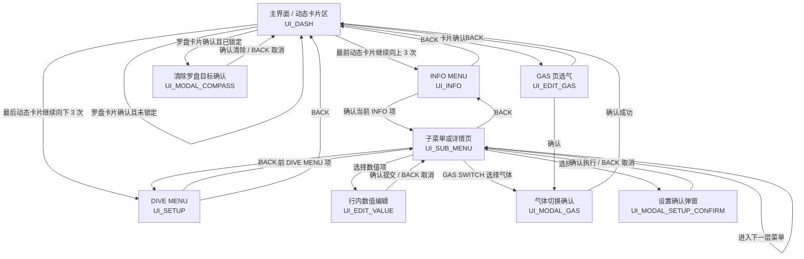
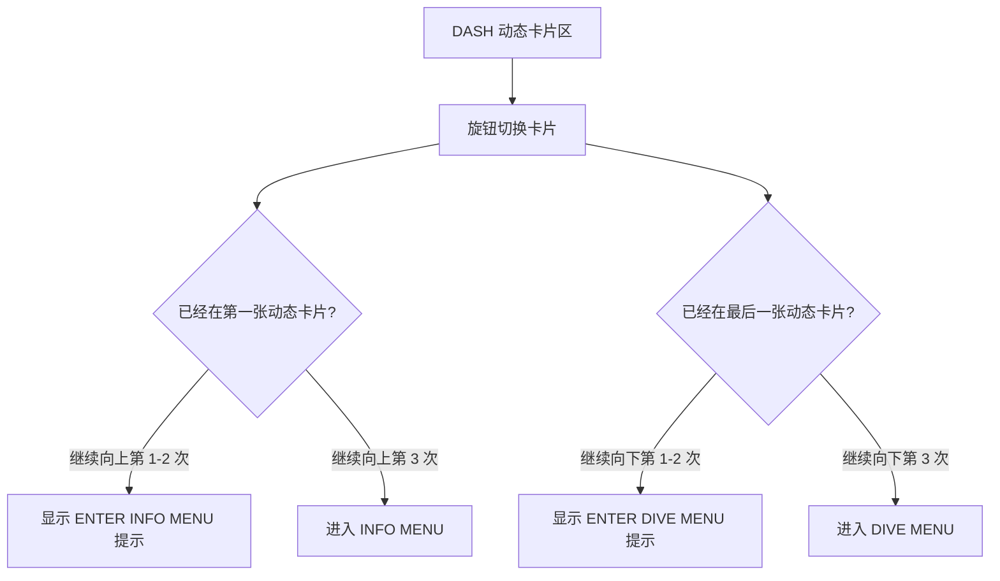
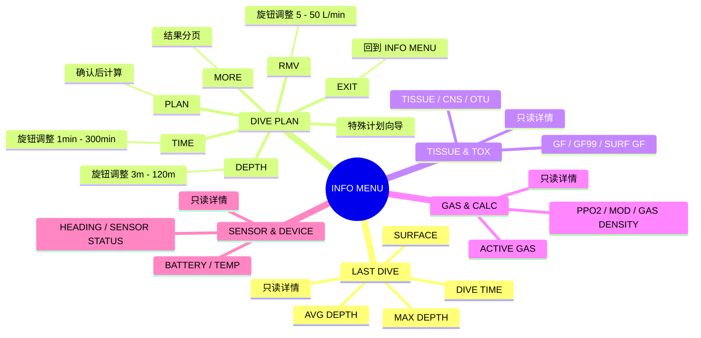
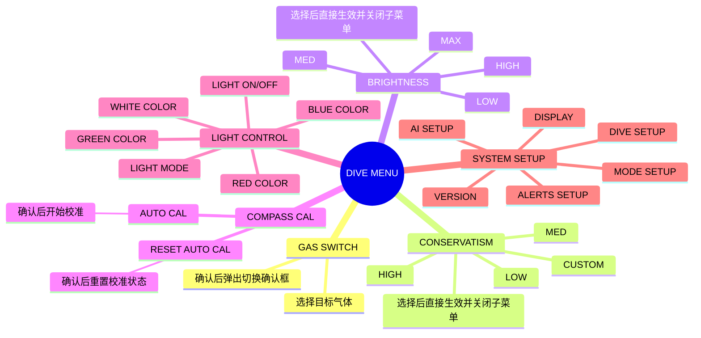
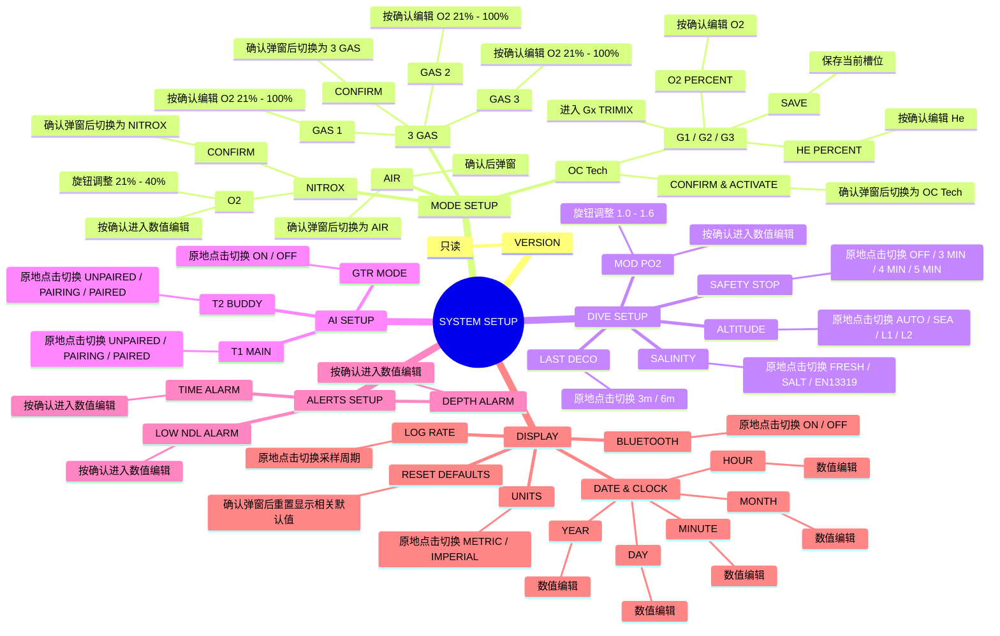
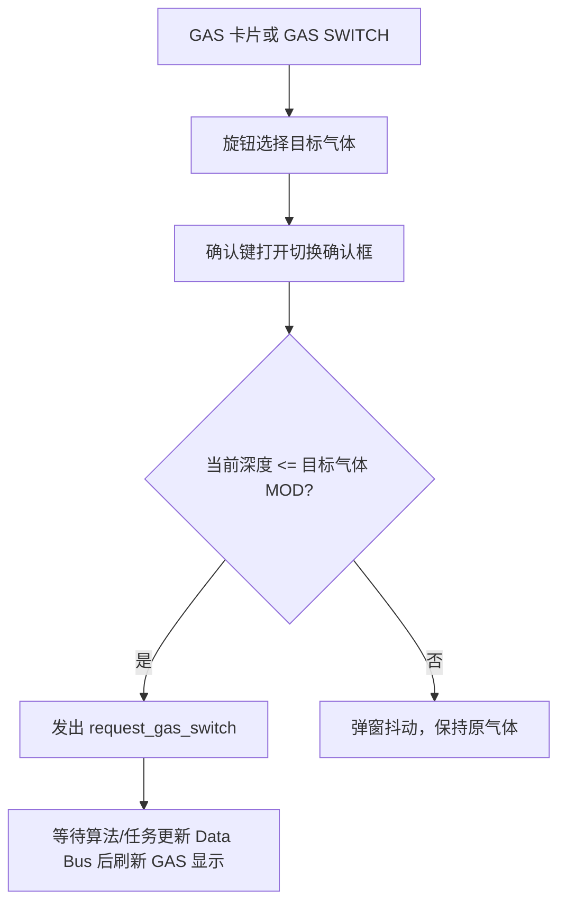
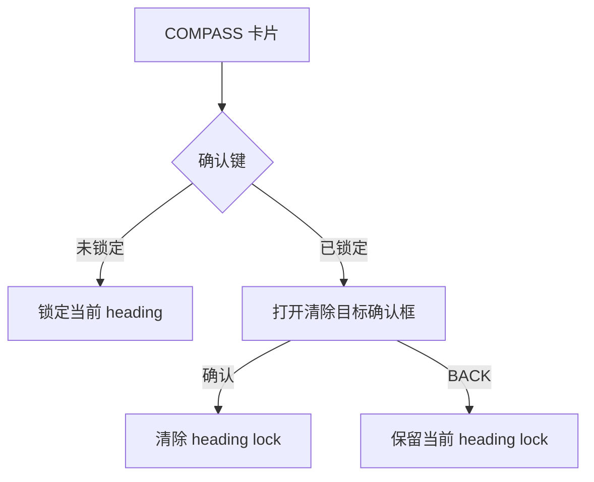

# UI 状态与菜单交互说明

本文档说明当前潜水电脑 UI 的真实交互路径：用户从哪个界面进入、确认键会打开什么、旋钮在当前状态下做什么、返回键退到哪里。

文档中的界面名称尽量使用屏幕上实际出现的文案；括号里的 `UI_*` / `MENU_*` 是代码里的稳定状态或菜单 ID，方便和实现对应。

## 1. 基本输入

| 输入 | 在普通页面 | 在菜单列表 | 在数值编辑 | 在确认弹窗 |
|---|---|---|---|---|
| 旋钮上/下 | 切换右侧卡片，或在边界触发菜单入口蓄力 | 移动高亮行 | 按步进增减当前值 | 无业务动作 |
| 确认键 | 执行当前卡片动作 | 进入、切换、编辑或打开确认弹窗 | 提交当前值 | 确认执行 |
| BACK | 回到第一个动态卡片 | 返回上一层 | 取消编辑并恢复原值 | 关闭弹窗或取消 |

## 2. 总状态图

## 3. 主界面 DASH

主界面由左侧固定栏和右侧动态卡片组成。左侧固定栏始终显示关键潜水数据；右侧卡片由布局配置决定，可能包括空白卡、罗盘、减压、计划、气体、自定义网格等。

右侧卡片确认键行为：

| 卡片 | 确认键 | BACK |
|---|---|---|
| BLANK 空白卡 | 无动作 | 回到第一张动态卡片 |
| CUSTOM 自定义网格 | 无动作，只显示配置的组件 | 回到第一张动态卡片 |
| COMPASS 罗盘 | 未锁定时锁定当前航向；已锁定时打开清除确认框 | 回到第一张动态卡片 |
| DECO 减压 | 无动作，只显示减压/组织/毒性数据 | 回到第一张动态卡片 |
| PLAN 轨迹/计划图 | 无动作，只显示轨迹或计划图 | 回到第一张动态卡片 |
| GAS 气体 | 进入选气状态；旋钮选择目标气体；确认打开切气确认框 | 选气时返回 DASH；普通浏览时回到第一张动态卡片 |

## 4. INFO MENU

入口：在第一张动态卡片继续向上旋钮 3 次。

INFO MENU 是信息入口，其中大部分页面只读；`DIVE PLAN` 是例外，它是可操作的计划向导。

INFO MENU 操作：

| 位置 | 旋钮 | 确认键 | BACK |
|---|---|---|---|
| INFO MENU 顶层 | 移动选中项；最后一项继续向下 3 次回 DASH | 打开选中项 | 回到第一张动态卡片 |
| LAST DIVE / TISSUE & TOX / GAS & CALC / SENSOR & DEVICE | 移动详情行高亮 | 只读，无业务动作 | 回到 INFO MENU |
| DIVE PLAN | 在输入页调整当前值；在结果页按列表规则移动 | NEXT / PLAN / MORE / EXIT | 回到 INFO MENU |

## 5. DIVE MENU

入口：在最后一张动态卡片继续向下旋钮 3 次。

DIVE MENU 是设置入口。顶层有 6 项：

DIVE MENU 操作：

| 位置 | 旋钮 | 确认键 | BACK |
|---|---|---|---|
| DIVE MENU 顶层 | 移动选中项；第一项继续向上 3 次回 DASH | 打开选中项 | 回到第一张动态卡片 |
| 普通子菜单 | 移动选中项 | 按当前行类型执行 | 返回上一层；第一层返回 DIVE MENU |
| 行内数值编辑 | 调整当前数值 | 提交 | 取消并恢复原值 |
| 设置确认弹窗 | 无业务动作 | 确认执行 | 取消 |

## 6. SYSTEM SETUP 展开

`SYSTEM SETUP` 是 DIVE MENU 下的集合页，屏幕标题实际显示为 `SYSTEMS SETUP`。

## 7. 设置项动作类型

| 动作类型 | 用户感受 | 当前例子 |
|---|---|---|
| 只读 | 确认键不改变业务状态 | VERSION、普通 INFO 详情 |
| 打开下一层 | 确认后进入子菜单，BACK 回到父级 | SYSTEM SETUP -> MODE SETUP / DIVE SETUP / DISPLAY |
| 原地切换 | 确认一次立即切到下一个枚举值，并刷新当前行 | SALINITY、SAFETY STOP、LAST DECO、ALTITUDE、AI、UNITS、LOG RATE、BLUETOOTH |
| 直接选择生效 | 选中某个固定选项后立即应用并关闭当前子菜单 | CONSERVATISM、BRIGHTNESS、灯光颜色强度 |
| 行内数值编辑 | 确认进入编辑；旋钮调值；确认提交；BACK 取消 | MOD PO2、Nitrox O2、3 GAS O2、Trimix O2/He、告警阈值、日期时间 |
| 二次确认 | 确认先弹窗；弹窗里再确认才应用 | AIR/NITROX/3 GAS/OC Tech 模式切换、RESET DEFAULTS、气体切换 |
| 特殊向导 | 同一页面内部有自己的阶段和按钮语义 | DIVE PLAN |

## 8. GAS SWITCH

气体切换有两个入口：

| 入口 | 路径 |
|---|---|
| 主界面 GAS 卡片 | DASH -> GAS 卡片确认 -> 选气 -> 确认弹窗 |
| 设置菜单 | DIVE MENU -> GAS SWITCH -> 选择气体 -> 确认弹窗 |

## 9. 罗盘

## 10. 返回规则

| 当前状态 | BACK 结果 |
|---|---|
| DASH | 回到第一张动态卡片 |
| INFO MENU 顶层 | 回到第一张动态卡片 |
| DIVE MENU 顶层 | 回到第一张动态卡片 |
| INFO 详情页 | 回到 INFO MENU |
| DIVE MENU 子菜单 | 回到上一层；没有上一层则回 DIVE MENU |
| DIVE PLAN | 退出计划页，回到 INFO MENU |
| GAS 选气 | 取消选气，回到 DASH |
| 气体确认弹窗 | 如果来自 GAS 卡片，回到选气状态；如果来自 GAS SWITCH，关闭子菜单 |
| 罗盘确认弹窗 | 关闭弹窗，保留锁定状态 |
| 设置确认弹窗 | 取消待确认设置，回到子菜单 |
| 数值编辑 | 取消编辑，恢复进入编辑前的值 |

## 11. 数据刷新

菜单和卡片不主动计算业务数据，只消费 Data Bus 和 VM。

| 数据域 | 典型刷新位置 |
|---|---|
| 潜水剖面：深度、上升率、潜水/水面时间、深度统计 | 固定栏、INFO LAST DIVE、轨迹图 |
| 减压状态：NDL、TTS、停留深度/时间、ceiling | 固定栏、DECO 卡、INFO |
| 组织和毒性：组织舱、GF99、SURF GF、CNS、OTU | DECO 卡、TISSUE & TOX |
| 气体供给：当前气体、气体槽、PPO2、MOD、FiO2、密度 | GAS 卡、GAS & CALC、固定栏 |
| 系统：电量、温度、时间 | 固定栏、SENSOR & DEVICE |
| 罗盘：heading、heading lock | COMPASS 卡、heading 组件 |
| 传感器预览：gyro、accel、mag、MLX、TMAG、pressure、BLE、CPU/FPS | SENSOR PREVIEW 自定义卡 |
| 计划：轨迹、减压计划结果 | PLAN 卡、DIVE PLAN |
| 布局：页面顺序、固定栏、自定义卡 | 重建页面；结构级替换后回到第一张动态卡片 |

## 12. 一句话总结

主界面负责看实时数据和切换卡片；`INFO MENU` 负责查看信息和进入 `DIVE PLAN`；`DIVE MENU` 负责设置。旋钮负责移动或调值，确认键负责进入或提交，BACK 负责退出或取消。`SYSTEM SETUP` 是 DIVE MENU 里的设置集合页，不是另一个独立顶层菜单。
