# UI 交互说明

本文档面向项目经理，用来说明当前潜水电脑 UI 的交互逻辑：用户怎么操作、点进去看到什么、怎么返回、界面数据如何响应变化。

## 1. 操作方式

当前 UI 主要有三种操作：

| 操作 | 含义 |
|---|---|
| 旋钮上/下 | 翻页、移动菜单选中项、调整数字。 |
| 确认键 | 进入当前选中项、确认操作、提交数值。 |
| 返回键 | 返回上一层、取消弹窗、取消编辑。 |

整体交互可以理解成：

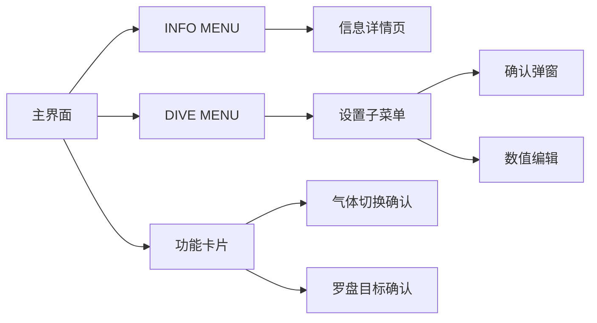

## 2. 主界面

开机后默认进入主界面。

主界面由两部分组成：

| 区域 | 内容 |
|---|---|
| 固定栏 | 始终显示关键潜水数据，例如 NDL、深度、潜水时间、气体、电量和温度。 |
| 右侧页面 | 可以上下切换的功能页，例如罗盘、减压、计划、气体、自定义数据显示页。 |

主界面旋钮逻辑：

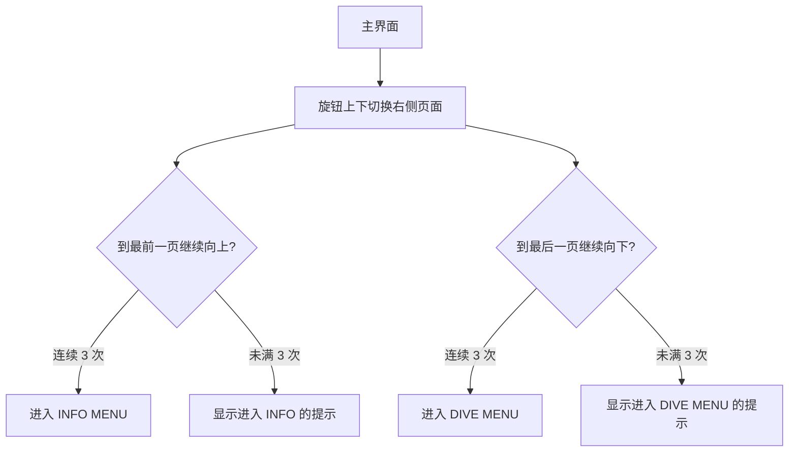

这里的“连续 3 次”是防误触设计。用户滑到边界后，不会马上进入菜单，而是先出现提示条；继续同方向操作到第 3 次才进入菜单。

## 3. 右侧功能页

主界面右侧有多张功能页。不同页面点击后的反应不同。

| 当前页面 | 确认键行为 | 输出响应 |
|---|---|---|
| 自定义数据显示页 | 不进入二级页面。 | 只展示当前配置的组件数据。 |
| 罗盘页 | 第一次确认会锁定当前航向；已锁定时再次确认会弹出清除目标确认框。 | 罗盘页显示目标航向提示和目标标记。 |
| 减压页 | 不进入二级页面。 | 显示 GF、GF99、SurfGF、CNS、OTU、组织图。 |
| 计划页 | 不进入二级页面。 | 显示潜水轨迹或计划曲线。 |
| 气体页 | 进入气体选择状态。 | 当前气体列表高亮从“正在使用的气体”变成“正在选择的气体”。 |

## 4. INFO MENU

从主界面最前方继续向上旋钮 3 次，进入 INFO MENU。

INFO MENU 是只读信息入口，主要用于查看状态和摘要。

| INFO 菜单项 | 确认后进入 |
|---|---|
| LAST DIVE | 最近一次潜水摘要。 |
| DIVE PLAN | 潜水计划输入与结果页。 |
| TISSUE & TOX | 组织、GF、CNS、OTU 信息。 |
| GAS & CALC | 当前气体和计算相关信息。 |
| SENSOR & DEVICE | 传感器和设备状态信息。 |

INFO MENU 操作：

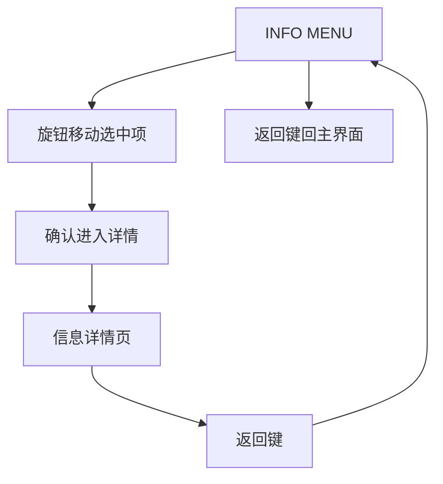

INFO MENU 底部继续向下旋钮 3 次，也会回到主界面。

## 5. DIVE MENU

从主界面最后方继续向下旋钮 3 次，进入 DIVE MENU。

DIVE MENU 是设置入口。

| DIVE MENU 菜单项 | 确认后进入 |
|---|---|
| GAS SWITCH | 选择并确认切换气体。 |
| CONSERVATISM | 设置保守度。 |
| BRIGHTNESS | 设置屏幕亮度。 |
| COMPASS CAL | 罗盘校准和重置。 |
| LIGHT CONTROL | 控制灯光开关、模式和颜色亮度。 |
| SYSTEM SETUP | 系统、潜水参数、AI、告警、显示等设置。 |

DIVE MENU 操作：

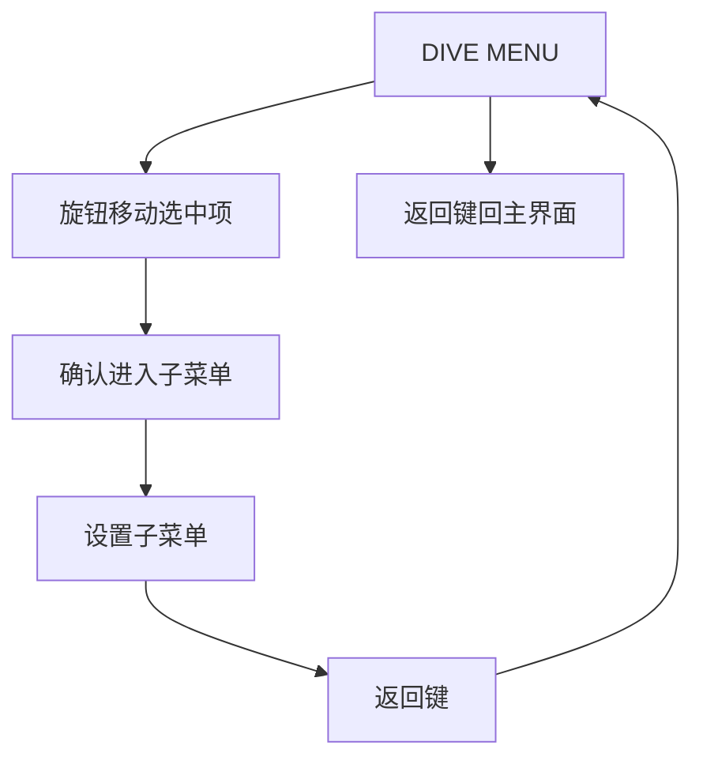

DIVE MENU 顶部继续向上旋钮 3 次，也会回到主界面。

## 6. 子菜单通用规则

进入 INFO 或 DIVE MENU 的子菜单后，通用规则如下：

| 操作 | 结果 |
|---|---|
| 旋钮 | 移动当前选中行。 |
| 确认键 | 执行当前选中行。可能进入下一层、直接生效、打开确认弹窗或进入数字编辑。 |
| 返回键 | 返回上一层；如果已经是第一层子菜单，则回到 INFO MENU 或 DIVE MENU。 |

子菜单层级示意：

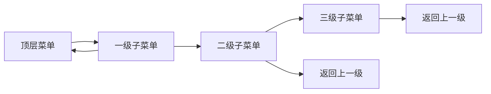

## 7. 设置项的几种交互

DIVE MENU 中的设置项大致分为四类。

| 类型 | 交互方式 | 例子 |
|---|---|---|
| 直接生效 | 选中后按确认，设置立即生效并关闭子菜单。 | BRIGHTNESS、CONSERVATISM。 |
| 进入下一层 | 选中后按确认，打开下一层选项。 | SYSTEM SETUP 里的 MODE SETUP、DISPLAY。 |
| 数字编辑 | 选中后按确认，当前行进入编辑态；旋钮调数值；确认提交；返回取消。 | MOD PPO2、深度告警、时间告警、日期时间字段。 |
| 二次确认 | 选中后按确认，弹出确认框；确认提交，返回取消。 | 某些模式切换或重置类设置。 |

数字编辑流程：

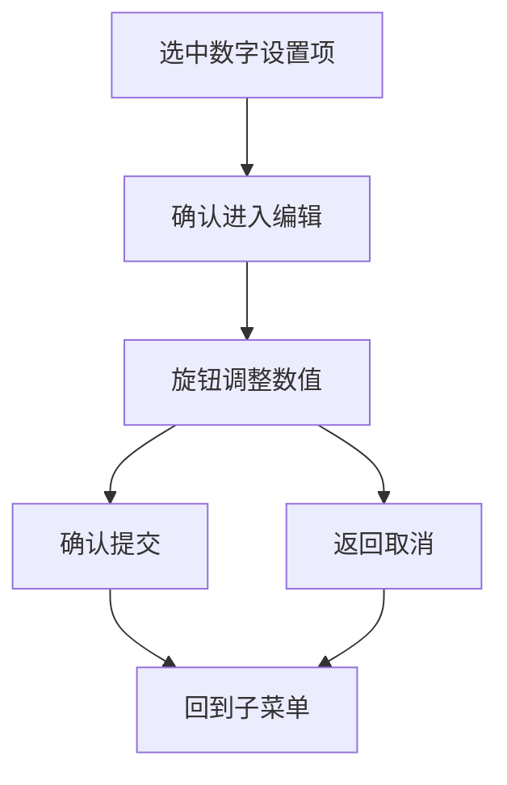

## 8. GAS SWITCH 交互

气体切换有两种入口：

| 入口 | 进入方式 |
|---|---|
| 主界面 GAS 页 | 在 GAS 页按确认。 |
| DIVE MENU / GAS SWITCH | 进入 GAS SWITCH 子菜单后选择气体。 |

气体切换流程：

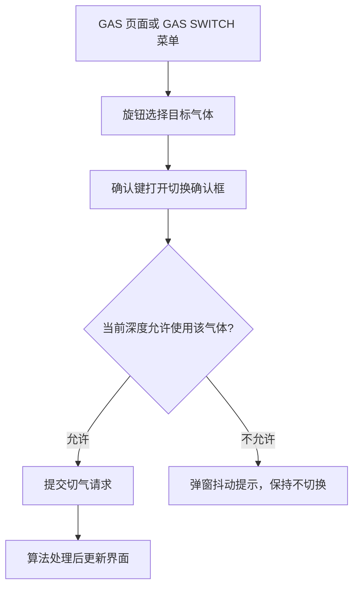

输出响应：

| 情况 | 界面响应 |
|---|---|
| 正常浏览 GAS 页 | 高亮当前正在使用的气体。 |
| 进入选气状态 | 高亮当前游标选择的气体。 |
| 气体可切换 | 关闭弹窗，等待算法确认后刷新当前气体。 |
| 气体不可切换 | 弹窗轻微抖动，不提交切换。 |

## 9. 罗盘交互

罗盘页有两个主要交互：锁定航向和清除航向。

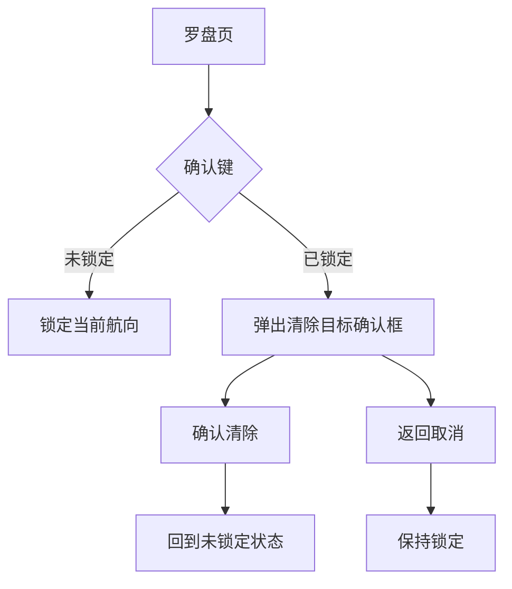

输出响应：

| 状态 | 界面显示 |
|---|---|
| 未锁定 | 显示当前航向和“按确认标记航向”的提示。 |
| 已锁定 | 显示当前航向、目标航向提示，以及罗盘卷尺上的目标标记。 |
| 清除确认弹窗 | 显示是否清除目标航向的确认提示。 |

## 10. COMPASS CAL 交互

COMPASS CAL 位于 DIVE MENU。

| 菜单项 | 确认后 |
|---|---|
| START | 发起罗盘校准请求，菜单状态显示为校准中。 |
| RESET | 发起校准重置请求，状态回到空闲。 |

输出响应：

| 校准状态 | 界面响应 |
|---|---|
| IDLE | 顶层 DIVE MENU badge 显示空闲状态。 |
| RUNNING | 顶层 DIVE MENU badge 显示校准进行中。 |
| READY | 底层传感器任务更新状态后，菜单刷新显示可用状态。 |

## 11. LIGHT CONTROL 交互

LIGHT CONTROL 位于 DIVE MENU。

| 菜单项 | 确认后 |
|---|---|
| LIGHT | 切换灯光开关。 |
| MODE | 在常亮和呼吸模式之间切换。 |
| RED / GREEN / BLUE / WHITE | 进入对应颜色亮度选择。 |
| 10% / 30% / 50% / 70% / 100% | 设置当前颜色亮度。 |

输出响应：

| 操作 | 界面响应 |
|---|---|
| 切换 LIGHT | 当前行右侧显示 ON 或 OFF。 |
| 切换 MODE | 当前行右侧显示 ALWAYS 或 BREATH。 |
| 选择颜色亮度 | 应用后关闭当前子菜单。 |

## 12. DIVE PLAN 交互

DIVE PLAN 位于 INFO MENU，但它不是普通只读信息页，而是一个简单的计划向导。

流程：

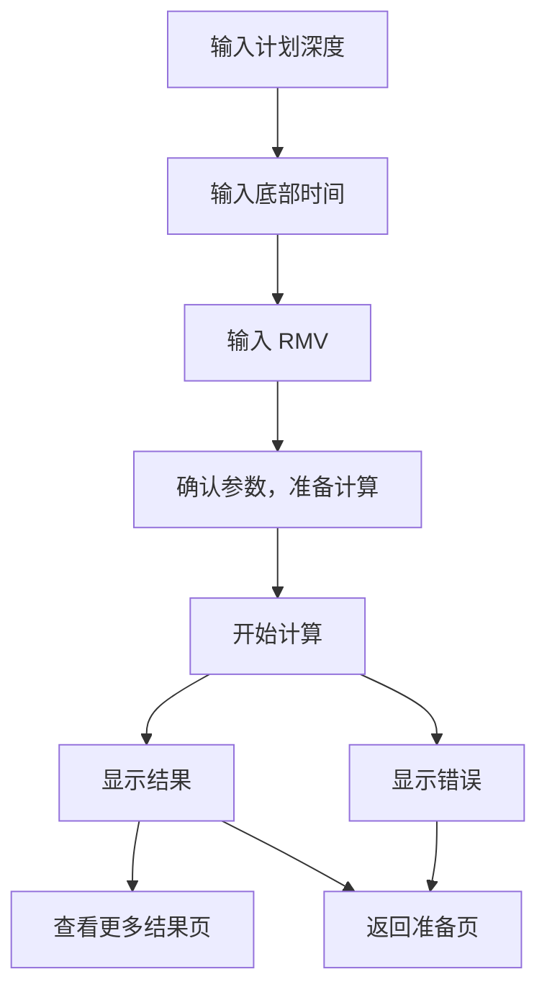

操作方式：

| 页面 | 旋钮 | 确认键 |
|---|---|---|
| 输入深度 | 调整深度。 | 下一步。 |
| 输入时间 | 调整时间。 | 下一步。 |
| 输入 RMV | 调整 RMV。 | 下一步。 |
| 准备计算 | 无需调数值。 | 开始计算。 |
| 计算中 | 等待。 | 通常不操作。 |
| 结果页 | 不调输入。 | 查看更多结果或返回准备页。 |
| 错误页 | 不调输入。 | 返回准备页。 |

返回键可退出 DIVE PLAN，回到 INFO MENU。

## 13. 告警交互

告警会覆盖在当前界面上，不要求用户先进入某个菜单。

告警来源可以是算法、传感器、平台或调试层。

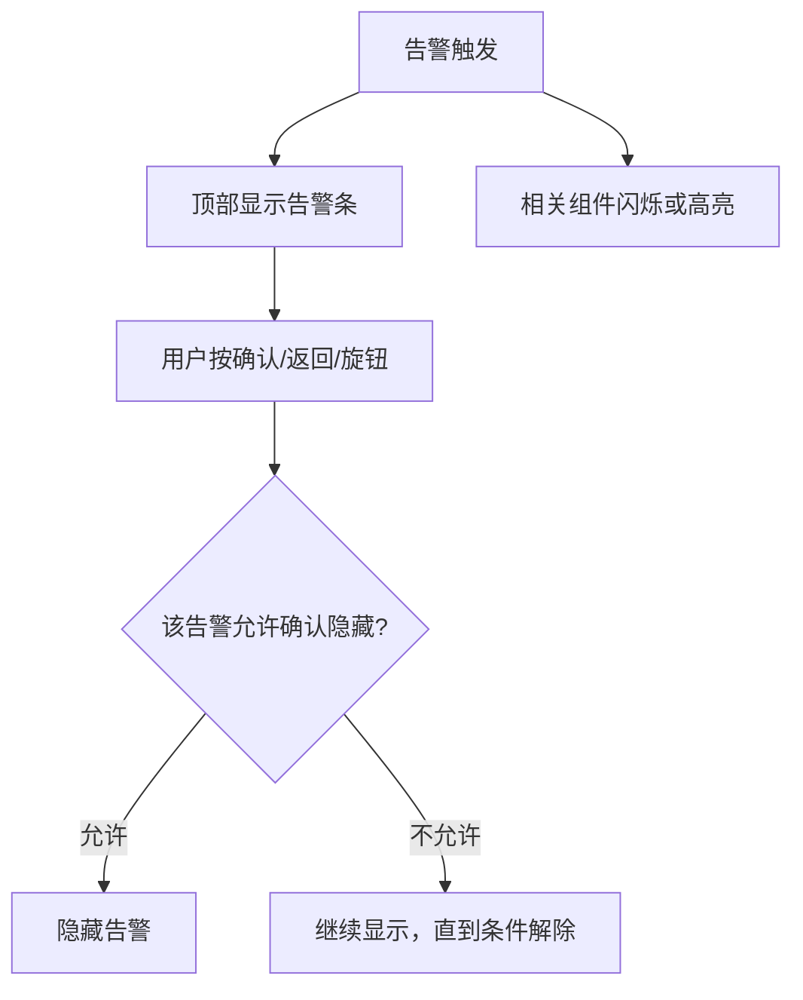

告警显示规则：

| 等级 | 界面响应 | 用户确认 |
|---|---|---|
| 严重告警 | 告警条强闪烁，相关模块强提示。 | 通常不能直接隐藏，必须等条件解除。 |
| 警告告警 | 告警条和相关模块弱提示。 | 可以确认隐藏，条件解除前不重复弹出。 |
| 信息提示 | 短时间显示提示条。 | 通常自动消失。 |

## 14. 数据变化后的输出响应

界面会根据传感器、算法和设置变化自动刷新。

| 数据变化 | 界面响应 |
|---|---|
| 深度变化 | 固定栏深度、最大/平均深度、减压页、上升速率图标刷新。 |
| NDL / 停留状态变化 | NDL、安全停留、减压停留显示刷新。 |
| 组织 / GF / CNS / OTU 变化 | 减压页和组织图刷新。 |
| 气体 / PPO2 / MOD / POD 变化 | GAS 页、气体名称、PPO2、MOD、气瓶压力相关模块刷新。 |
| 电量 / 温度 / 时间变化 | SYS、电量、温度、时间相关模块刷新。 |
| 罗盘航向变化 | 罗盘页和航向模块刷新。 |
| 传感器预览数据变化 | 传感器预览页刷新。 |
| 计划数据变化 | 计划页刷新。 |
| 布局配置变化 | 重建页面和固定栏布局，尽量恢复用户所在页面；结构级布局替换会回到主界面第一页。 |

数据刷新是自动发生的，不需要用户手动刷新。

## 15. 布局变化后的响应

当 APP 或配置下发改变页面顺序、固定栏模块或自定义页内容时，UI 会重建布局。

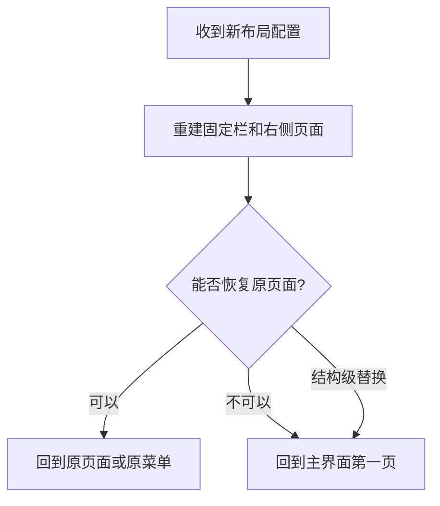

项目经理可以按这个规则理解：

- 普通布局更新：尽量不打断用户，能恢复原页面就恢复。
- 页面顺序或结构大改：回到主界面第一页，避免停在错误页面。
- 重建完成后，固定栏和当前页数据会自动补刷。

## 16. 最简交互路径汇总

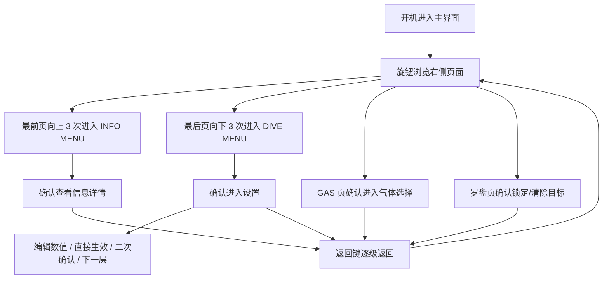

一句话总结：

主界面负责看数据和切换功能页；INFO MENU 负责查看信息；DIVE MENU 负责修改设置；确认键进入或提交，返回键退出或取消，旋钮负责切换和调整。界面数据变化后自动刷新，告警会主动覆盖提示。
