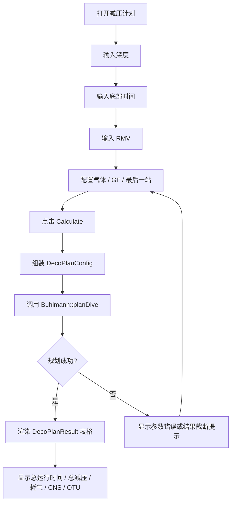

# 离线减压计划使用教程

本文说明 `Buhlmann` 新增的离线减压计划接口怎么调用，以及后续 UI 侧可以怎么测试。该接口用于参考计划和界面验证，不会修改当前实时潜水状态。

## 接口概览

头文件：`Buhlmann.h`

核心接口：

```cpp
bool planDive(const DecoPlanConfig& config, DecoPlanResult& result);
int formatDecoPlan(const DecoPlanResult& result, char* buffer, int bufferSize);
```

主要结构体：

```cpp
DecoPlanConfig config;  // 输入参数
DecoPlanResult result;  // 结构化输出
DecoPlanEntry entry;    // 单行计划记录
```

`planDive()` 会创建一个临时 `Buhlmann` 实例，从全新水面组织负荷开始模拟：下潜、底部停留、上升、减压站停留。它不会污染当前对象里的实时组织负荷、当前减压站序列或潜水时间。

`formatDecoPlan()` 只负责把 `DecoPlanResult` 格式化成文本，方便串口、日志或调试界面显示。结构化数据仍以 `DecoPlanResult.entries` 为准。

## 参数说明

`DecoPlanConfig` 默认是一组空气 `30m / 20min` 的参考参数，可按需要覆盖：

```cpp
DecoPlanConfig config;
config.bottomDepthMeters = 40.0f;
config.bottomTimeSeconds = 30 * 60;
config.descentRateMpm = 18.0f;
config.ascentRateMpm = 10.0f;
config.rmvLitersPerMinute = 14.0f;
config.gfLow = 0.30f;
config.gfHigh = 0.80f;
config.finalStopDepthMeters = 3.0f; // 也可设置为 6.0f
config.bottomPPO2 = 1.4f;
config.decoPPO2 = 1.6f;
```

注意：

- `bottomTimeSeconds` 表示总底部时间，包含下潜时间；实际底部停留时间会自动减去下潜时间。
- `finalStopDepthMeters` 只支持 `3.0f` 或 `6.0f`。
- `gases[0]` 是底气，必须启用。
- 多气体规划时，接口会按深度调用 `getBestGasForDepth()` 自动选择可用的最高氧气比例气体。

## 调用示例

```cpp
#include "Buhlmann.h"

void runDecoPlanExample()
{
    Buhlmann buhlmann(62.7f);

    DecoPlanConfig config;
    config.bottomDepthMeters = 40.0f;
    config.bottomTimeSeconds = 30 * 60;
    config.gfLow = 0.30f;
    config.gfHigh = 0.80f;
    config.finalStopDepthMeters = 3.0f;

    config.gases[0] = Gas(0.21f, 0.0f);
    config.gases[0].enabled = true;

    config.gases[1] = Gas(0.50f, 0.0f);
    config.gases[1].enabled = true;

    config.gases[2] = Gas(1.00f, 0.0f);
    config.gases[2].enabled = true;

    DecoPlanResult result;
    bool ok = buhlmann.planDive(config, result);

    char text[1024];
    int written = buhlmann.formatDecoPlan(result, text, sizeof(text));

    if (ok) {
        // 使用 result.entries 做 UI 表格，或打印 text。
    }

    if (written < 0) {
        // 文本缓冲区不够；结构化 result 仍可继续使用。
    }
}
```

## 结果读取

遍历 `result.entries[0..entryCount)`：

```cpp
for (int i = 0; i < result.entryCount; i++) {
    const DecoPlanEntry& entry = result.entries[i];
    // entry.depthMeters
    // entry.timeSeconds
    // entry.runtimeSeconds
    // entry.gasIndex
    // entry.oxygenFraction
    // entry.heliumFraction
    // entry.gasQtyLiters
    // entry.entryType
}
```

`entryType` 含义：

- `DECO_PLAN_ENTRY_BOTTOM`：底部段，耗气包含下潜和底部停留。
- `DECO_PLAN_ENTRY_ASCENT`：上升段。
- `DECO_PLAN_ENTRY_DECO_STOP`：减压停留站。

汇总字段：

- `totalRuntimeSeconds`：总运行时间。
- `totalDecoSeconds`：总减压停留时间。
- `totalGasLiters`：估算总耗气量。
- `cns` / `otu`：估算氧暴露。
- `truncated`：固定数组容量不够时置位。

## UI 侧测试思路

UI 可以基本照 Java 里的减压计划向导做：输入深度、时间、RMV 和气体配置，点击计算后调用 `planDive()`，再把 `DecoPlanResult` 渲染成表格、耗气统计和摘要。

建议 UI 页面：

- 深度输入：目标深度，单位米。
- 时间输入：总底部时间，单位分钟。
- RMV 输入：默认 14 L/min。
- 气体配置：Gas1 底气，Gas2/Gas3 减压气，可启用/禁用。
- 参数配置：GF Low/High、最后停留站 3m/6m、Bottom PPO2、Deco PPO2。
- 计算中页面：防止重复点击。
- 结果页：显示停留站表格、总运行时间、总减压时间、总耗气、CNS、OTU。

大概流程：



## UI 验收用例

建议至少测这些场景：

- 空气 `30m / 20min`：能生成结果，`entryCount > 0`，不会崩溃。
- 空气 `40m / 30min`：应出现减压站，运行时间单调递增。
- 多气体 `Air + EAN50 + O2`：浅站应自动切到更高氧气比例气体，且不能超过 MOD。
- 最后一站 `6m`：减压停留站不能浅于 6m，最后到水面只作为上升段。
- 小文本缓冲区：`formatDecoPlan()` 返回 `-1`，但结构化结果仍可显示。
- 非法输入：深度、时间、速度或 RMV 非法时，UI 应阻止调用或显示错误。

## 注意事项

- 该接口是离线规划，不等同于实时潜水过程中的当前减压义务。
- 结果用于模拟、调试和界面参考，不应作为未经验证的生命支持决策依据。
- 如果 UI 需要显示分钟，建议对秒数向上取整；如果需要做精细对比，直接使用秒字段。